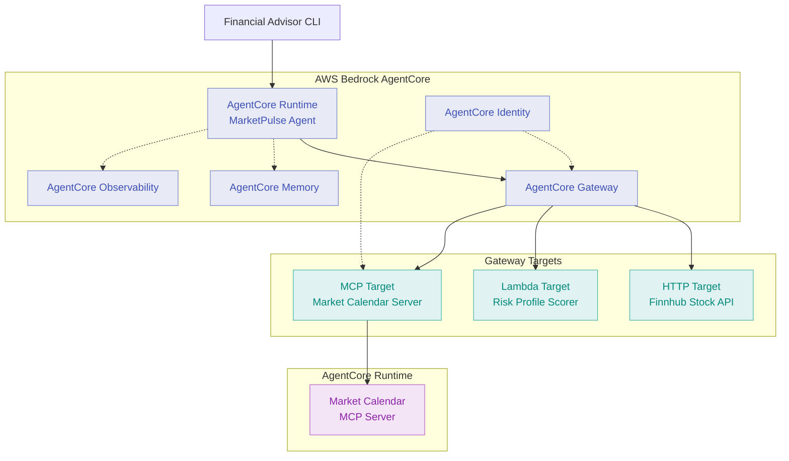

# AWS AgentCore Workshop: MarketPulse

A hands-on workshop for FSI engineering teams to learn AWS Bedrock AgentCore by building an AI-powered investment brief assistant.

## Overview

MarketPulse is a conversational assistant for financial advisors. Before a client meeting, an advisor can ask:

> "I'm meeting Sarah Chen at 2pm today. She's a conservative investor and she's interested in Apple. Can you give me a quick brief?"

MarketPulse responds with:
- Current stock price from a live API
- Risk suitability assessment against the client's profile
- Market calendar check for upcoming holidays
- Remembered context from previous sessions

## Learning Objectives

By completing this workshop, you will:

1. Deploy an agent to **AgentCore Runtime** using the Strands framework
2. Configure **AgentCore Gateway** with three target types: HTTP API, Lambda, and MCP Server
3. Enable **AgentCore Memory** for persistent advisor and client context
4. Secure the agent with **AgentCore Identity** using OAuth 2.0
5. Instrument the agent with **AgentCore Observability** to trace requests end-to-end

## Prerequisites

**AWS Requirements:**
- AWS account with Bedrock model access enabled (Claude 3 Sonnet)
- AWS CLI configured with appropriate permissions

**Local Development:**
- Terraform >= 1.0.7
- Python 3.11+
- Docker
- AWS CLI

**API Keys:**
- Finnhub API key (free registration at https://finnhub.io)

## Workshop Structure

This workshop uses a **single Terraform directory with progressive feature enablement**. You enable capabilities module-by-module via feature flags in `terraform.tfvars`, keeping focus on AgentCore concepts rather than infrastructure management.

### Module Progression

| Module | Topic | Feature Flags | Duration |
|--------|-------|---------------|----------|
| 1 | AgentCore Runtime | _(base deployment)_ | 30 min |
| 2 | Gateway - HTTP Target | `enable_gateway`, `enable_http_target` | 20 min |
| 3 | Gateway - Lambda Target | `enable_lambda_target` | 20 min |
| 4 | Gateway - MCP Target | `enable_mcp_target` | 25 min |
| 5 | Memory | `enable_memory` | 25 min |
| 6 | Identity (OAuth 2.0) | `enable_identity` | 25 min |
| 7 | Observability | `enable_observability` | 30 min |

## Quick Start

### 1. Configure Environment

```bash
# Clone or navigate to workshop directory
cd aws-agentcore-workshop

# Copy Terraform configuration template
cp terraform/terraform.tfvars.example terraform/terraform.tfvars

# Configure terraform.tfvars with your AWS region and preferences
# (Edit the file to set project_name, environment, aws_region, etc.)

# For Module 2+: Add your Finnhub API key to terraform.tfvars
# finnhub_api_key = "your_key_here"
# Terraform stores this in Secrets Manager automatically - no manual setup needed
```

### 2. Initialise Terraform

```bash
cd terraform
terraform init
terraform validate
```

### 3. Follow Module-by-Module

Start with [Module 1: AgentCore Runtime](docs/01-runtime.md) and work through sequentially. Each module will:

1. Explain the AgentCore concept
2. Guide you to enable feature flags
3. Run `terraform apply`
4. Test the new capability

## Project Structure

```
aws-agentcore-workshop/
├── README.md                    # This file
├── DEVELOPMENT_PLAN.md          # Detailed implementation plan
├── .env.example                 # Environment variables template
├── .gitignore                   # Git exclusions
├── terraform/                   # Single Terraform directory
│   ├── main.tf                  # Providers and backend
│   ├── variables.tf             # Feature flags and configuration
│   ├── outputs.tf               # Output values
│   ├── locals.tf                # Computed values
│   ├── runtime.tf               # Agent runtime (always deployed)
│   ├── gateway.tf               # Gateway + HTTP target
│   ├── lambda.tf                # Lambda function + target
│   ├── mcp.tf                   # MCP server + target
│   ├── memory.tf                # Memory configuration
│   ├── identity.tf              # OAuth 2.0 authentication
│   ├── observability.tf         # Tracing and logging
│   └── terraform.tfvars.example # Configuration template
├── agent/                       # MarketPulse Strands agent
│   ├── Dockerfile
│   ├── requirements.txt
│   └── app.py
├── mcp-server/                  # Market calendar MCP server
│   ├── Dockerfile
│   ├── requirements.txt
│   └── server.py
├── lambda/                      # Risk profile scorer
│   └── scorer.py
├── scripts/                     # Build and test scripts
│   ├── build-agent.sh
│   ├── build-mcp.sh
│   ├── test-agent.py
│   ├── test-stock.py
│   ├── test-risk.py
│   ├── test-calendar.py
│   ├── test-auth.py
│   └── destroy.sh
└── docs/                        # Module documentation
    ├── 00-introduction.md
    ├── 01-runtime.md
    ├── 02-gateway-http.md
    ├── 03-gateway-lambda.md
    ├── 04-gateway-mcp.md
    ├── 05-memory.md
    ├── 06-identity.md
    └── 07-observability.md
```

## Architecture

At the end of the workshop, you will have deployed this architecture:



## Key Concepts

### Feature Flag Workflow

Instead of managing multiple Terraform directories, this workshop uses feature flags:

```hcl
# terraform/terraform.tfvars

# Module 1: Base agent (always deployed)
# No flags needed

# Module 2: Add HTTP Gateway target
enable_gateway     = true
enable_http_target = true

# Module 3: Add Lambda target
enable_lambda_target = true

# Module 4: Add MCP target
enable_mcp_target = true

# Module 5: Add Memory
enable_memory = true

# Module 6: Add Identity
enable_identity = true

# Module 7: Add Observability
enable_observability = true
```

### Progressive Deployment

After enabling each module's flags:

```bash
cd terraform
terraform plan    # Review changes
terraform apply   # Deploy
```

Then test the new capability with the provided test scripts.

## Troubleshooting

### Terraform State

This workshop uses a local state file for simplicity. If you encounter state issues:

```bash
cd terraform
rm -rf .terraform .terraform.lock.hcl terraform.tfstate*
terraform init
```

### Container Builds

If container builds fail:

```bash
# Ensure Docker is running
docker ps

# Manually build and push
cd agent
docker build -t marketpulse-agent .
```

### API Rate Limits

Finnhub free tier allows 60 calls/minute. If you hit rate limits during testing, wait 60 seconds before retrying.

## Clean Up

To destroy all resources:

```bash
cd terraform
terraform destroy

# Or use the provided script
cd ../scripts
./destroy.sh
```

## Extension Activities

For engineers who finish early:

1. Add a Knowledge Base target to retrieve compliance documents
2. Implement session-level memory isolation between advisors
3. Add a second MCP server wrapping an internal firm API
4. Configure custom observability dashboards in CloudWatch

## Resources

- [AWS Bedrock AgentCore Documentation](https://docs.aws.amazon.com/bedrock-agentcore)
- [Strands Agents Framework](https://github.com/strands-agents/sdk-python)
- [Model Context Protocol (MCP)](https://modelcontextprotocol.io)
- [Finnhub Stock API](https://finnhub.io/docs/api)
- [Nager.Date Holidays API](https://date.nager.at)

## Support

For workshop support or questions:
- Review module documentation in `docs/`
- Check `DEVELOPMENT_PLAN.md` for implementation details
- Consult AWS Bedrock AgentCore documentation

## Licence

This workshop is provided as-is for educational purposes.