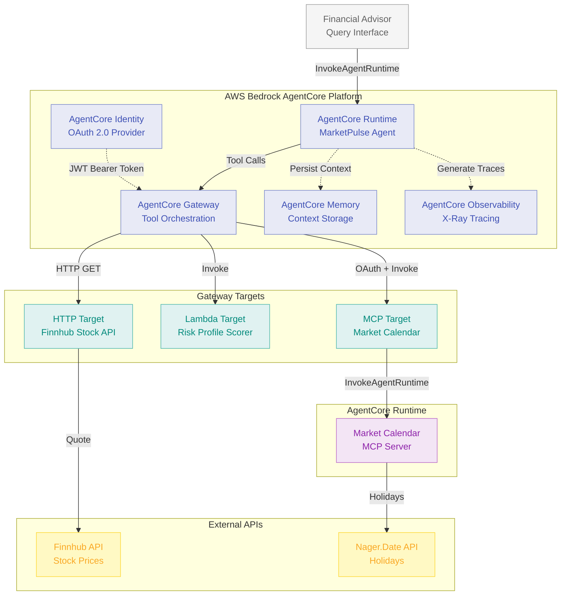

# AWS AgentCore Workshop: MarketPulse

A hands-on workshop for FSI engineering teams to learn AWS Bedrock AgentCore by building an AI-powered investment brief assistant.

## Overview

MarketPulse is a conversational assistant for financial advisors. Before a client meeting, an advisor can ask:

> "I'm meeting Sarah Chen at 2pm today. She's a conservative investor and she's interested in BHP Group. Can you give me a quick brief?"

MarketPulse responds with:
- Current stock price from a live API
- Risk suitability assessment against the client's profile
- Market calendar check for upcoming holidays
- Remembered context from previous sessions

## Learning Objectives

By completing this workshop, you will:

1. Deploy an agent to **AgentCore Runtime** using the Strands framework
2. Configure **AgentCore Gateway** with three target types: HTTP API, Lambda, and MCP Server
3. Enable **AgentCore Memory** for persistent advisor and client context
4. Secure the agent with **AgentCore Identity** using OAuth 2.0
5. Instrument the agent with **AgentCore Observability** to trace requests end-to-end

## Prerequisites

**AWS Requirements:**
- AWS account with Bedrock model access enabled (Claude 3 Sonnet)
- AWS CLI configured with appropriate permissions

**Local Development:**
- Terraform >= 1.0.7
- Python 3.11+
- Docker (or Colima for macOS)
- AWS CLI

**API Keys:**
- Finnhub API key (free registration at https://finnhub.io)

## Workshop Structure

This workshop uses a **single Terraform directory with progressive feature enablement**. You enable capabilities module-by-module via feature flags in `terraform.tfvars`, keeping focus on AgentCore concepts rather than infrastructure management.

### Module Progression

| Module | Topic | Feature Flags | Duration |
|--------|-------|---------------|----------|
| 1 | AgentCore Runtime | _(base deployment)_ | 30 min |
| 2 | Gateway - HTTP Target | `enable_gateway`, `enable_http_target` | 20 min |
| 3 | Gateway - Lambda Target | `enable_lambda_target` | 20 min |
| 4 | Gateway - MCP Target | `enable_mcp_target` | 25 min |
| 5 | Memory | `enable_memory` | 25 min |
| 6 | Identity (OAuth 2.0) | `enable_identity` | 25 min |
| 7 | Observability | `enable_observability` | 30 min |

**Total Workshop Time:** Approximately 3 hours including testing and discussion.

**Time Breakdown:**
- Setup and prerequisites: 15 minutes
- Module progression: 165 minutes (2h 45m)
- End-to-end testing: 15 minutes
- Clean up: 10 minutes

**Recommended Schedule:**
- **Self-paced:** Complete over 2-3 sessions with breaks
- **Instructor-led:** Full-day workshop with lunch break after Module 4
- **Rapid deployment:** Experienced engineers can complete in 2 hours by enabling all features and testing at the end (not recommended for learning)

## Quick Start

### 1. Verify Prerequisites

Ensure all required tools are installed and configured:

```bash
# Verify Terraform
terraform version  # Should be >= 1.0.7

# Verify Python
python3 --version  # Should be >= 3.11

# Verify AWS CLI and credentials
aws --version
aws sts get-caller-identity  # Should show your account details
```

**Docker Setup (macOS):**

For macOS (especially Apple Silicon), install and start Colima:

```bash
# Install Colima (Docker alternative for macOS)
brew install colima

# Start Colima with aarch64 architecture
colima start --arch aarch64

# Verify Docker is working
docker --version
docker ps  # Should show no errors
```

**Note:** Colima provides Docker runtime without Docker Desktop. If you're already using Docker Desktop, you can skip the Colima installation.

**AWS Account Setup:**
1. Enable Bedrock model access in your AWS account:
   - Navigate to AWS Console → Bedrock → Model access
   - Request access to Claude Sonnet 4.5 (au.anthropic.claude-sonnet-4-5-20250929-v1:0)
   - Wait for approval (usually instant for standard models)

2. Register for Finnhub API key:
   - Visit https://finnhub.io
   - Create free account
   - Copy API key from dashboard

### 2. Configure Environment

```bash
# Clone or navigate to workshop directory
cd aws-agentcore-workshop

# Copy Terraform configuration template
cp terraform/terraform.tfvars.example terraform/terraform.tfvars

# Edit terraform.tfvars with your preferences
# Required changes:
#   - aws_region (default: ap-southeast-2)
#   - finnhub_api_key (from step 1)
#   - project_name (optional, default: marketpulse-workshop)
#   - environment (optional, default: dev)

# Example terraform.tfvars:
# project_name      = "marketpulse-workshop"
# environment       = "dev"
# aws_region        = "ap-southeast-2"
# finnhub_api_key   = "your_finnhub_key_here"
# agent_model_id    = "au.anthropic.claude-sonnet-4-5-20250929-v1:0"
#
# Feature flags (enable progressively during workshop):
# enable_gateway        = false
# enable_http_target    = false
# enable_lambda_target  = false
# enable_mcp_target     = false
# enable_memory         = false
# enable_identity       = false
# enable_observability  = false
```

**Important:** Never commit `terraform.tfvars` to version control (it's in `.gitignore`).

### 3. Initialise Terraform

```bash
cd terraform
terraform init     # Downloads providers and initialises backend
terraform validate # Verifies configuration syntax
terraform plan     # Preview resources (should show agent runtime only)
```

Expected output from `terraform plan`:
- 1 ECR repository
- 1 AgentCore Runtime
- 1 AgentCore Runtime Endpoint
- 1 IAM role for agent execution
- Total: ~5-7 resources for base deployment

### 4. Follow Module-by-Module Workflow

**Do not enable all features at once.** Follow the progressive learning path:

1. Start with [Module 1: AgentCore Runtime](docs/01-runtime.md)
   - Deploys base agent without tools
   - Verifies agent responds to prompts

2. Continue to [Module 2: Gateway HTTP Target](docs/02-gateway-http.md)
   - Edit `terraform.tfvars`: set `enable_gateway = true`, `enable_http_target = true`
   - Run `terraform apply`
   - Test with `python scripts/test-stock.py`

3. Progress through remaining modules:
   - [Module 3: Gateway Lambda](docs/03-gateway-lambda.md)
   - [Module 4: Gateway MCP](docs/04-gateway-mcp.md)
   - [Module 5: Memory](docs/05-memory.md)
   - [Module 6: Identity](docs/06-identity.md)
   - [Module 7: Observability](docs/07-observability.md)

Each module will:
1. Explain the AgentCore concept being introduced
2. Guide you to enable specific feature flags
3. Run `terraform apply` to deploy new resources
4. Test the new capability with provided scripts

### 5. Complete End-to-End Test

After finishing all 7 modules:

```bash
# Run comprehensive test
python scripts/test-full.py

# Review distributed trace in AWS X-Ray console
# (URL provided in test output)
```

### 6. Clean Up Resources

When finished with the workshop:

```bash
# Option 1: Use provided script (recommended)
./scripts/destroy.sh

# Option 2: Manual cleanup
cd terraform
terraform destroy  # Type 'yes' to confirm
```

**Important:** Destroying resources stops all charges. Verify in AWS Console that all resources are deleted.

## Project Structure

```
aws-agentcore-workshop/
├── README.md                    # This file
├── DEVELOPMENT_PLAN.md          # Detailed implementation plan
├── .env.example                 # Environment variables template
├── .gitignore                   # Git exclusions
├── terraform/                   # Single Terraform directory
│   ├── main.tf                  # Providers and backend
│   ├── variables.tf             # Feature flags and configuration
│   ├── outputs.tf               # Output values
│   ├── locals.tf                # Computed values
│   ├── runtime.tf               # Agent runtime (always deployed)
│   ├── gateway.tf               # Gateway + HTTP target
│   ├── lambda.tf                # Lambda function + target
│   ├── mcp.tf                   # MCP server + target
│   ├── memory.tf                # Memory configuration
│   ├── identity.tf              # OAuth 2.0 authentication
│   ├── observability.tf         # Tracing and logging
│   └── terraform.tfvars.example # Configuration template
├── agent/                       # MarketPulse Strands agent
│   ├── Dockerfile
│   ├── requirements.txt
│   └── app.py
├── mcp-server/                  # Market calendar MCP server
│   ├── Dockerfile
│   ├── requirements.txt
│   └── server.py
├── lambda/                      # Risk profile scorer
│   └── scorer.py
├── scripts/                     # Build and test scripts
│   ├── build-agent.sh
│   ├── build-mcp.sh
│   ├── test-agent.py
│   ├── test-stock.py
│   ├── test-risk.py
│   ├── test-calendar.py
│   ├── test-auth.py
│   ├── test-memory.py
│   ├── test-trace.py
│   ├── test-full.py             # Complete end-to-end test
│   ├── test_utils.py
│   └── destroy.sh
└── docs/                        # Module documentation
    ├── 00-introduction.md
    ├── 01-runtime.md
    ├── 02-gateway-http.md
    ├── 03-gateway-lambda.md
    ├── 04-gateway-mcp.md
    ├── 05-memory.md
    ├── 06-identity.md
    └── 07-observability.md
```

## Architecture

At the end of the workshop, you will have deployed this architecture:


```mermaid
graph TB
    Advisor[Financial Advisor<br>Query Interface]
    
    subgraph AgentCore["AWS Bedrock AgentCore Platform"]
        Runtime[AgentCore Runtime<br>MarketPulse Agent]
        Gateway[AgentCore Gateway<br>Tool Orchestration]
        Memory[AgentCore Memory<br>Context Storage]
        Identity[AgentCore Identity<br>OAuth 2.0 Provider]
        Observability[AgentCore Observability<br>X-Ray Tracing]
    end
    
    subgraph Targets["Gateway Targets"]
        HTTP[HTTP Target<br>Finnhub Stock API]
        Lambda[Lambda Target<br>Risk Profile Scorer]
        MCP[MCP Target<br>Market Calendar]
    end
    
    subgraph MCPRuntime["AgentCore Runtime"]
        MCPServer[Market Calendar<br>MCP Server]
    end
    
    subgraph External["External APIs"]
        Finnhub[Finnhub API<br>Stock Prices]
        Nager[Nager.Date API<br>Holidays]
    end
    
    Advisor -->|InvokeAgentRuntime| Runtime
    Runtime -->|Tool Calls| Gateway
    Gateway -->|HTTP GET| HTTP
    Gateway -->|Invoke| Lambda
    Gateway -->|OAuth + Invoke| MCP
    MCP -->|InvokeAgentRuntime| MCPServer
    Runtime -.->|Persist Context| Memory
    Runtime -.->|Generate Traces| Observability
    Identity -.->|JWT Bearer Token| Gateway
    HTTP -->|Quote| Finnhub
    MCPServer -->|Holidays| Nager
    
    classDef llm fill:#E8EAF6,stroke:#7986CB,color:#3F51B5
    classDef process fill:#E0F2F1,stroke:#4DB6AC,color:#00897B
    classDef components fill:#F3E5F5,stroke:#BA68C8,color:#8E24AA
    classDef api fill:#FFF9C4,stroke:#FDD835,color:#F9A825
    classDef inputOutput fill:#F5F5F5,stroke:#9E9E9E,color:#616161
    
    class Runtime,Gateway,Memory,Identity,Observability llm
    class HTTP,Lambda,MCP process
    class MCPServer components
    class Finnhub,Nager api
    class Advisor inputOutput
```

## Key Concepts

### Feature Flag Workflow

Instead of managing multiple Terraform directories, this workshop uses feature flags:

```hcl
# terraform/terraform.tfvars

# Module 1: Base agent (always deployed)
# No flags needed

# Module 2: Add HTTP Gateway target
enable_gateway     = true
enable_http_target = true

# Module 3: Add Lambda target
enable_lambda_target = true

# Module 4: Add MCP target
enable_mcp_target = true

# Module 5: Add Memory
enable_memory = true

# Module 6: Add Identity
enable_identity = true

# Module 7: Add Observability
enable_observability = true
```

### Progressive Deployment

After enabling each module's flags:

```bash
cd terraform
terraform plan    # Review changes
terraform apply   # Deploy
```

Then test the new capability with the provided test scripts.

## Testing Your Deployment

Each module includes targeted test scripts in the `scripts/` directory. Run these progressively as you enable features:

### Module 1: Basic Agent Test
```bash
python scripts/test-agent.py
```
Verifies the agent runtime responds to basic prompts.

### Module 2: Stock Price Tool
```bash
python scripts/test-stock.py
```
Tests HTTP Gateway target with Finnhub API integration.

### Module 3: Risk Assessment Tool
```bash
python scripts/test-risk.py
```
Tests Lambda Gateway target with risk profile scoring.

### Module 4: Market Calendar Tool
```bash
python scripts/test-calendar.py
```
Tests MCP Gateway target with market holidays API.

### Module 5: Memory Persistence
```bash
python scripts/test-memory.py
```
Tests memory by storing and recalling client details across sessions.

### Module 6: OAuth Authentication
```bash
python scripts/test-auth.py
```
Verifies OAuth 2.0 authentication is enabled for MCP target.

### Module 7: Distributed Tracing
```bash
python scripts/test-trace.py
```
Generates a complex trace exercising all tools for X-Ray inspection.

### Complete End-to-End Test

After enabling all features, run the comprehensive test:

```bash
python scripts/test-full.py
```

This runs a realistic advisor scenario that:
- Stores client details in memory
- Retrieves current stock price from Finnhub
- Assesses risk suitability via Lambda
- Checks market calendar via authenticated MCP server
- Generates a complete distributed trace

**Expected Output:** A concise investment brief with all requested information. The test script will guide you to view the trace in AWS X-Ray console.

### Validation Checklist

Confirm your deployment is production-ready:

- [ ] `terraform validate` passes with no errors
- [ ] All test scripts execute successfully
- [ ] Agent responds with relevant information (not generic responses)
- [ ] Stock prices are current (not placeholders)
- [ ] Risk assessments match client profile
- [ ] Market calendar shows real holidays from Nager.Date API
- [ ] Memory persists details across separate invocations
- [ ] MCP calls require authentication (test-auth.py confirms OAuth enabled)
- [ ] Distributed trace visible in X-Ray console shows all spans
- [ ] CloudWatch logs show no error messages
- [ ] IAM roles follow least-privilege principle (inspect policies)

## Workshop Completion Criteria

You have successfully completed the workshop when:

1. **All 7 modules are deployed and tested**
   - Runtime, Gateway (HTTP/Lambda/MCP), Memory, Identity, Observability

2. **test-full.py executes successfully**
   - Agent provides a relevant investment brief
   - All tools are invoked correctly
   - Response includes stock price, risk assessment, and market calendar

3. **Distributed trace is visible**
   - X-Ray console shows complete request flow
   - All tool invocations appear as separate spans
   - No error spans in the trace

4. **Memory demonstrates persistence**
   - Client details stored in Session 1
   - Recalled automatically in Session 2 without repetition

5. **OAuth authentication is functional**
   - test-auth.py confirms MCP target requires authentication
   - Agent successfully obtains JWT tokens via Identity provider

6. **Infrastructure is documented**
   - You can explain each Terraform resource's purpose
   - You understand the role of Gateway targets vs agent tools
   - You can describe the OAuth 2.0 flow for MCP authentication

**Next Steps After Completion:**
- Review `terraform/` directory to understand IaC patterns
- Examine CloudWatch logs for each component
- Adapt the agent code for your own FSI use cases
- Explore adding Knowledge Base targets for compliance documents

## Troubleshooting

### Common Issues

#### "Resource name must match regex" Error

**Symptom:** Terraform validation fails with error about resource name not matching regex pattern.

**Cause:** AWSCC provider resources have strict naming requirements (alphanumeric + underscores only, no hyphens).

**Solution:** The workshop uses local variables to convert names. If you modified resource names, ensure they follow the pattern `[a-zA-Z][a-zA-Z0-9_]{0,47}`.

#### Container Build Fails

**Symptom:** Docker build fails or ECR push is rejected.

**Cause:** Docker not running, incorrect AWS credentials, or ECR authentication expired.

**Solution:**
```bash
# Check Docker is running
docker ps

# Re-authenticate with ECR
aws ecr get-login-password --region ap-southeast-2 | \
  docker login --username AWS --password-stdin \
  $(aws sts get-caller-identity --query Account --output text).dkr.ecr.ap-southeast-2.amazonaws.com

# Rebuild and push
./scripts/build-agent.sh
```

#### Agent Returns "Tool Not Found" Error

**Symptom:** Agent responds but says tool is not available.

**Cause:** Gateway target not registered or synchronise call not executed.

**Solution:**
```bash
# Verify Gateway ID in SSM Parameter Store
aws ssm get-parameter --name /marketpulse-workshop/dev/gateway-id

# Manually synchronise Gateway targets (replace GATEWAY_ID)
aws bedrock-agentcore synchronize-gateway-targets \
  --gateway-id GATEWAY_ID \
  --region ap-southeast-2
```

#### Memory Permissions Error

**Symptom:** Agent fails with "Access Denied" when accessing memory.

**Cause:** IAM permissions not propagated or incomplete memory permissions.

**Solution:**
Wait 30-60 seconds after `terraform apply` for IAM permissions to propagate globally. If the issue persists, verify the agent runtime role includes all memory permissions:
- `bedrock-agentcore:InvokeMemory`
- `bedrock-agentcore:GetMemory`
- `bedrock-agentcore:ListMemories`
- `bedrock-agentcore:ListEvents`
- `bedrock-agentcore:GetEvent`
- `bedrock-agentcore:CreateEvent`
- `bedrock-agentcore:DeleteEvent`

#### MCP Server Returns 401 Unauthorised

**Symptom:** Agent receives 401 error when calling MCP tool.

**Cause:** OAuth 2.0 authentication not configured or client credentials invalid.

**Solution:**
```bash
# Check if Identity is enabled
cd terraform
terraform output mcp_authentication_enabled

# If false, enable Identity
# Edit terraform.tfvars: enable_identity = true
terraform apply

# Verify OAuth provider exists
aws ssm get-parameter --name /marketpulse-workshop/dev/mcp-oauth-provider-arn

# Test authentication
python scripts/test-auth.py
```

#### Finnhub API Rate Limit Exceeded

**Symptom:** Stock price queries return 429 error.

**Cause:** Finnhub free tier allows 60 calls/minute.

**Solution:** Wait 60 seconds before retrying. For production use, upgrade to a paid Finnhub plan.

#### X-Ray Trace Not Appearing

**Symptom:** Agent request succeeds but no trace visible in X-Ray console.

**Cause:** Traces can take 10-30 seconds to appear and be indexed.

**Solution:**
1. Wait 30 seconds after request
2. Verify observability is enabled: `terraform output observability_enabled`
3. Check CloudWatch logs for trace ID:
   ```bash
   aws logs tail /aws/bedrock/agent/marketpulse_workshop_agent \
     --region ap-southeast-2 --follow
   ```

#### Terraform State Corruption

**Symptom:** Terraform state file shows inconsistent resource states.

**Cause:** Interrupted `terraform apply` or manual resource changes via console.

**Solution:**
```bash
# Backup current state
cp terraform.tfstate terraform.tfstate.backup.manual

# Import specific resource (example)
terraform import awscc_bedrockagentcore_runtime.agent <runtime-id>

# Or destroy and recreate (CAUTION: destroys resources)
terraform destroy
terraform apply
```

### API Rate Limits

**Finnhub Free Tier:**
- 60 calls/minute
- Stock price queries count toward limit
- Solution: Wait between queries or upgrade plan

**AWS Service Quotas:**
- AgentCore Runtime: 10 per region (default)
- AgentCore Gateway: 5 per region (default)
- Request service quota increase via AWS Support if needed

### Terraform State

This workshop uses a local state file (`terraform.tfstate`) for simplicity. In production, use remote state with locking:

```hcl
# main.tf
terraform {
  backend "s3" {
    bucket         = "your-terraform-state-bucket"
    key            = "agentcore-workshop/terraform.tfstate"
    region         = "ap-southeast-2"
    encrypt        = true
    dynamodb_table = "terraform-lock-table"
  }
}
```

### Getting Help

If you encounter issues not covered here:

1. **Check CloudWatch Logs:**
   - Agent: `/aws/bedrock/agent/marketpulse_workshop_agent`
   - Lambda: `/aws/lambda/marketpulse-workshop-dev-risk-scorer`
   - MCP Server: `/aws/bedrock/agent/marketpulse_workshop_mcp_server`

2. **Enable Verbose Logging:**
   Add environment variable to agent Dockerfile:
   ```dockerfile
   ENV LOG_LEVEL=DEBUG
   ```

3. **Review Module Documentation:**
   Each module in `docs/` includes troubleshooting specific to that component.

4. **Consult AWS Documentation:**
   - [AWS Bedrock AgentCore Troubleshooting](https://docs.aws.amazon.com/bedrock-agentcore/latest/userguide/troubleshooting.html)
   - [AWS Support Centre](https://console.aws.amazon.com/support/home)

## Clean Up

To destroy all resources:

```bash
cd terraform
terraform destroy

# Or use the provided script
cd ../scripts
./destroy.sh
```

## Resources

- [AWS Bedrock AgentCore Documentation](https://docs.aws.amazon.com/bedrock-agentcore/latest/userguide/)
- [AWS Bedrock AgentCore API Reference](https://docs.aws.amazon.com/bedrock-agentcore/latest/APIReference/)
- [Strands Agents Framework](https://github.com/awslabs/strands-agents)
- [AWS AgentCore Starter Toolkit](https://github.com/awslabs/bedrock-agentcore-starter-toolkit)
- [Model Context Protocol (MCP)](https://modelcontextprotocol.io)
- [FastMCP Documentation](https://github.com/punkpeye/fastmcp)
- [Finnhub Stock API](https://finnhub.io/docs/api)
- [Nager.Date Holidays API](https://date.nager.at)
- [Terraform AWS Provider](https://registry.terraform.io/providers/hashicorp/aws/latest/docs)
- [Terraform AWSCC Provider](https://registry.terraform.io/providers/hashicorp/awscc/latest/docs)

## Support

For workshop support or questions:

1. **Module Documentation:** Review detailed guides in `docs/` directory
2. **Development Plan:** Check `DEVELOPMENT_PLAN.md` for implementation details
3. **Troubleshooting:** See expanded troubleshooting section above
4. **AWS Documentation:** Consult official Bedrock AgentCore documentation
5. **CloudWatch Logs:** Examine logs for error details (paths listed in troubleshooting)

**Common Support Scenarios:**

- **"Agent not responding"** → Check CloudWatch logs, verify container is running
- **"Tool not working"** → Verify Gateway target registered, check tool schema matches
- **"Permission denied"** → Wait for IAM propagation (30-60s), verify role policies
- **"Terraform errors"** → Run `terraform validate`, check resource naming conventions
- **"Can't view traces"** → Wait 30s for indexing, verify observability enabled

## About This Workshop

**Target Audience:** FSI engineers, cloud architects, and DevOps teams building AI agents on AWS.

**Learning Approach:** Hands-on, progressive deployment with Terraform Infrastructure-as-Code.

**Production Readiness:** This workshop demonstrates production-ready patterns but uses simplified configurations for learning. For production deployment:
- Use remote Terraform state with locking (S3 + DynamoDB)
- Implement VPC networking (remove PUBLIC network mode)
- Add WAF protection for endpoints
- Configure backup and disaster recovery
- Implement comprehensive monitoring and alerting
- Follow AWS Well-Architected Framework principles
- Conduct security review and penetration testing
- Establish incident response procedures

**Repository Structure Philosophy:**

This workshop intentionally uses a **single Terraform directory with feature flags** rather than multiple directories. This design:
- Matches how teams deploy integrated systems in production
- Avoids cross-directory state references and complexity
- Keeps focus on AgentCore concepts, not Terraform logistics
- Allows progressive enablement via simple variable toggling
- Demonstrates real-world IaC patterns for agent platforms

## Acknowledgements

This workshop uses:
- **AWS Bedrock AgentCore** - AWS's managed agent runtime platform
- **Strands Agents SDK** - Python framework for building agents
- **FastMCP** - Python library for Model Context Protocol servers
- **Finnhub** - Financial market data API
- **Nager.Date** - Public holidays API

Special thanks to the AWS Bedrock team for AgentCore and the Strands framework.

## Licence

This workshop is provided as-is for educational purposes.