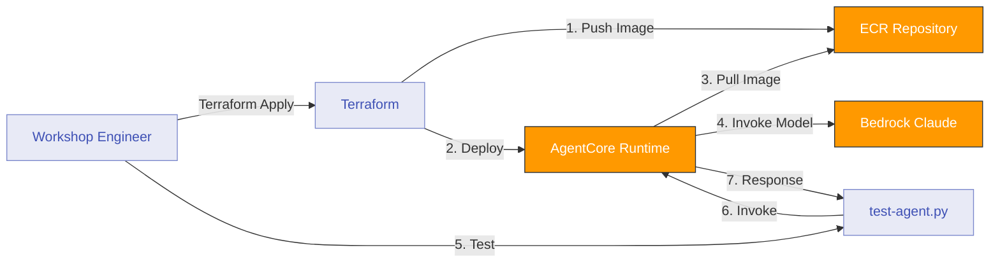

# Module 1: Deploy MarketPulse Agent to AgentCore Runtime

**Duration:** 30 minutes  
**Prerequisites:** Completed [Introduction](00-introduction.md)

## Learning Objectives

By the end of this module, you will:

1. Understand how AgentCore Runtime hosts containerised agents
2. Build and deploy a Strands-based agent to Runtime
3. Invoke the agent and receive a response
4. Inspect agent logs in CloudWatch

## What is AgentCore Runtime?

AgentCore Runtime is a fully managed container runtime for AI agents. It handles:

- **Container orchestration** - Scaling, health checks, deployments
- **Model integration** - Direct access to Bedrock models
- **Logging** - Automatic CloudWatch Logs integration
- **Networking** - VPC configuration and security groups

You provide a Docker image, Runtime handles the infrastructure.

## Architecture: Module 1



## The MarketPulse Agent (Initial Version)

In this module, the agent has **no tools**. It's a simple conversational agent that understands the FSI domain but cannot fetch live data yet.

**Agent capabilities in Module 1:**
- Respond to queries about stock markets
- Explain financial concepts
- Provide general market commentary
- Cannot fetch real stock prices (we add this in Module 2)

## Step 1: Review the Agent Code

The agent code is already provided in `agent/app.py`:

```python
from bedrock_agentcore.runtime import BedrockAgentCoreApp
from strands import Agent
from strands.models import BedrockModel

# Initialise AgentCore app
app = BedrockAgentCoreApp()

# Configure Bedrock model from environment variable
model_id = os.environ.get("BEDROCK_MODEL_ID", "anthropic.claude-sonnet-4-5-20250929-v1:0")
model = BedrockModel(model_id=model_id)

# Create the MarketPulse agent
agent = Agent(
    model=model,
    tools=[],  # Tools will be added in later modules
    system_prompt="""
You are MarketPulse, an AI investment brief assistant for financial advisors.

Your role is to help advisors prepare for client meetings by providing:
- Current stock information (when tools are available)
- Risk assessments based on client profiles (when tools are available)
- Market calendar information (when tools are available)

Always be professional, concise, and focused on actionable insights.

In this initial version, you don't have access to live data tools yet.
Provide general guidance based on your training data knowledge, and acknowledge
that you'll have more capabilities as additional modules are enabled.
"""
)

@app.entrypoint
def marketpulse_agent(payload):
    """
    Agent invocation entrypoint.
    
    AgentCore Runtime will call this function with the request payload.
    The payload contains a 'prompt' field with the user's query.
    
    Returns the agent's response as a string.
    """
    user_input = payload.get("prompt")
    print(f"MarketPulse received query: {user_input}")
    
    response = agent(user_input)
    
    # Extract text response from Strands agent
    return response.message['content'][0]['text']

if __name__ == "__main__":
    app.run()
```

**Key components:**

1. **BedrockAgentCoreApp** - Wrapper that makes the agent compatible with Runtime
2. **BedrockModel** - Configuration for which Bedrock model to use (from environment variable)
3. **Agent** - Strands agent with model, tools (empty for now), and system prompt
4. **@app.entrypoint decorator** - Defines the function that Runtime calls with each request
5. **Payload handling** - Extract prompt, invoke agent, return response text

## Step 2: Review the Dockerfile

The Dockerfile packages the agent code:

```dockerfile
FROM public.ecr.aws/docker/library/python:3.11-slim

WORKDIR /app

COPY requirements.txt requirements.txt
RUN pip install --no-cache-dir -r requirements.txt && \
    pip install --no-cache-dir aws-opentelemetry-distro==0.10.1

# Create non-root user for security
RUN useradd -m -u 1000 bedrock_agentcore
USER bedrock_agentcore

EXPOSE 8080
EXPOSE 8000

COPY . .

# Health check endpoint
HEALTHCHECK --interval=30s --timeout=3s --start-period=5s --retries=3 \
  CMD curl -f http://localhost:8080/ping || exit 1

CMD ["opentelemetry-instrument", "python", "app.py"]
```

**Key Dockerfile features:**
- Uses AWS public ECR base image
- Installs OpenTelemetry for observability (used in Module 7)
- Runs as non-root user for security
- Includes health check endpoint that Runtime uses
- Exposes ports 8080 (agent) and 8000 (metrics)

## Step 3: Configure Terraform

Create `terraform/terraform.tfvars` from the example:

```bash
cp terraform/terraform.tfvars.example terraform/terraform.tfvars
```

Edit `terraform/terraform.tfvars`:

```hcl
# Project Configuration
project_name = "marketpulse"
environment  = "workshop"
aws_region   = "ap-southeast-2"

# Bedrock Model
bedrock_model_id = "anthropic.claude-sonnet-4-5-20250929-v1:0"

# Feature Flags (Module 1: All disabled initially)
enable_gateway       = false
enable_http_target   = false
enable_lambda_target = false
enable_mcp_target    = false
enable_memory        = false
enable_identity      = false
enable_observability = false

# Tags (optional)
tags = {
  Workshop  = "AWS AgentCore MarketPulse"
  ManagedBy = "Terraform"
}
```

**Important:** In Module 1, the Runtime is always deployed (no feature flag needed). Gateway and other components are disabled.

## Step 4: Build and Deploy

The deployment requires a specific order due to dependencies:

**Step 4a: Create ECR Repository**

First, run Terraform to create the ECR repository:

```bash
cd terraform
terraform init
terraform plan
terraform apply
```

**Expected behaviour:** The ECR repository will be created, but the Runtime deployment will fail because no container image exists yet. This is expected and correct.

**Step 4b: Build and Push Image**

Now that the ECR repository exists, build and push the Docker image:

```bash
# From project root
./scripts/build-agent.sh
```

This script:
1. Builds the Docker image
2. Authenticates Docker to ECR
3. Tags the image
4. Pushes to the ECR repository created in Step 4a

**Step 4c: Deploy Runtime**

Finally, run Terraform again to create the Runtime with the now-available image:

```bash
cd terraform
terraform apply
```

This time the Runtime deployment will succeed because the container image exists in ECR.

**What Terraform creates:**

- ECR repository for agent images
- IAM role for the agent with Bedrock permissions
- AgentCore Runtime instance
- CloudWatch Log Group for agent logs

**Expected output:**

```
Apply complete! Resources: 6 added, 0 changed, 0 destroyed.

Outputs:

agent_endpoint_id = "endpoint-abc123"
agent_endpoint_name = "marketpulse_workshop_agent_endpoint"
agent_runtime_arn = "arn:aws:bedrock-agentcore:ap-southeast-2:123456789012:runtime/runtime-xyz789"
agent_runtime_id = "runtime-xyz789"
ecr_repository_name = "marketpulse-workshop-agent"
ecr_repository_url = "123456789012.dkr.ecr.ap-southeast-2.amazonaws.com/marketpulse-workshop-agent"
runtime_name = "marketpulse_workshop_agent"
test_command = "python scripts/test-agent.py"
next_phase = "Phase 2: Enable gateway and runtime"
```

## Step 5: Test the Agent

Use the provided test script:

```bash
# From project root
python3 scripts/test-agent.py
```

The script sends a hardcoded test prompt: "Hello! Can you introduce yourself as MarketPulse?"

**Expected response:**

```
AWS AgentCore Workshop: Testing MarketPulse Agent
============================================================

Retrieving agent configuration from Terraform outputs...
✓ Runtime ARN: arn:aws:bedrock-agentcore:ap-southeast-2:123456789012:runtime/runtime-xyz789
✓ Endpoint Name: marketpulse_workshop_agent_endpoint

Sending test prompt: Hello! Can you introduce yourself as MarketPulse?

Invoking agent runtime...
  Runtime ARN: arn:aws:bedrock-agentcore:ap-southeast-2:123456789012:runtime/runtime-xyz789
  Session ID: test-session-a1b2c3d4-...

Response content type: application/json
Processing JSON response...

Agent Response:
------------------------------------------------------------
Hello! I'm MarketPulse, your AI investment brief assistant designed
to help financial advisors prepare for client meetings.

I can assist you with:
- Stock market information and analysis
- Risk assessments based on client investment profiles  
- Market calendar and trading day information

In this initial phase, I don't yet have access to live data tools,
but as we progress through the workshop modules, I'll gain the ability
to fetch real-time stock prices, assess risk profiles, and check
market calendars.

How can I help you prepare for your next client meeting?
------------------------------------------------------------

Session ID: test-session-a1b2c3d4-...
Request ID: req-xyz123
Content Type: application/json

✓ Agent test successful!
```

## Step 6: Inspect Agent Logs

View agent logs in CloudWatch:

```bash
# Log group format: /aws/bedrock/agent/<agent_name>
aws logs tail /aws/bedrock/agent/marketpulse_workshop_agent --follow
```

**What to look for:**

```
[INFO] MarketPulse received query: Hello! Can you introduce yourself as MarketPulse?
[INFO] Agent processing request...
[INFO] Response generated
```

Alternatively, view logs in the AWS Console:
1. Navigate to CloudWatch > Log Groups
2. Select `/aws/bedrock/agent/marketpulse_workshop_agent`
3. View the latest log stream

**Note:** The actual log group name uses underscores (not hyphens) as required by AWS naming conventions.

## Verification Checklist

- [ ] Agent container built and pushed to ECR
- [ ] Terraform apply completed successfully
- [ ] `agent_endpoint` output received
- [ ] Test script connects to agent
- [ ] Agent responds to queries
- [ ] Logs visible in CloudWatch

## Common Issues

### Build fails with "Cannot connect to Docker daemon"

**Cause:** Docker is not running.

**Solution:**
```bash
# macOS/Windows: Start Docker Desktop
# Linux:
sudo systemctl start docker
```

### Terraform apply fails with "Insufficient permissions"

**Cause:** AWS credentials lack required permissions.

**Solution:** Ensure your IAM user/role has:
- `bedrock:*` permissions
- `ec2:*` permissions for VPC
- `iam:*` permissions for roles
- `ecr:*` permissions for container registry
- `logs:*` permissions for CloudWatch

### Agent responds with "Model access denied"

**Cause:** Bedrock model access not enabled.

**Solution:**
1. Navigate to AWS Console > Bedrock > Model access
2. Select "Claude 3 Sonnet"
3. Click "Request model access"
4. Wait for approval (usually instant)

### Test script times out

**Cause:** Agent is still starting up (cold start can take 30-60 seconds).

**Solution:** Wait 1 minute after Terraform apply, then retry.

## Understanding What You Built

### Container Lifecycle

1. **Build time** - Docker packages your code and dependencies
2. **Push time** - ECR stores the image
3. **Deploy time** - Terraform tells Runtime to use the image
4. **Start time** - Runtime pulls image and starts container
5. **Invoke time** - Your test script sends a request
6. **Response time** - Agent processes query and returns response

### IAM Permissions

The agent's IAM role allows:

```json
{
  "Effect": "Allow",
  "Action": [
    "bedrock:InvokeModel",
    "bedrock:InvokeModelWithResponseStream",
    "logs:CreateLogGroup",
    "logs:CreateLogStream",
    "logs:PutLogEvents"
  ],
  "Resource": "*"
}
```

This grants access to:
- Bedrock for model inference
- CloudWatch for logging

Later modules will add permissions for Gateway, Memory, etc.

### Cost Considerations

**Module 1 costs:**

- **AgentCore Runtime** - ~$0.20/hour for a small instance
- **Bedrock Claude 3 Sonnet** - $3 per 1M input tokens, $15 per 1M output tokens
- **CloudWatch Logs** - $0.50/GB ingested
- **ECR Storage** - $0.10/GB/month

**Estimated cost for workshop:** ~$2-5 total if completed in one session.

## FSI Relevance: Runtime in Production

In a financial services context, AgentCore Runtime provides:

1. **Compliance** - Containers run in your VPC, data doesn't leave your AWS account
2. **Audit** - All invocations are logged with request/response pairs
3. **Scalability** - Runtime auto-scales based on load
4. **Isolation** - Each agent runs in its own container namespace
5. **Versioning** - Container tags enable rollback to previous versions

This is critical for regulated workloads where you need control over the runtime environment.

## Discussion Questions

1. **How does AgentCore Runtime compare to how your team currently deploys applications?**
   - Consider: ECS, EKS, Lambda, EC2

2. **What benefits do you see from managed infrastructure?**
   - Think about: Operational overhead, scaling, monitoring

3. **What concerns do you have about containerised AI agents?**
   - Consider: Cold starts, debugging, resource limits

## Next Steps

You've successfully deployed an AI agent to AgentCore Runtime. The agent can converse but has no access to external data.

In [Module 2](02-gateway-http.md), you'll add the AgentCore Gateway and connect your first tool: a stock price API.

**Before proceeding:**

- Ensure the agent responds to test queries
- Review the CloudWatch logs to understand logging format  
- Note the `agent_runtime_arn` and `agent_endpoint_name` from Terraform outputs

---

**Key Takeaways:**

- AgentCore Runtime hosts containerised agents with managed infrastructure
- Strands provides the agent framework; Runtime provides the hosting
- Terraform manages deployment declaratively with feature flags
- Logs automatically flow to CloudWatch for debugging
- Module 1 establishes the foundation; subsequent modules add capabilities