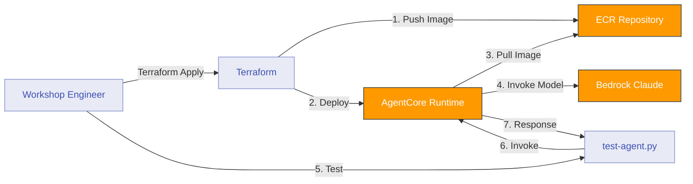

# Module 1: Deploy MarketPulse Agent to AgentCore Runtime

**Duration:** 30 minutes  
**Prerequisites:** Completed [Introduction](00-introduction.md)

## Learning Objectives

By the end of this module, you will:

1. Understand how AgentCore Runtime hosts containerised agents
2. Build and deploy a Strands-based agent to Runtime
3. Invoke the agent and receive a response
4. Inspect agent logs in CloudWatch

## What is AgentCore Runtime?

AgentCore Runtime is a fully managed container runtime for AI agents. It handles:

- **Container orchestration** - Scaling, health checks, deployments
- **Model integration** - Direct access to Bedrock models
- **Logging** - Automatic CloudWatch Logs integration
- **Networking** - VPC configuration and security groups

You provide a Docker image, Runtime handles the infrastructure.

## Architecture: Module 1


```mermaid
flowchart LR
    User[Workshop Engineer] -->|Terraform Apply| TF[Terraform]
    TF -->|1. Push Image| ECR[ECR Repository]
    TF -->|2. Deploy| Runtime[AgentCore Runtime]
    Runtime -->|3. Pull Image| ECR
    Runtime -->|4. Invoke Model| Bedrock[Bedrock Claude]
    
    User -->|5. Test| Script[test-agent.py]
    Script -->|6. Invoke| Runtime
    Runtime -->|7. Response| Script
    
    classDef aws fill:#FF9900,stroke:#232F3E,color:#FFFFFF
    classDef user fill:#E8EAF6,stroke:#7986CB,color:#3F51B5
    
    class ECR,Runtime,Bedrock aws
    class User,TF,Script user
```

## The MarketPulse Agent (Initial Version)

In this module, the agent has **no tools**. It's a simple conversational agent that understands the FSI domain but cannot fetch live data yet.

**Agent capabilities in Module 1:**
- Respond to queries about stock markets
- Explain financial concepts
- Provide general market commentary
- Cannot fetch real stock prices (we add this in Module 2)

## Step 1: Review the Agent Code

The agent code is already provided in `agent/app.py`:

```python
from bedrock_agentcore.runtime import BedrockAgentCoreApp
from strands import Agent
from strands.models import BedrockModel

# Initialise AgentCore app
app = BedrockAgentCoreApp()

# Configure Bedrock model from environment variable
model_id = os.environ.get("BEDROCK_MODEL_ID", "au.anthropic.claude-sonnet-4-5-20250929-v1:0")
model = BedrockModel(model_id=model_id)


def build_system_prompt(available_tools: list) -> str:
    """Build the system prompt for the tools available right now."""
    # With ENABLE_GATEWAY=false there are no tools, so the agent is told to say
    # that any figure it mentions is illustrative rather than live market data.
    ...


@app.entrypoint
def marketpulse_agent(payload):
    """
    Agent invocation entrypoint.

    AgentCore Runtime will call this function with the request payload.
    The payload contains a 'prompt' field with the user's query.

    Returns the agent's response as a string.
    """
    user_input = payload.get("prompt")
    logger.info(f"MarketPulse received query: {user_input}")

    tools = gateway_tools()          # empty until Module 2 enables the Gateway
    system_prompt = build_system_prompt(tools)

    agent = Agent(model=model, tools=tools, system_prompt=system_prompt)
    response = agent(user_input)

    # Extract text response from Strands agent
    return response.message['content'][0]['text']

if __name__ == "__main__":
    app.run()
```

The file contains more than this: the Gateway connection used from Module 2, and the
memory session handling used from Module 5. Both stay inert while their feature flags
are `false`, so Module 1 runs a plain conversational agent.

**Key components:**

1. **BedrockAgentCoreApp** - Wrapper that makes the agent compatible with Runtime
2. **BedrockModel** - Configuration for which Bedrock model to use (from environment variable)
3. **Agent** - Strands agent with model, tools (empty for now), and system prompt
4. **@app.entrypoint decorator** - Defines the function that Runtime calls with each request
5. **Payload handling** - Extract prompt, invoke agent, return response text

## Step 2: Review the Dockerfile

The Dockerfile packages the agent code:

```dockerfile
FROM public.ecr.aws/docker/library/python:3.11-slim

WORKDIR /app

COPY requirements.txt requirements.txt
RUN apt-get update && apt-get install -y --no-install-recommends curl && \
    rm -rf /var/lib/apt/lists/* && \
    pip install --no-cache-dir -r requirements.txt && \
    pip install --no-cache-dir "aws-opentelemetry-distro>=0.18.0,<1.0.0"

# Create non-root user for security
RUN useradd -m -u 1000 bedrock_agentcore
USER bedrock_agentcore

EXPOSE 8080
EXPOSE 8000

COPY . .

# Health check endpoint
HEALTHCHECK --interval=30s --timeout=3s --start-period=5s --retries=3 \
  CMD curl -f http://localhost:8080/ping || exit 1

CMD ["opentelemetry-instrument", "python", "app.py"]
```

**Key Dockerfile features:**
- Uses AWS public ECR base image
- Installs curl so the health check can call `/ping`
- Installs OpenTelemetry for observability (used in Module 7)
- Runs as non-root user for security
- Includes health check endpoint that Runtime uses
- Exposes ports 8080 (agent) and 8000 (metrics)

## Step 3: Configure Terraform

Create `terraform/terraform.tfvars` from the example:

```bash
cp terraform/terraform.tfvars.example terraform/terraform.tfvars
```

Edit `terraform/terraform.tfvars`:

```hcl
# Project Configuration
project_name = "marketpulse-workshop"
environment  = "dev"
aws_region   = "ap-southeast-2"

# Bedrock Model
bedrock_model_id = "au.anthropic.claude-sonnet-4-5-20250929-v1:0"

# Feature Flags (Module 1: All disabled initially)
enable_gateway       = false
enable_http_target   = false
enable_lambda_target = false
enable_mcp_target    = false
enable_memory        = false
enable_identity      = false
enable_observability = false

# Tags (optional)
tags = {
  Workshop  = "AWS AgentCore MarketPulse"
  ManagedBy = "Terraform"
}
```

**Important:** In Module 1, the Runtime is always deployed (no feature flag needed). Gateway and other components are disabled.

## Step 4: Build and Deploy

**Important - Docker Setup (macOS users):**

Before running Docker commands, ensure Colima is installed and running:

```bash
# Install Colima (if not already installed)
brew install colima

# Start Colima with aarch64 architecture
colima start --arch aarch64

# Verify Docker is working
docker ps  # Should show no errors
```

**Note:** If you're using Docker Desktop instead of Colima, ensure it's running before proceeding.

Terraform builds and pushes the container image as part of the apply, so a single
command deploys everything:

```bash
cd terraform
terraform init
terraform plan
terraform apply
```

Terraform creates the ECR repository, runs `scripts/build-container.sh agent` to build
and push the image, then creates the Runtime from that image. The build step needs a
running Docker daemon, which is why Colima or Docker Desktop must be up first.

**Rebuilding later:** whenever you change `agent/app.py`, `agent/Dockerfile` or
`agent/requirements.txt`, the next `terraform apply` rebuilds and pushes automatically.
To rebuild by hand, run `./scripts/build-agent.sh` from the project root.

**What Terraform creates:**

- ECR repository for agent images
- IAM role for the agent with Bedrock permissions
- AgentCore Runtime instance
- CloudWatch Log Group for agent logs

**Expected output:**

```
Apply complete! Resources: 6 added, 0 changed, 0 destroyed.

Outputs:

agent_endpoint_id = "endpoint-abc123"
agent_endpoint_name = "marketpulse_workshop_dev_agent_endpoint"
agent_runtime_arn = "arn:aws:bedrock-agentcore:ap-southeast-2:123456789012:runtime/runtime-xyz789"
agent_runtime_id = "runtime-xyz789"
ecr_repository_name = "marketpulse-workshop-agent"
ecr_repository_url = "123456789012.dkr.ecr.ap-southeast-2.amazonaws.com/marketpulse-workshop-agent"
runtime_name = "marketpulse_workshop_dev_agent"
test_command = "python scripts/test-agent.py"
next_phase = "Phase 2: Enable gateway and runtime"
```

## Step 5: Test the Agent

Use the provided test script:

```bash
# From project root
python3 scripts/test-agent.py
```

The script sends a hardcoded test prompt: "Hello! Can you introduce yourself as MarketPulse?"

**Expected response:**

```
AWS AgentCore Workshop: Testing MarketPulse Agent
============================================================

Retrieving agent configuration from Terraform outputs...
✓ Runtime ARN: arn:aws:bedrock-agentcore:ap-southeast-2:123456789012:runtime/runtime-xyz789
✓ Endpoint Name: marketpulse_workshop_dev_agent_endpoint

Sending test prompt: Hello! Can you introduce yourself as MarketPulse?

Invoking agent runtime...
  Runtime ARN: arn:aws:bedrock-agentcore:ap-southeast-2:123456789012:runtime/runtime-xyz789
  Session ID: test-session-a1b2c3d4-...

Response content type: application/json
Processing JSON response...

Agent Response:
------------------------------------------------------------
Hello! I'm MarketPulse, your AI investment brief assistant designed
to help financial advisors prepare for client meetings.

I can assist you with:
- Stock market information and analysis
- Risk assessments based on client investment profiles  
- Market calendar and trading day information

In this initial phase, I don't yet have access to live data tools,
but as we progress through the workshop modules, I'll gain the ability
to fetch real-time stock prices, assess risk profiles, and check
market calendars.

How can I help you prepare for your next client meeting?
------------------------------------------------------------

Session ID: test-session-a1b2c3d4-...
Request ID: req-xyz123
Content Type: application/json

✓ Agent test successful!
```

## Step 6: Inspect Agent Logs

View agent logs in CloudWatch:

```bash
# AgentCore writes to /aws/bedrock-agentcore/runtimes/<runtime-id>-<endpoint-name>
cd terraform
aws logs tail "$(terraform output -raw agent_log_group)" --follow
```

**What to look for:**

```
[INFO] MarketPulse received query: Hello! Can you introduce yourself as MarketPulse?
[INFO] Agent processing request...
[INFO] Response generated
```

Alternatively, view logs in the AWS Console:
1. Navigate to CloudWatch > Log Groups
2. Select the log group printed by `terraform output -raw agent_log_group`
3. View the latest log stream

**Note:** The actual log group name uses underscores (not hyphens) as required by AWS naming conventions.

## Verification Checklist

- [ ] Agent container built and pushed to ECR
- [ ] Terraform apply completed successfully
- [ ] `agent_endpoint` output received
- [ ] Test script connects to agent
- [ ] Agent responds to queries
- [ ] Logs visible in CloudWatch

## Common Issues

### Build fails with "Cannot connect to Docker daemon"

**Cause:** Docker is not running.

**Solution:**
```bash
# macOS/Windows: Start Docker Desktop
# Linux:
sudo systemctl start docker
```

### Terraform apply fails with "Insufficient permissions"

**Cause:** AWS credentials lack required permissions.

**Solution:** Ensure your IAM user/role has:
- `bedrock:*` permissions
- `ec2:*` permissions for VPC
- `iam:*` permissions for roles
- `ecr:*` permissions for container registry
- `logs:*` permissions for CloudWatch

### Agent responds with "Model access denied"

**Cause:** Bedrock model access not enabled.

**Solution:**
1. Navigate to AWS Console > Bedrock > Model access
2. Select "Claude Sonnet 4.5"
3. Click "Request model access"
4. Wait for approval (usually instant)

### Test script times out

**Cause:** Agent is still starting up (cold start can take 30-60 seconds).

**Solution:** Wait 1 minute after Terraform apply, then retry.

## Understanding What You Built

### Container Lifecycle

1. **Build time** - Docker packages your code and dependencies
2. **Push time** - ECR stores the image
3. **Deploy time** - Terraform tells Runtime to use the image
4. **Start time** - Runtime pulls image and starts container
5. **Invoke time** - Your test script sends a request
6. **Response time** - Agent processes query and returns response

### IAM Permissions

The agent's IAM role allows:

```json
{
  "Effect": "Allow",
  "Action": [
    "bedrock:InvokeModel",
    "bedrock:InvokeModelWithResponseStream",
    "logs:CreateLogGroup",
    "logs:CreateLogStream",
    "logs:PutLogEvents"
  ],
  "Resource": "*"
}
```

This grants access to:
- Bedrock for model inference
- CloudWatch for logging

Later modules will add permissions for Gateway, Memory, etc.

### Cost Considerations

**Module 1 costs:**

- **AgentCore Runtime** - ~$0.20/hour for a small instance
- **Bedrock Claude Sonnet 4.5** - $3 per 1M input tokens, $15 per 1M output tokens
- **CloudWatch Logs** - $0.50/GB ingested
- **ECR Storage** - $0.10/GB/month

**Estimated cost for workshop:** ~$2-5 total if completed in one session.

## FSI Relevance: Runtime in Production

In a financial services context, AgentCore Runtime provides:

1. **Compliance** - Containers run in your VPC, data doesn't leave your AWS account
2. **Audit** - All invocations are logged with request/response pairs
3. **Scalability** - Runtime auto-scales based on load
4. **Isolation** - Each agent runs in its own container namespace
5. **Versioning** - Container tags enable rollback to previous versions

This is critical for regulated workloads where you need control over the runtime environment.

## Discussion Questions

1. **How does AgentCore Runtime compare to how your team currently deploys applications?**
   - Consider: ECS, EKS, Lambda, EC2

2. **What benefits do you see from managed infrastructure?**
   - Think about: Operational overhead, scaling, monitoring

3. **What concerns do you have about containerised AI agents?**
   - Consider: Cold starts, debugging, resource limits

## Next Steps

You've successfully deployed an AI agent to AgentCore Runtime. The agent can converse but has no access to external data.

In [Module 2](02-gateway-http.md), you'll add the AgentCore Gateway and connect your first tool: a stock price API.

**Before proceeding:**

- Ensure the agent responds to test queries
- Review the CloudWatch logs to understand logging format  
- Note the `agent_runtime_arn` and `agent_endpoint_name` from Terraform outputs

---

**Key Takeaways:**

- AgentCore Runtime hosts containerised agents with managed infrastructure
- Strands provides the agent framework; Runtime provides the hosting
- Terraform manages deployment declaratively with feature flags
- Logs automatically flow to CloudWatch for debugging
- Module 1 establishes the foundation; subsequent modules add capabilities