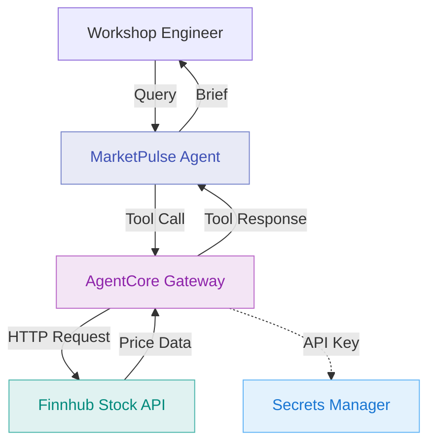

# Module 2: Add Stock Price API as HTTP Gateway Target

**Duration:** 20 minutes  
**Prerequisites:** Completed [Module 1](01-runtime.md)

## Learning Objectives

By the end of this module, you will:

1. Understand how AgentCore Gateway integrates external APIs
2. Register an HTTP target pointing to Finnhub stock price API
3. Update the agent to use the new tool
4. Query the agent for real-time stock prices
5. Understand the difference between tools and targets

## What is AgentCore Gateway?

AgentCore Gateway is a managed integration layer that:

- **Exposes external services as tools** - APIs, Lambda functions, MCP servers
- **Handles authentication** - API keys, OAuth tokens, AWS SigV4
- **Manages rate limiting** - Prevents overwhelming external services
- **Centralises logging** - All tool calls are logged for audit
- **Provides schema validation** - Ensures requests/responses match expected formats

Gateway sits between your agent and external systems, providing a clean abstraction layer.

## Architecture: Module 2



## Why Finnhub?

**Finnhub** provides a free tier stock data API that's perfect for workshops:

- **Free tier** - 60 API calls/minute with free API key
- **No credit card** - Registration only requires email
- **Real-time data** - Current prices, day ranges, trading volume
- **Simple API** - Single endpoint for quote data
- **Reliable** - Backed by professional market data providers

**API endpoint:**
```
GET https://finnhub.io/api/v1/quote?symbol=AAPL&token=YOUR_API_KEY
```

**Response:**
```json
{
  "c": 184.25,  // Current price
  "h": 185.10,  // Day high
  "l": 182.50,  // Day low
  "o": 183.00,  // Open price
  "pc": 183.50, // Previous close
  "t": 1708322400 // Timestamp
}
```

## Step 1: Get a Finnhub API Key

1. Navigate to https://finnhub.io/register
2. Register with your email
3. Verify your email
4. Copy your API key from the dashboard
5. Store it in AWS Secrets Manager:

```bash
aws secretsmanager create-secret \
    --name marketpulse/finnhub-api-key \
    --secret-string "your_api_key_here" \
    --region ap-southeast-2
```

## Step 2: Update Agent Code

Edit `agent/app.py` to add the stock price tool:

```python
from bedrock_agentcore import BedrockAgentCoreApp
from strands_agents import Agent

agent = Agent(
    name="MarketPulse",
    model="anthropic.claude-sonnet-4-5-20250929-v1:0",
    instructions="""
    You are MarketPulse, an AI investment brief assistant for financial advisors.
    
    You now have access to real-time stock price data via the get_stock_price tool.
    Always use this tool when asked about current stock prices.
    
    Present price information clearly:
    - Current price
    - Day range (low to high)
    - Price change from previous close
    
    Always cite that data is from Finnhub and is real-time.
    """
)

# Tool will be registered by Gateway - agent just declares it
@agent.tool
def get_stock_price(ticker: str) -> dict:
    """
    Get real-time stock price data for a ticker symbol.
    
    Args:
        ticker: Stock ticker symbol (e.g., 'AAPL', 'TSLA', 'MSFT')
    
    Returns:
        dict: Current price, day range, and previous close
    """
    # Gateway implementation - this is just the schema
    pass

app = BedrockAgentCoreApp(agent)

if __name__ == "__main__":
    app.run(host="0.0.0.0", port=8080)
```

**Key changes:**

1. **Updated instructions** - Agent knows it has access to stock prices
2. **Tool declaration** - `@agent.tool` decorator defines the tool schema
3. **No implementation** - Gateway handles the actual HTTP call

## Step 3: Configure Terraform

Edit `terraform/terraform.tfvars`:

```hcl
# Feature Flags (Enable Gateway and HTTP target)
enable_runtime = true
enable_gateway = true
enable_http_target = true
enable_lambda_target = false
enable_mcp_target = false
enable_memory = false
enable_identity = false
enable_observability = false
```

**What changed:** `enable_gateway` and `enable_http_target` are now `true`.

## Step 4: Rebuild and Deploy

Rebuild the agent with the updated tool:

```bash
./scripts/build-agent.sh
```

Deploy with Terraform:

```bash
cd terraform
terraform apply
```

**What Terraform creates:**

- AgentCore Gateway instance
- HTTP target pointing to Finnhub API
- IAM permissions for Gateway access
- Secrets Manager integration for API key

**Expected output:**

```
Apply complete! Resources: 3 added, 1 changed, 0 destroyed.

Outputs:

agent_endpoint = "https://abc123.agentcore.ap-southeast-2.amazonaws.com"
gateway_id = "gtw-xyz789"
http_target_id = "tgt-finnhub-123"
```

## Step 5: Test Stock Price Queries

Test with a simple stock query:

```bash
python scripts/test-agent.py "What is the current price of Apple stock?"
```

**Expected response:**

```
Agent Response:
===============

Current Market Data for Apple (AAPL):

Price: $184.25
Day Range: $182.50 - $185.10
Previous Close: $183.50
Change: +$0.75 (+0.41%)

This data is real-time from Finnhub as of 2:15 PM AEDT.

Apple is trading within its day range, showing moderate positive movement 
from yesterday's close. Would you like me to assess this against a specific 
client's risk profile?
```

Test with multiple tickers:

```bash
python scripts/test-agent.py "Compare current prices for Apple and Microsoft"
```

The agent will call `get_stock_price` twice (once for AAPL, once for MSFT) and present a comparison.

## Step 6: Inspect Gateway Logs

View Gateway logs to see the HTTP calls:

```bash
aws logs tail /aws/bedrock-agentcore/gateway/marketpulse --follow
```

**What to look for:**

```
[INFO] Tool called: get_stock_price
[INFO] Parameters: {"ticker": "AAPL"}
[INFO] HTTP Target: finnhub-stock-api
[INFO] Request: GET https://finnhub.io/api/v1/quote?symbol=AAPL
[INFO] Response: 200 OK (142ms)
[INFO] Returned: {"c": 184.25, "h": 185.10, "l": 182.50, ...}
```

## Understanding Tools vs Targets

This is a critical concept in AgentCore Gateway:

### Tool (Agent's View)

```python
@agent.tool
def get_stock_price(ticker: str) -> dict:
    """Get real-time stock price data"""
    pass
```

The agent sees a Python function signature. It knows:
- **What it does** - Get stock price
- **What it needs** - A ticker symbol
- **What it returns** - Price data dict

### Target (Gateway's Configuration)

```hcl
resource "aws_agentcore_http_target" "finnhub" {
  name = "finnhub-stock-api"
  url  = "https://finnhub.io/api/v1/quote"
  
  authentication {
    type = "api_key"
    api_key_secret_arn = aws_secretsmanager_secret.finnhub_key.arn
  }
  
  request_mapping {
    query_parameters = {
      symbol = "$.ticker"
      token  = "${secret:api_key}"
    }
  }
}
```

Gateway knows:
- **Where to call** - Finnhub URL
- **How to authenticate** - API key from Secrets Manager
- **How to map parameters** - `ticker` → `symbol` query parameter

### The Bridge

Gateway connects tools to targets:

```hcl
resource "aws_agentcore_tool_association" "stock_price" {
  agent_id  = aws_agentcore_agent.marketpulse.id
  tool_name = "get_stock_price"
  target_id = aws_agentcore_http_target.finnhub.id
}
```

When the agent calls `get_stock_price("AAPL")`:

1. Gateway receives the tool call
2. Looks up the target (Finnhub HTTP API)
3. Maps `ticker="AAPL"` to `symbol=AAPL` query parameter
4. Adds API key from Secrets Manager
5. Sends `GET https://finnhub.io/api/v1/quote?symbol=AAPL&token=xxx`
6. Returns response to agent

The agent never sees HTTP details, URLs, or API keys.

## Verification Checklist

- [ ] Finnhub API key stored in Secrets Manager
- [ ] Agent rebuilt with stock price tool
- [ ] Terraform apply successful
- [ ] `gateway_id` and `http_target_id` outputs received
- [ ] Test query returns real stock prices
- [ ] Gateway logs show HTTP calls to Finnhub

## Common Issues

### "Tool not found" error

**Cause:** Tool association not created in Gateway.

**Solution:** Check Terraform outputs for `http_target_id`. If missing:
```bash
terraform taint aws_agentcore_tool_association.stock_price
terraform apply
```

### "Authentication failed" on Finnhub

**Cause:** API key incorrect or not found in Secrets Manager.

**Solution:**
```bash
# Verify secret exists
aws secretsmanager get-secret-value \
    --secret-id marketpulse/finnhub-api-key \
    --region ap-southeast-2

# Update if needed
aws secretsmanager update-secret \
    --secret-id marketpulse/finnhub-api-key \
    --secret-string "your_correct_api_key"
```

### Rate limit errors

**Cause:** Free tier allows 60 calls/minute. Exceeded if testing heavily.

**Solution:** Wait 1 minute between test batches. Upgrade to paid tier if needed for production.

### Agent returns stale data

**Cause:** Agent may be using cached responses.

**Solution:** Gateway caching is disabled by default. If issues persist:
```bash
# Force agent restart
terraform taint aws_agentcore_agent.marketpulse
terraform apply
```

## FSI Relevance: Gateway in Production

In financial services, AgentCore Gateway provides:

1. **API Management** - Single point to manage all external integrations
2. **Audit Trail** - Every API call logged with request/response
3. **Security** - API keys never exposed to agent code
4. **Rate Limiting** - Prevent costly API overruns
5. **Fallback Handling** - Configure backup data sources if primary fails

This is critical for FSI where:
- Market data costs money (Bloomberg, Reuters)
- Every external call must be audited
- API keys are sensitive credentials
- Rate limits prevent budget overruns

## Discussion Questions

1. **What external services does your team currently integrate with?**
   - Consider: Market data, credit scoring, KYC services

2. **How do you currently manage API keys and credentials?**
   - Think about: Hardcoded, environment variables, secret managers

3. **What benefits do you see from centralising integration logic in Gateway?**
   - Consider: Maintenance, security, observability

4. **When would you use HTTP target vs Lambda target?**
   - Think about: External APIs vs internal logic

## Cost Considerations

**Module 2 additional costs:**

- **AgentCore Gateway** - ~$0.10/hour
- **Secrets Manager** - $0.40/month per secret
- **Finnhub API** - Free tier (60 calls/minute)

**Estimated additional cost:** ~$1 for workshop duration.

## Next Steps

You've successfully connected an external API to your agent via AgentCore Gateway. The agent can now retrieve real-time stock prices.

In [Module 3](03-gateway-lambda.md), you'll add a Lambda target to perform risk assessment calculations internally.

**Before proceeding:**

- Test multiple stock tickers (AAPL, MSFT, TSLA, GOOGL)
- Review Gateway logs to understand request/response flow
- Ensure Secrets Manager contains your Finnhub API key

---

**Key Takeaways:**

- Gateway abstracts integration complexity from agent code
- Tools define "what", targets define "where" and "how"
- HTTP targets connect to external REST APIs
- Secrets Manager secures API credentials
- Tool associations link agent tools to Gateway targets
- All integration calls are centrally logged for audit