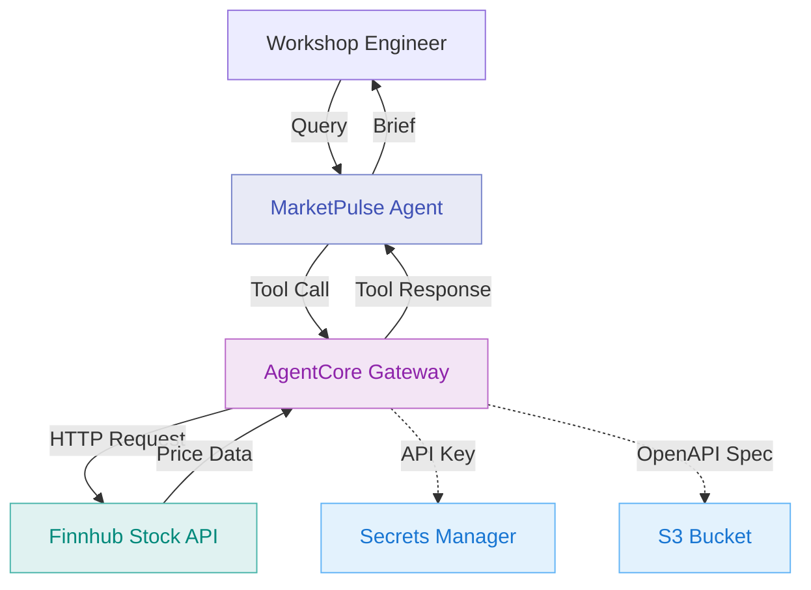

# Module 2: Add Stock Price API as HTTP Gateway Target

**Duration:** 20 minutes  
**Prerequisites:** Completed [Module 1](01-runtime.md)

## Learning Objectives

By the end of this module, you will:

1. Understand how AgentCore Gateway integrates external APIs
2. Register an HTTP target pointing to Finnhub stock price API
3. Understand how tool routing works between agent code and Gateway targets
4. Query the agent for real-time stock prices
5. Understand the difference between tools and targets

## What is AgentCore Gateway?

AgentCore Gateway is a managed integration layer that:

- **Exposes external services as tools** - APIs, Lambda functions, MCP servers
- **Handles authentication** - API keys, OAuth tokens, AWS SigV4
- **Manages rate limiting** - Prevents overwhelming external services
- **Centralises logging** - All tool calls are logged for audit
- **Provides schema validation** - Ensures requests/responses match expected formats

Gateway sits between your agent and external systems, providing a clean abstraction layer.

## Architecture: Module 2



## Why Finnhub?

**Finnhub** provides a free tier stock data API that's practical for workshops:

- **Free tier** - 60 API calls/minute with free API key
- **No credit card** - Registration only requires email
- **Real-time data** - Current prices, day ranges, trading volume
- **Simple API** - Single endpoint for quote data

**API endpoint:**
```
GET https://finnhub.io/api/v1/quote?symbol=AAPL&token=YOUR_API_KEY
```

**Response:**
```json
{
  "c": 184.25,  // Current price
  "h": 185.10,  // Day high
  "l": 182.50,  // Day low
  "o": 183.00,  // Open price
  "pc": 183.50, // Previous close
  "t": 1708322400 // Timestamp
}
```

## Step 1: Get a Finnhub API Key

1. Navigate to https://finnhub.io/register
2. Register with your email address
3. Verify your email
4. Copy your API key from the dashboard

You will provide this key via `terraform.tfvars` in Step 3. Terraform stores it in Secrets Manager automatically - no manual secret creation is required.

## Step 2: Review the Agent Code

The stock price tool is already declared in `agent/app.py`. You do not need to modify the agent code for this module.

Review the relevant section:

```python
from bedrock_agentcore.runtime import BedrockAgentCoreApp
from strands import Agent
from strands.models import BedrockModel

def get_stock_price(symbol: str) -> dict:
    """
    Retrieves current stock price and trading data for a ticker symbol.
    
    This tool is routed through AgentCore Gateway to the Finnhub API.
    
    Args:
        symbol: Stock ticker symbol (e.g., AAPL, MSFT, TSLA)
        
    Returns:
        dict: Stock quote data with current price, day range, etc.
    """
    # Implementation handled by AgentCore Gateway
    pass

# Build tool list based on enabled features
tools = []

if os.environ.get("ENABLE_GATEWAY", "false").lower() == "true":
    tools.append(get_stock_price)

agent = Agent(
    model=model,
    tools=tools,
    system_prompt=system_prompt
)
```

**What's happening here:**

- `get_stock_price` is a plain function with a docstring and type hints only
- The function body is empty (`pass`) because AgentCore Gateway handles the actual HTTP call
- The function is appended to `tools` only when `ENABLE_GATEWAY=true` is set as an environment variable
- Terraform sets this environment variable on the Runtime when `enable_gateway = true` in `terraform.tfvars`

When the agent calls `get_stock_price`, AgentCore intercepts the call and routes it to the Gateway target. The Gateway matches the call to the registered target by function name (which matches the OpenAPI `operationId`), appends the API key from Secrets Manager, and calls Finnhub directly.

## Step 3: Configure Terraform

Edit `terraform/terraform.tfvars` to enable Gateway and HTTP target, and add your Finnhub API key:

```hcl
# Feature Flags
enable_gateway       = true
enable_http_target   = true
enable_lambda_target = false
enable_mcp_target    = false
enable_memory        = false
enable_identity      = false
enable_observability = false

# Finnhub API Key (required when enable_http_target = true)
finnhub_api_key = "your_finnhub_api_key_here"
```

**What changed:** `enable_gateway` and `enable_http_target` are now `true`. The `finnhub_api_key` tells Terraform to store your key in Secrets Manager.

## Step 4: Deploy

Run Terraform to deploy the Gateway components:

```bash
cd terraform
terraform plan   # Review what will be created
terraform apply
```

**What Terraform creates:**

- IAM role for Gateway with permissions to invoke targets and read Secrets Manager
- S3 bucket for storing the OpenAPI specification
- OpenAPI spec describing the Finnhub quote endpoint (uploaded to S3)
- Secrets Manager secret containing your Finnhub API key
- AgentCore Gateway (via AWS CLI)
- Gateway API key credential provider linked to the secret
- Gateway HTTP target pointing to Finnhub, with the OpenAPI spec as its schema

Terraform also updates the Runtime's `ENABLE_GATEWAY` environment variable to `true`. This activates the `get_stock_price` tool in the running agent.

**You do not need to rebuild the agent container.** Terraform updates the Runtime environment variables in place. The existing image picks up the new configuration.

**Expected output:**

```
Apply complete! Resources: 8 added, 1 changed, 0 destroyed.

Outputs:

agent_endpoint_id = "ep-abc123"
agent_endpoint_name = "marketpulse_workshop_agent_endpoint"
agent_runtime_arn = "arn:aws:bedrock-agentcore:ap-southeast-2:123456789012:runtime/runtime-xyz789"
finnhub_target_configured = true
gateway_id = <sensitive>
openapi_spec_bucket = "marketpulse-workshop-openapi-specs"
```

`gateway_id` is marked sensitive and will not show as plain text. The value is stored in SSM Parameter Store at `/${project_name}/${environment}/gateway-id`.

Wait 1-2 minutes after apply completes for the Runtime to pick up the new environment variables.

## Step 5: Test Stock Price Queries

Use the dedicated stock price test script:

```bash
python scripts/test-stock.py
```

This script runs three queries against the agent: a single stock price, a multi-stock comparison, and a trading range query.

**Expected output:**

```
AWS AgentCore Workshop: Testing Stock Price Tool (Module 2)
======================================================================

Retrieving agent configuration from Terraform outputs...
✓ Runtime ARN: arn:aws:bedrock-agentcore:ap-southeast-2:123456789012:runtime/runtime-xyz789
✓ Endpoint Name: marketpulse_workshop_agent_endpoint
✓ Gateway ID: gtw-abc123

Running stock price tests...

Test 1/3: Single stock price query
Query: What is the current price of Apple stock (AAPL)?

Agent Response:
----------------------------------------------------------------------
Apple Inc. (AAPL) - Current Market Data

Current Price: $184.25
Day Range: $182.50 - $185.10
Open: $183.00
Previous Close: $183.50
Change: +$0.75 (+0.41%)

Data sourced from Finnhub (real-time).
----------------------------------------------------------------------
```

For multi-stock comparisons - the agent calls `get_stock_price` once per ticker and consolidates the results.

## Step 6: Inspect Agent Logs

The agent logs its activity to CloudWatch. View them with:

```bash
aws logs tail /aws/bedrock/agent/marketpulse_workshop_agent --follow \
    --region ap-southeast-2
```

Replace `marketpulse_workshop_agent` with your actual runtime name if you changed `project_name` or `environment` in `terraform.tfvars`.

**What to look for:**

```
[INFO] MarketPulse received query: What is the current price of Apple stock (AAPL)?
[INFO] Tools available: 1
[INFO] Gateway enabled - stock price tool available
```

You can also view the Gateway configuration in the AWS console:

1. Navigate to **Bedrock** > **AgentCore** > **Gateways**
2. Select your gateway
3. View the registered targets under **Targets**
4. See the `get-stock-price` target with its OpenAPI spec

## Understanding Tools vs Targets

This is a key concept in AgentCore Gateway:

### Tool (Agent's View)

```python
def get_stock_price(symbol: str) -> dict:
    """Retrieves current stock price and trading data for a ticker symbol."""
    pass
```

The agent sees a plain Python function signature. It knows:
- **What it does** - Get stock price data
- **What it needs** - A ticker symbol string
- **What it returns** - A dict of price data

The implementation is empty because the agent never executes it directly.

### Target (Gateway's Configuration)

The OpenAPI spec (stored in S3 and defined in `terraform/gateway.tf`) describes the external API:

```json
{
  "openapi": "3.0.0",
  "servers": [{ "url": "https://finnhub.io/api/v1" }],
  "paths": {
    "/quote": {
      "get": {
        "operationId": "get_stock_price",
        "parameters": [
          {
            "name": "symbol",
            "in": "query",
            "required": true,
            "schema": { "type": "string" }
          }
        ]
      }
    }
  }
}
```

The `operationId` (`get_stock_price`) is the link between the Python function and the API endpoint.

### The Bridge

The Gateway target is registered via AWS CLI (inside a Terraform `null_resource` in `gateway.tf`). When the agent asks to call `get_stock_price("AAPL")`:

1. AgentCore intercepts the call before the Python body executes
2. Looks up the Gateway target whose `operationId` matches `get_stock_price`
3. Maps the `symbol` argument to the `symbol` query parameter
4. Retrieves the API key from Secrets Manager
5. Sends `GET https://finnhub.io/api/v1/quote?symbol=AAPL&token=xxx`
6. Returns the response to the agent

The agent code never handles URLs, API keys, or HTTP responses directly.

**Why AWS CLI instead of native Terraform resources?**

The AWSCC provider does not yet have full Gateway support. Terraform `null_resource` provisioners call the AWS CLI to create the Gateway and register targets. The Terraform code handles idempotency by checking for an existing Gateway before creating a new one.

## Verification Checklist

- [ ] Finnhub API key added to `terraform.tfvars`
- [ ] `enable_gateway = true` and `enable_http_target = true` in `terraform.tfvars`
- [ ] `terraform apply` completed with `finnhub_target_configured = true` in outputs
- [ ] `python scripts/test-stock.py` returns real stock prices
- [ ] Agent logs visible in CloudWatch with received queries

## Common Issues

### Agent responds with general knowledge, not real prices

**Cause:** The `ENABLE_GATEWAY` environment variable was not updated on the Runtime, or the Runtime has not picked up the change yet.

**Solution:** Wait 2 minutes after `terraform apply`, then retest. If the issue persists, verify the Runtime environment variables in the AWS console under **Bedrock** > **AgentCore** > **Runtimes** > your runtime > **Configuration**.

### "Gateway not deployed yet" error from test-stock.py

**Cause:** `gateway_id` output is null, meaning the Gateway was not created successfully.

**Solution:** Check for errors in the `null_resource.gateway` provisioner output during `terraform apply`. Common causes are insufficient IAM permissions or AWS CLI not being installed.

### "Authentication failed" on Finnhub

**Cause:** API key was entered incorrectly in `terraform.tfvars`.

**Solution:**
```bash
# Verify the secret value in Secrets Manager
aws secretsmanager get-secret-value \
    --secret-id marketpulse-workshop-finnhub-api-key \
    --region ap-southeast-2 \
    --query 'SecretString' --output text

# If wrong, update terraform.tfvars with the correct key and re-apply
cd terraform && terraform apply
```

### Rate limit errors from Finnhub

**Cause:** Free tier allows 60 calls/minute. Heavy testing can exceed this.

**Solution:** Wait 60 seconds between test batches. For normal workshop usage, the free tier is sufficient.

### Agent returns stale data after enabling Gateway

**Cause:** The Runtime container has not picked up the latest environment variable changes.

**Solution:** Verify `terraform apply` completed cleanly with the Runtime diff showing `ENABLE_GATEWAY` being updated to `true`. If needed, force a Runtime update:
```bash
cd terraform
terraform taint awscc_bedrockagentcore_runtime.agent
terraform apply
```

## FSI Relevance: Gateway in Production

In financial services, AgentCore Gateway provides:

1. **API Management** - Single point to manage all external integrations
2. **Audit Trail** - Every API call logged with request/response
3. **Security** - API keys never exposed to agent code
4. **Rate Limiting** - Prevent costly API overruns
5. **Fallback Handling** - Configure backup data sources if primary fails

This matters for FSI because:
- Market data costs money (Bloomberg, Refinitiv/LSEG)
- Every external call must be auditable for compliance
- API keys are credentials subject to access control policies
- Rate limits prevent runaway spend in automated scenarios

## Discussion Questions

1. **What external services does your team currently integrate with?**
   - Consider: Market data, credit scoring, KYC services

2. **How do you currently manage API keys and credentials?**
   - Think about: Hardcoded, environment variables, secret managers

3. **What benefits do you see from centralising integration logic in Gateway?**
   - Consider: Maintenance, security, observability

4. **When would you use HTTP target vs Lambda target?**
   - Think about: External APIs vs internal logic

## Cost Considerations

**Module 2 additional costs:**

- **AgentCore Gateway** - Charged per request (see current [pricing page](https://aws.amazon.com/bedrock/pricing/))
- **Secrets Manager** - $0.40/month per secret
- **S3** - Negligible for a single small JSON file
- **Finnhub API** - Free tier (60 calls/minute)
- **SSM Parameter Store** - Free for standard parameters

**Estimated additional cost for workshop duration:** Less than $1.

## Next Steps

The agent can now retrieve real-time stock prices via AgentCore Gateway. Finnhub data flows through the Gateway to the agent without any API key handling in agent code.

In [Module 3](03-gateway-lambda.md), you'll add a Lambda target for risk assessment. Unlike HTTP targets (external APIs), Lambda targets run your own code - useful for compliance logic, data transformation, or internal systems.

**Before proceeding:**

- Test multiple stock tickers (AAPL, MSFT, TSLA, GOOGL)
- Verify the agent references current prices, not training data values
- Check CloudWatch Logs to confirm the agent is receiving your queries

---

**Key Takeaways:**

- Gateway abstracts integration complexity from agent code
- Tools define what data the agent needs; OpenAPI `operationId` links the function name to the Gateway target
- HTTP targets connect to external REST APIs using an OpenAPI specification
- Secrets Manager stores credentials; agent code never handles API keys
- Terraform manages the full Gateway configuration via feature flags
- The container image does not need rebuilding when only environment variables change