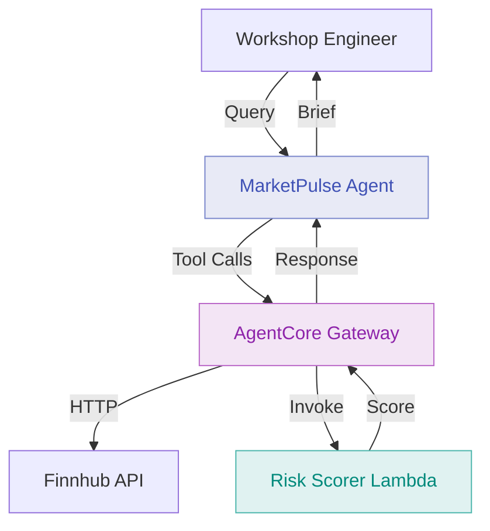

# Module 3: Deploy Risk Profile Scorer Lambda as Gateway Target

**Duration:** 20 minutes  
**Prerequisites:** Completed [Module 2](02-gateway-http.md)

## Learning Objectives

By the end of this module, you will:

1. Deploy a Lambda function that scores client risk profiles
2. Register the Lambda as a Gateway target
3. Understand when to use Lambda targets vs HTTP targets
4. Query the agent for stock suitability assessments

## What is a Lambda Target?

A Lambda target in AgentCore Gateway allows agents to invoke AWS Lambda functions as tools. This is useful for:

- **Internal business logic** - Calculations, scoring, validation
- **Private data access** - Internal databases, S3, DynamoDB
- **Custom processing** - Data transformation, aggregation
- **Cost control** - Pay only for execution time

Unlike HTTP targets (external APIs), Lambda targets run in your AWS account with full VPC access.

## Architecture: Module 3



## The Risk Scorer Lambda

The Lambda function takes:
- **Stock ticker** - The stock being considered
- **Client risk profile** - Conservative, Moderate, or Aggressive

And returns:
- **Suitability label** - Clear match, Proceed with caution, Not suitable
- **Reasoning** - Why this assessment was made

**Example logic:**

```
Conservative investor + High volatility stock → "Proceed with caution"
Aggressive investor + Growth stock → "Clear match"
Conservative investor + Crypto → "Not suitable"
```

## Step 1: Review the Lambda Code

The Lambda code is provided in `lambda/risk-scorer/app.py`:

```python
import json

def lambda_handler(event, context):
    """
    Assess stock suitability against client risk profile.
    
    Input:
        ticker: Stock ticker symbol
        risk_profile: "conservative", "moderate", or "aggressive"
        
    Output:
        suitability: "clear_match", "proceed_with_caution", "not_suitable"
        reasoning: Explanation of the assessment
    """
    
    ticker = event.get('ticker', '').upper()
    risk_profile = event.get('risk_profile', '').lower()
    
    # Stock volatility mapping (simplified for workshop)
    volatility_map = {
        'AAPL': 'low',
        'MSFT': 'low',
        'GOOGL': 'medium',
        'AMZN': 'medium',
        'TSLA': 'high',
        'NVDA': 'high'
    }
    
    volatility = volatility_map.get(ticker, 'medium')
    
    # Suitability matrix
    suitability_matrix = {
        ('conservative', 'low'): ('clear_match', 'Established company with stable returns'),
        ('conservative', 'medium'): ('proceed_with_caution', 'Moderate volatility may not align with conservative goals'),
        ('conservative', 'high'): ('not_suitable', 'High volatility inappropriate for conservative portfolio'),
        ('moderate', 'low'): ('clear_match', 'Stable investment suitable for balanced portfolio'),
        ('moderate', 'medium'): ('clear_match', 'Good fit for moderate risk tolerance'),
        ('moderate', 'high'): ('proceed_with_caution', 'Higher risk than typical moderate allocation'),
        ('aggressive', 'low'): ('clear_match', 'Stable foundation with growth potential'),
        ('aggressive', 'medium'): ('clear_match', 'Strong match for growth-focused portfolio'),
        ('aggressive', 'high'): ('clear_match', 'High growth potential appropriate for risk tolerance')
    }
    
    suitability, reasoning = suitability_matrix.get(
        (risk_profile, volatility),
        ('proceed_with_caution', 'Unable to determine suitability')
    )
    
    return {
        'statusCode': 200,
        'body': json.dumps({
            'ticker': ticker,
            'risk_profile': risk_profile,
            'suitability': suitability,
            'reasoning': reasoning,
            'volatility_assessed': volatility
        })
    }
```

**Key points:**

1. **Simplified logic** - Real systems would use historical volatility data
2. **Matrix-based** - Easy to understand and audit
3. **FSI-relevant** - Risk assessment is core to advisory workflows

## Step 2: Update Agent Code

Add the risk scoring tool to `agent/app.py`:

```python
@agent.tool
def assess_client_suitability(ticker: str, risk_profile: str) -> dict:
    """
    Assess whether a stock is suitable for a client's risk profile.
    
    Args:
        ticker: Stock ticker symbol
        risk_profile: Client's risk profile ("conservative", "moderate", "aggressive")
    
    Returns:
        dict: Suitability assessment with reasoning
    """
    pass
```

Update agent instructions:

```python
agent = Agent(
    name="MarketPulse",
    model="anthropic.claude-sonnet-4-5-20250929-v1:0",
    instructions="""
    You are MarketPulse, an AI investment brief assistant for financial advisors.
    
    Available tools:
    - get_stock_price: Real-time stock data
    - assess_client_suitability: Risk profile assessment
    
    When asked about stock suitability for a client, always:
    1. Get current price with get_stock_price
    2. Assess suitability with assess_client_suitability
    3. Present both pieces of information clearly
    
    Risk profiles are: conservative, moderate, aggressive
    """
)
```

## Step 3: Configure Terraform

Edit `terraform/terraform.tfvars`:

```hcl
# Feature Flags (Add Lambda target)
enable_runtime = true
enable_gateway = true
enable_http_target = true
enable_lambda_target = true
enable_mcp_target = false
enable_memory = false
enable_identity = false
enable_observability = false
```

## Step 4: Rebuild and Deploy

Rebuild the agent:

```bash
./scripts/build-agent.sh
```

Deploy Lambda and Gateway configuration:

```bash
cd terraform
terraform apply
```

**What Terraform creates:**

- Lambda function with risk scoring logic
- Lambda execution role with CloudWatch permissions
- Lambda target in Gateway
- Tool association linking `assess_client_suitability` to Lambda

**Expected output:**

```
Apply complete! Resources: 4 added, 1 changed, 0 destroyed.

Outputs:

lambda_function_arn = "arn:aws:lambda:ap-southeast-2:123456789012:function:marketpulse-risk-scorer"
lambda_target_id = "tgt-lambda-risk-123"
```

## Step 5: Test Risk Assessments

Test with a suitability query:

```bash
python scripts/test-agent.py "I'm meeting with Sarah Chen, a conservative investor. Is Apple suitable for her?"
```

**Expected response:**

```
Agent Response:
===============

Investment Brief for Sarah Chen (Conservative Profile)

Stock: Apple Inc. (AAPL)
Current Price: $184.25
Day Range: $182.50 - $185.10

Suitability Assessment: Clear Match ✓

Apple is an established company with stable returns, making it suitable 
for Sarah's conservative investment profile. The stock shows low volatility 
and has a track record of consistent performance.

Recommendation: Appropriate for inclusion in Sarah's portfolio.
```

Test with a mismatch:

```bash
python scripts/test-agent.py "Is Tesla suitable for a conservative investor?"
```

**Expected response:**

```
Agent Response:
===============

Stock: Tesla Inc. (TSLA)
Current Price: $198.50

Suitability Assessment: Not Suitable ✗

Tesla exhibits high volatility which is inappropriate for a conservative 
portfolio. The stock's price movements are significantly larger than 
typical for conservative holdings.

Recommendation: Consider more stable alternatives like AAPL or MSFT.
```

## Step 6: View Lambda Logs

Check Lambda execution logs:

```bash
aws logs tail /aws/lambda/marketpulse-risk-scorer --follow
```

**What to look for:**

```
START RequestId: abc-123
[INFO] Assessing ticker=AAPL, risk_profile=conservative
[INFO] Volatility assessed: low
[INFO] Suitability: clear_match
END RequestId: abc-123
REPORT Duration: 45ms Billed Duration: 46ms Memory: 128MB Max Memory: 52MB
```

## HTTP Target vs Lambda Target: When to Use Each

| Factor | HTTP Target | Lambda Target |
|--------|-------------|---------------|
| **Data source** | External API | Internal logic/data |
| **Cost model** | Per API call | Per execution time |
| **Latency** | Network + processing | Execution only |
| **Authentication** | API keys, OAuth | IAM |
| **VPC access** | No | Yes |
| **Auditability** | External logs | CloudWatch |
| **Use cases** | Market data, public APIs | Calculations, DB queries |

**Choose HTTP when:**
- External service provides the data
- Service is already API-based
- No custom processing needed

**Choose Lambda when:**
- Logic is internal to your organisation
- Need VPC access for databases
- Custom calculations required
- Want full control over implementation

## Verification Checklist

- [ ] Lambda function deployed successfully
- [ ] Agent rebuilt with risk assessment tool
- [ ] Terraform apply completed
- [ ] `lambda_target_id` output received
- [ ] Test queries return suitability assessments
- [ ] Lambda logs show executions

## Common Issues

### Lambda timeout errors

**Cause:** Default timeout too short for processing.

**Solution:** Increase timeout in `terraform/lambda.tf`:
```hcl
timeout = 30  # seconds
```

### "Tool not found" for assess_client_suitability

**Cause:** Tool association not created.

**Solution:**
```bash
terraform taint aws_agentcore_tool_association.risk_scorer
terraform apply
```

### Lambda returns 500 error

**Cause:** Code error or missing dependencies.

**Solution:** Check Lambda logs:
```bash
aws logs tail /aws/lambda/marketpulse-risk-scorer --since 5m
```

## FSI Relevance: Lambda for Compliance

In financial services, Lambda targets are critical for:

1. **Proprietary Scoring** - Risk models are intellectual property
2. **Regulated Calculations** - Must use audited, version-controlled code
3. **Data Sovereignty** - Client data stays in your AWS account
4. **Audit Trail** - Every execution logged in CloudWatch
5. **Version Control** - Lambda versions enable rollback

This pattern is common for:
- Credit scoring models
- Fraud detection algorithms
- Portfolio optimisation
- Regulatory reporting calculations

## Discussion Questions

1. **What calculations does your team currently perform that could be Lambda functions?**
2. **How do you version and audit business logic today?**
3. **What benefits do you see from separating calculation logic from agent prompts?**

## Next Steps

You've added internal business logic via Lambda. The agent can now retrieve prices and assess suitability.

In [Module 4](04-gateway-mcp.md), you'll deploy an MCP server to provide market calendar data.

---

**Key Takeaways:**

- Lambda targets enable internal business logic as agent tools
- Gateway handles Lambda invocation and error handling
- Lambda provides full VPC access for private data sources
- Separation of concerns: agent orchestrates, Lambda calculates
- CloudWatch provides complete execution audit trail