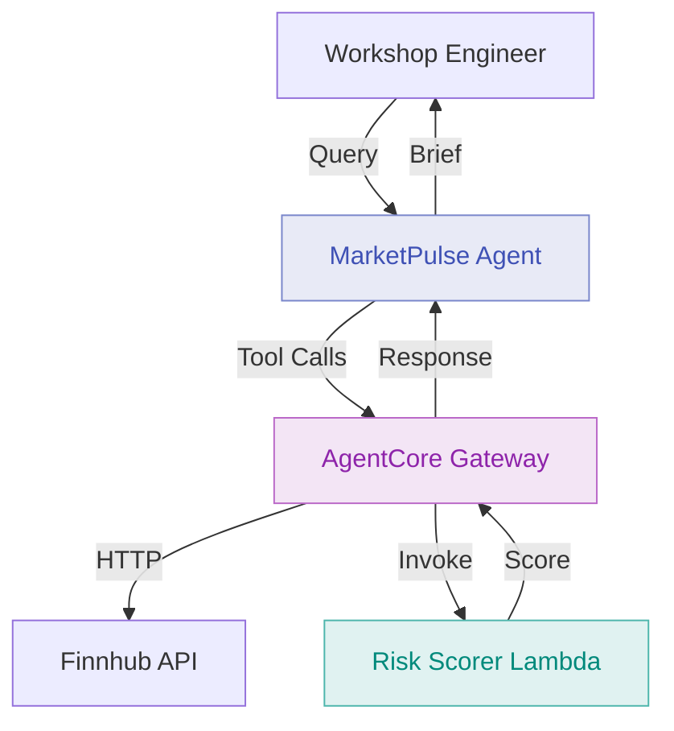

# Module 3: Deploy Risk Profile Scorer Lambda as Gateway Target

**Duration:** 20 minutes  
**Prerequisites:** Completed [Module 2](02-gateway-http.md)

## Learning Objectives

By the end of this module, you will:

1. Deploy a Lambda function that scores client risk profiles
2. Register the Lambda as a Gateway target
3. Understand when to use Lambda targets vs HTTP targets
4. Query the agent for stock suitability assessments

## What is a Lambda Target?

A Lambda target in AgentCore Gateway allows agents to invoke AWS Lambda functions as tools. This is useful for:

- **Internal business logic** - Calculations, scoring, validation
- **Private data access** - Internal databases, S3, DynamoDB
- **Custom processing** - Data transformation, aggregation
- **Cost control** - Pay only for execution time

Unlike HTTP targets (external APIs), Lambda targets run in your AWS account with full VPC access.

## Architecture: Module 3



## The Risk Scorer Lambda

The Lambda function takes:
- **Stock ticker** - The stock being considered (e.g., AAPL, TSLA)
- **Client risk profile** - `conservative`, `moderate`, or `aggressive`

And returns:
- **Suitability label** - `clear_match`, `proceed_with_caution`, or `not_suitable`
- **Reasoning** - Plain-language explanation for the advisor
- **Volatility assessed** - The volatility category used in the decision

**Example logic:**

```
Conservative investor + Low volatility stock  → "clear_match"
Conservative investor + High volatility stock → "not_suitable"
Aggressive investor + High volatility stock   → "clear_match"
Moderate investor + Medium volatility stock   → "clear_match"
```

## Step 1: Review the Lambda Code

The Lambda is in `lambda/scorer.py`. Open it and review the key sections:

```python
# Volatility classification per ticker
VOLATILITY_MAP = {
    "AAPL": "low",
    "MSFT": "low",
    "GOOGL": "medium",
    "TSLA": "high",
    "NVDA": "high",
    # ...
}

# Suitability matrix: (risk_profile, volatility) -> (suitability, reasoning)
SUITABILITY_MATRIX = {
    ("conservative", "low"):    ("clear_match",          "Stable earnings, low volatility..."),
    ("conservative", "medium"): ("proceed_with_caution", "Moderate volatility may exceed..."),
    ("conservative", "high"):   ("not_suitable",         "High volatility inappropriate..."),
    # ... all nine combinations defined
}
```

The handler receives arguments directly from AgentCore Gateway and returns the result in the response body:

```python
def handler(event: dict, context) -> dict:
    ticker       = event.get("ticker", "").strip().upper()
    risk_profile = event.get("risk_profile", "").strip().lower()
    ...
    return {
        "statusCode": 200,
        "body": json.dumps(result),
    }
```

**Key points:**

1. **Simplified logic** - A real system would use historical volatility data
2. **Matrix-based** - Easy to understand, audit, and extend
3. **FSI-relevant** - Risk assessment is central to advisory workflows

## Step 2: Review the Agent Tool Definition

Open `agent/app.py`. The risk scoring tool is already defined and wired to the Gateway:

```python
def assess_client_suitability(ticker: str, risk_profile: str) -> dict:
    """
    Assesses whether a stock is suitable for a client's risk profile.

    This tool is routed through AgentCore Gateway to the risk scorer Lambda.

    Args:
        ticker:       Stock ticker symbol (e.g., AAPL, TSLA)
        risk_profile: Client risk profile - conservative, moderate, or aggressive

    Returns:
        dict: Suitability label and plain-language reasoning for the advisor.
    """
    # Implementation handled by AgentCore Gateway -> Lambda
    pass

if os.environ.get("ENABLE_LAMBDA_TARGET", "false").lower() == "true":
    tools.append(assess_client_suitability)
```

The function body is empty because AgentCore intercepts the call and routes it to the Gateway Lambda target automatically based on the function name matching the tool schema defined in Terraform.

## Step 3: Configure Terraform

Edit `terraform/terraform.tfvars` to enable the Lambda target:

```hcl
enable_gateway       = true
enable_http_target   = true
enable_lambda_target = true
```

## Step 4: Deploy

Deploy the Lambda function and register the Gateway target:

```bash
cd terraform
terraform apply
```

Terraform will create:

| Resource | Description |
|----------|-------------|
| `aws_lambda_function.risk_scorer` | The risk scoring function |
| `aws_iam_role.risk_scorer` | Lambda execution role |
| `aws_cloudwatch_log_group.risk_scorer` | Log group for execution logs |
| `aws_lambda_permission.allow_gateway` | Allows Gateway to invoke Lambda |
| `aws_iam_role_policy.gateway_lambda_access` | Grants Gateway role Lambda invoke permission |
| `null_resource.lambda_gateway_target` | Registers Lambda as a Gateway target via AWS CLI |

**Expected output:**

```
Apply complete! Resources: 6 added, 1 changed, 0 destroyed.

Outputs:

lambda_function_arn  = "arn:aws:lambda:ap-southeast-2:123456789012:function:marketpulse-workshop-dev-risk-scorer"
lambda_function_name = "marketpulse-workshop-dev-risk-scorer"
lambda_log_group     = "/aws/lambda/marketpulse-workshop-dev-risk-scorer"
```

After `terraform apply` completes, rebuild the agent container so it picks up the updated environment variable:

```bash
./scripts/build-agent.sh
```

Wait 2-3 minutes for the AgentCore Runtime to restart with the new container image.

## Step 5: Test Risk Assessments

Run the included test script:

```bash
python scripts/test-risk.py
```

The script runs four test scenarios covering different investor profiles:

**Conservative investor + Apple (low volatility):**

```
Query: I'm meeting with Sarah Chen, a conservative investor. Is Apple suitable?

Agent Response:
Sarah Chen - Conservative Investor

Stock: Apple Inc. (AAPL)
Current Price: $184.25

Suitability: Clear Match

Apple is an established company with stable earnings and low price volatility,
well aligned with Sarah's capital preservation goals.

Recommendation: Appropriate for her portfolio.
```

**Conservative investor + Tesla (high volatility):**

```
Query: Is Tesla suitable for a conservative investor?

Agent Response:
Tesla (TSLA) Suitability Assessment - Conservative Profile

Suitability: Not Suitable

Tesla's high price volatility is inappropriate for a conservative portfolio
focused on capital preservation. Consider stable alternatives like AAPL or MSFT.
```

You can also run ad-hoc queries directly:

```bash
python scripts/test-agent.py "Is NVIDIA suitable for a moderate risk investor?"
```

## Step 6: View Lambda Execution Logs

Check CloudWatch Logs to verify the Lambda is being invoked:

```bash
aws logs tail /aws/lambda/marketpulse-workshop-dev-risk-scorer --follow
```

Look for log entries showing the assessment:

```
START RequestId: abc-123
[INFO] Risk scorer invoked with event: {"ticker": "AAPL", "risk_profile": "conservative"}
[INFO] Ticker=AAPL volatility=low risk_profile=conservative
[INFO] Assessment result: {"ticker": "AAPL", "suitability": "clear_match", ...}
END RequestId: abc-123
REPORT Duration: 12ms Billed Duration: 13ms Memory: 128MB Max Memory: 48MB
```

**In the AWS Console:** Lambda → Functions → `marketpulse-workshop-dev-risk-scorer` → Monitor → View CloudWatch Logs.

## HTTP Target vs Lambda Target: When to Use Each

| Factor | HTTP Target | Lambda Target |
|--------|-------------|---------------|
| **Data source** | External API | Internal logic / private data |
| **Cost model** | Per API call | Per execution (ms) |
| **Authentication** | API keys, OAuth | IAM |
| **VPC access** | No | Yes |
| **Audit trail** | External service logs | CloudWatch |
| **Versioning** | API versioning | Lambda versions/aliases |
| **Use cases** | Market data, public APIs | Scoring, DB queries, custom logic |

**Choose HTTP when** the data lives in an external system your team doesn't control.

**Choose Lambda when** the logic or data is internal, needs auditing, or requires VPC access.

## How the Tool Schema Works

The Lambda target registration (in `lambda.tf`) includes an inline tool schema:

```json
{
  "name": "assess_client_suitability",
  "description": "Assesses whether a stock is suitable...",
  "inputSchema": {
    "json": {
      "type": "object",
      "properties": {
        "ticker":       { "type": "string" },
        "risk_profile": { "type": "string", "enum": [...] }
      },
      "required": ["ticker", "risk_profile"]
    }
  }
}
```

When the agent calls `assess_client_suitability`, AgentCore Gateway:
1. Matches the function name against registered target tool schemas
2. Routes the call to the Lambda ARN registered for that tool
3. Passes the arguments as the Lambda `event` payload
4. Returns the Lambda response to the agent

## Verification Checklist

- [ ] `terraform apply` completed with 6 new resources
- [ ] `lambda_function_arn` output is present
- [ ] Agent container rebuilt with `./scripts/build-agent.sh`
- [ ] `python scripts/test-risk.py` passes all 4 test scenarios
- [ ] CloudWatch Logs show Lambda invocations

## Common Issues

### Lambda target not being called

**Symptom:** Agent provides a generic response without invoking the tool.

**Cause:** Either the Gateway target was not registered, or the environment variable is not set.

**Check:**
```bash
# Verify the Lambda target was registered
cd terraform && terraform output lambda_target_configured

# Check agent environment variables
aws bedrock-agentcore list-agent-runtimes --region ap-southeast-2 \
  | jq '.agentRuntimes[] | select(.agentRuntimeName | contains("marketpulse"))'
```

### Lambda returns 400 error

**Cause:** AgentCore Gateway may be passing arguments in an unexpected format.

**Solution:** Check Lambda logs for the raw event payload and compare against the expected schema.

### Lambda timeout

**Cause:** Default timeout is sufficient for this scorer but may be low for complex logic.

**Solution:** Increase timeout in `terraform/lambda.tf`:
```hcl
timeout = 30  # seconds (current default)
```

### "No credentials" error in Lambda logs

**Cause:** Lambda IAM role lacks required permissions.

**Solution:** Verify the `aws_iam_role_policy_attachment.risk_scorer_basic` was applied:
```bash
cd terraform && terraform state show 'aws_iam_role_policy_attachment.risk_scorer_basic[0]'
```

## FSI Relevance: Lambda for Compliance

In financial services, Lambda targets are important because:

1. **Proprietary scoring** - Risk models are intellectual property that stay in your account
2. **Audit trail** - Every invocation is logged in CloudWatch with request/response
3. **Versioning** - Lambda versions and aliases support controlled rollout and rollback
4. **Data sovereignty** - Client data never leaves your AWS account
5. **Regulated calculations** - Code is version-controlled and auditable

This pattern is commonly used for:

- Portfolio suitability scoring
- Credit risk assessments
- Regulatory capital calculations
- Fraud detection signals

## Discussion Questions

1. What business logic in your team could be deployed as a Lambda Gateway target?
2. How does version-controlled Lambda code compare to AI prompts for regulatory auditability?
3. What data in your organisation requires VPC access that would benefit from Lambda targets?

## Next Steps

The agent can now retrieve live prices and assess suitability against client risk profiles.

In [Module 4](04-gateway-mcp.md), you'll deploy an MCP server to provide market holiday calendar data.

---

**Key Takeaways:**

- Lambda targets route agent tool calls to internal business logic
- AgentCore Gateway handles invocation, retries, and error handling
- Tool schemas defined in Terraform describe what arguments each tool accepts
- CloudWatch provides a complete audit trail of every Lambda invocation
- Lambda is preferred over HTTP targets when logic or data is internal to your organisation
