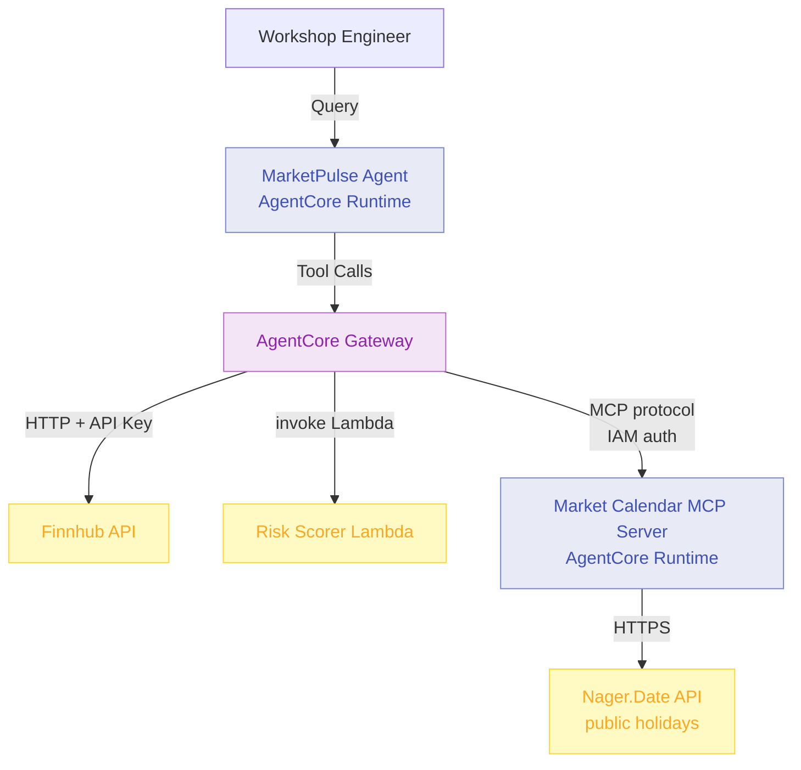

# Module 4: Deploy Market Calendar MCP Server as Gateway Target

**Duration:** 25 minutes  
**Prerequisites:** Completed [Module 3](03-gateway-lambda.md)

## Learning Objectives

By the end of this module, you will:

1. Understand what MCP servers are and when to use them over HTTP or Lambda targets
2. Deploy an MCP server to AgentCore Runtime using FastMCP
3. Register the MCP server as a Gateway MCP_SERVER target
4. Query the agent for market holiday information

## What is MCP?

**Model Context Protocol (MCP)** is an open standard for exposing tools and resources to AI agents. An MCP server:

- Advertises tools with structured schemas that agents can discover
- Handles the MCP protocol negotiation automatically
- Can serve multiple tools from a single deployment
- Supports both request/response and streaming interactions

**Key difference from HTTP and Lambda targets:**

| Feature | HTTP Target | Lambda Target | MCP Target |
|---------|------------|--------------|------------|
| Protocol | REST | AWS SDK | MCP (JSON-RPC) |
| Tool discovery | Manual (OpenAPI) | Manual (inline schema) | Automatic via `tools/list` |
| Multiple tools | One per target | One per target | Many per server |
| Reusability | External service | AWS account | Hosted in Runtime |

**When to use MCP:**

- You have multiple related tools that belong together (e.g., several calendar operations)
- You want AgentCore Gateway to auto-discover tool schemas rather than defining them manually
- You are building a reusable service that multiple agents will share

## Architecture: Module 4



**Key point:** The MCP server runs in a second AgentCore Runtime. Both the agent and the MCP server are containerised and hosted by AgentCore, but they are separate runtimes with separate IAM roles.

## MCP Transport: streamable-http

AgentCore Runtime requires MCP servers to use `streamable-http` transport. The container must listen at `0.0.0.0:8000/mcp`.

**Why not stdio?** Stdio transport requires a persistent stdin/stdout pipe between the client and server. Container runtimes like AgentCore cannot provide this — they communicate over HTTP. Streamable-HTTP is the appropriate transport for server-hosted MCP.

## Step 1: Review the MCP Server Code

The MCP server is in `mcp-server/server.py`. It uses **FastMCP** from the `mcp` package:

```python
from mcp.server.fastmcp import FastMCP
import httpx
from datetime import datetime, timedelta

# stateless_http=True is required for AgentCore Runtime.
# AgentCore provides session isolation and adds Mcp-Session-Id headers.
mcp = FastMCP("market-calendar", host="0.0.0.0", stateless_http=True)

@mcp.tool()
async def check_market_holidays(
    country_code: str = "AU",
    days_ahead: int = 7,
) -> dict:
    """
    Check for public holidays that affect market trading in the next N days.
    ...
    """
    # Calls Nager.Date API and filters holidays to the requested window
    ...

if __name__ == "__main__":
    mcp.run(transport="streamable-http")
```

**Key points:**

- `@mcp.tool()` is the only decorator needed — FastMCP reads the type annotations and docstring to generate the MCP tool schema automatically
- `stateless_http=True` tells FastMCP not to maintain session state; AgentCore Runtime handles session isolation
- `transport="streamable-http"` is the required transport for AgentCore Runtime

## Step 2: Review the Dockerfile

The MCP server Dockerfile in `mcp-server/Dockerfile` is similar to the agent Dockerfile but simpler — no Bedrock or OpenTelemetry needed. The server exposes port 8000:

```dockerfile
EXPOSE 8000
CMD ["python", "server.py"]
```

The agent Dockerfile exposes both 8080 (BedrockAgentCoreApp) and 8000. The MCP server only needs 8000.

## Step 3: Review the Agent Update

The `check_market_holidays` tool has been added to `agent/app.py`. When `ENABLE_MCP_TARGET=true`, the agent exposes this tool to AgentCore:

```python
def check_market_holidays(country_code: str = "AU", days_ahead: int = 7) -> dict:
    """
    Check for public holidays that affect market trading in the next N days.
    ...
    """
    # Implementation handled by AgentCore Gateway -> MCP Server
    pass

if os.environ.get("ENABLE_MCP_TARGET", "false").lower() == "true":
    tools.append(check_market_holidays)
```

The function body is empty — AgentCore Gateway intercepts calls to this function by name and routes them to the registered MCP server target. FastMCP on the server side handles the actual Nager.Date API call.

## Step 4: Configure Terraform

Edit `terraform/terraform.tfvars` to enable the MCP target:

```hcl
enable_gateway       = true
enable_http_target   = true
enable_lambda_target = true
enable_mcp_target    = true   # <-- add this
enable_memory        = false
enable_identity      = false
enable_observability = false
```

## Step 5: Build and Deploy

Build and push the MCP server container:

```bash
./scripts/build-mcp.sh
```

Apply the Terraform configuration:

```bash
cd terraform
terraform apply
```

**What Terraform creates:**

- ECR repository for the MCP server image
- IAM role for the MCP server Runtime (ECR pull + CloudWatch only — no Bedrock needed)
- Second AgentCore Runtime hosting the MCP server container
- Runtime Endpoint for the MCP server
- IAM policy granting the Gateway role permission to invoke the MCP Runtime
- Gateway MCP_SERVER target pointing to the MCP Runtime invocation URL
- SSM Parameter storing the MCP target ID (used by destroy provisioner)

After apply, Terraform calls `synchronize-gateway-targets` to trigger MCP tool discovery. AgentCore connects to the MCP server, calls `tools/list`, and indexes the `check_market_holidays` schema.

**Expected outputs:**

```
Apply complete! Resources: 8 added, 1 changed, 0 destroyed.

Outputs:

ecr_mcp_repository_url   = "123456789012.dkr.ecr.ap-southeast-2.amazonaws.com/marketpulse-workshop-mcp-server"
mcp_server_runtime_name  = "marketpulse_workshop_mcp_server"
mcp_server_endpoint_name = "marketpulse_workshop_mcp_endpoint"
mcp_target_configured    = true
```

## Step 6: Rebuild the Agent Container

The agent needs to pick up the new `ENABLE_MCP_TARGET` environment variable. Terraform updates the environment variable on the Runtime automatically, but the agent container must also be rebuilt so the new tool is registered in the tools list:

```bash
./scripts/build-agent.sh
```

Wait 2-3 minutes for the Runtime to restart with the new container image.

## Step 7: Test Market Calendar Queries

Run the market calendar test script:

```bash
python scripts/test-calendar.py
```

**What the script tests:**

1. Basic Australian market holiday check for the current week
2. Trade timing query — checks for closures before executing a large order
3. US market holiday lookup over a 14-day window

**Example response:**

```
Agent Response:
==============================================================

Market Calendar Check - Australian Markets

Period: 24 Feb - 3 Mar 2026

No scheduled market closures in the next 7 days.

Trading is open Monday to Friday this week. All sessions are
operating normally. Safe to proceed with order execution.

Note: Always confirm with the exchange for early closes or
unscheduled closures.
```

## Step 8: Review MCP Server Logs

Check MCP server container logs:

```bash
# Get the runtime name from Terraform output
MCP_RUNTIME=$(cd terraform && terraform output -raw mcp_server_runtime_name)

aws logs tail /aws/bedrock-agentcore/runtime/${MCP_RUNTIME} --follow
```

**What to look for:**

```
[INFO] Starting MarketPulse MCP server on port 8000
[INFO] Fetching holidays from https://date.nager.at/api/v3/PublicHolidays/2026/AU
[INFO] MCP Tool: check_market_holidays called
```

## How Gateway Reaches the MCP Server

When you create an MCP_SERVER Gateway target, you provide an **invocation URL**. Terraform constructs this from the Runtime ARN and Endpoint name:

```
https://bedrock-agentcore.{region}.amazonaws.com/runtimes/{url-encoded-arn}/invocations?qualifier={endpoint-name}
```

The Gateway authenticates to this URL using `GATEWAY_IAM_ROLE` — it signs requests with the Gateway's IAM role. The MCP Runtime accepts AWS SigV4 authentication.

This is the same URL format used to invoke any AgentCore Runtime, whether it hosts an agent or an MCP server.

## MCP vs HTTP vs Lambda: Decision Guide

Use this to choose the right target type for future tools:

**Use HTTP target** when:
- Tool calls an external API that already has an OpenAPI spec
- You don't control the API server
- Authentication is via API key, OAuth token, or no auth

**Use Lambda target** when:
- Business logic lives in your AWS account
- You need IAM-controlled access to AWS resources (DynamoDB, S3, etc.)
- Compliance requires versioned, auditable functions (e.g., risk scoring)

**Use MCP target** when:
- You are building a reusable tool service hosted in your own Runtime
- Multiple related tools belong together in one server
- You want automatic tool discovery — no manual schema management

## Verification Checklist

- [ ] `./scripts/build-mcp.sh` completes without error
- [ ] `terraform apply` succeeds — all 8 resources created
- [ ] `mcp_target_configured = true` in outputs
- [ ] Agent container rebuilt and pushed with `./scripts/build-agent.sh`
- [ ] `python scripts/test-calendar.py` returns holiday data
- [ ] MCP server logs show tool invocations

## Common Issues

### MCP server not responding (tool timeout)

**Cause:** MCP server Runtime still starting up (cold start after first deploy).

**Solution:** Wait 3-5 minutes after `terraform apply`, then retest.

```bash
# Check runtime status
aws bedrock-agentcore-control get-agent-runtime \
  --agent-runtime-id $(cd terraform && terraform output -raw mcp_server_runtime_id) \
  --region ap-southeast-2
```

### Gateway cannot reach MCP Runtime

**Cause:** IAM policy `gateway_mcp_access` not applied yet, or wrong Runtime ARN.

**Solution:** Verify the policy exists:

```bash
aws iam get-role-policy \
  --role-name marketpulse-workshop-gateway-role \
  --policy-name marketpulse-workshop-gateway-mcp-access
```

### Tool not appearing in agent tool list

**Cause:** Agent container was not rebuilt after enabling `enable_mcp_target`.

**Solution:** Rebuild and push the agent container, then wait for the Runtime to restart:

```bash
./scripts/build-agent.sh
```

### Nager.Date returns 404 for country code

**Cause:** Invalid country code. Nager.Date uses ISO 3166-1 alpha-2 codes.

**Solution:** Try `AU` (Australia), `US` (United States), `GB` (United Kingdom), `NZ` (New Zealand).

Verify directly:

```bash
curl "https://date.nager.at/api/v3/PublicHolidays/2026/AU"
```

## FSI Context: MCP in Production

In production FSI environments, MCP servers enable **service reuse** across agent teams:

- **Compliance MCP** - Check regulatory requirements, get approval thresholds
- **Product MCP** - Query product catalogue, retrieve term sheets
- **Client Data MCP** - KYC status, account flags, suitability history
- **Market Data MCP** - Real-time prices, corporate actions, index compositions

One MCP server can serve multiple agents across different teams, with access controlled by the Gateway's IAM and credential configuration.

## Discussion Questions

1. What internal systems in your organisation could be wrapped as MCP tools?
2. How does the MCP tool discovery mechanism compare to your current API catalogue approach?
3. What are the IAM boundaries between the Gateway, MCP server, and the data it accesses?

## Next Steps

You now have three working Gateway target types: HTTP, Lambda, and MCP. The agent can retrieve stock prices, assess client suitability, and check market calendars.

In [Module 5](05-memory.md), you will enable AgentCore Memory to persist advisor preferences and client context across separate sessions.

---

**Key Takeaways:**

- MCP servers use `streamable-http` transport in AgentCore Runtime — stdio is not supported
- `stateless_http=True` in FastMCP is required; AgentCore Runtime handles session isolation
- MCP tool schemas are auto-discovered by the Gateway — no manual schema management
- The Gateway authenticates to the MCP Runtime using its IAM role (GATEWAY_IAM_ROLE)
- The invocation URL format encodes the Runtime ARN in the path
