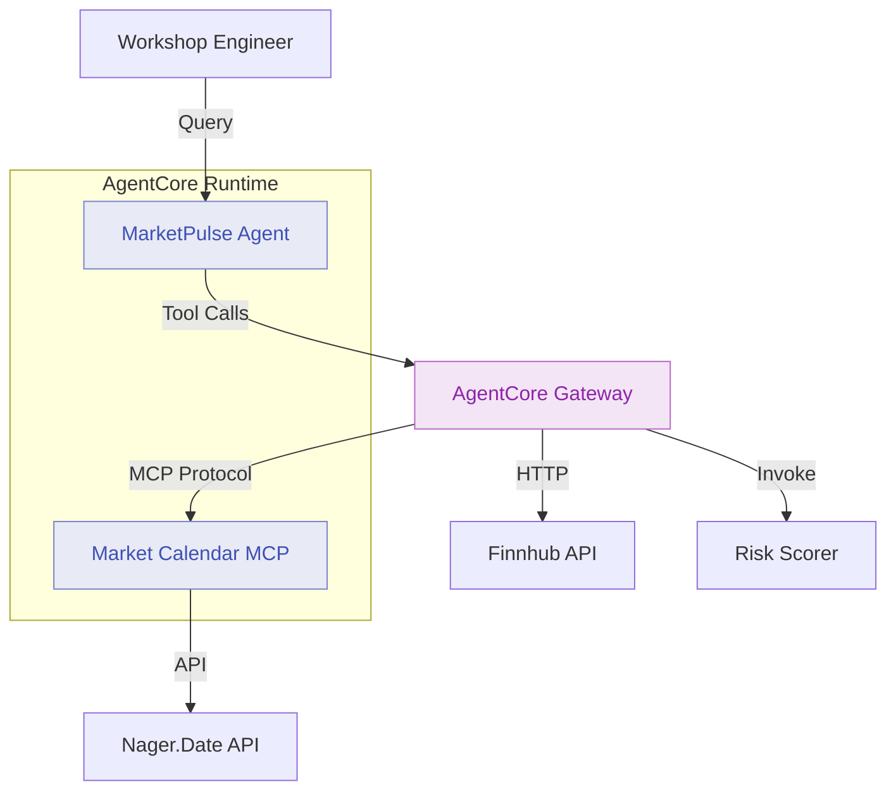

# Module 4: Deploy Market Calendar MCP Server as Gateway Target

**Duration:** 20 minutes  
**Prerequisites:** Completed [Module 3](03-gateway-lambda.md)

## Learning Objectives

By the end of this module, you will:

1. Understand what MCP servers are and when to use them
2. Deploy an MCP server to AgentCore Runtime
3. Register the MCP server as a Gateway target
4. Query the agent for market holiday information

## What is an MCP Server?

**MCP (Model Context Protocol)** is a standard for exposing tools and resources to AI agents. An MCP server:

- Provides structured tools with defined schemas
- Can offer resources (documents, data feeds)
- Uses a standard protocol for discovery and invocation
- Can be hosted anywhere agents can reach

**Key benefits:**

- **Reusability** - One MCP server can serve multiple agents
- **Standard interface** - Any MCP-compatible agent can use it
- **Encapsulation** - Business logic stays separate from agent code

## Architecture: Module 4



**Key insight:** The MCP server runs in AgentCore Runtime, just like the agent. This demonstrates Runtime's flexibility - it can host both agents and the services they depend on.

## The Market Calendar MCP Server

The MCP server wraps the **Nager.Date** public holidays API to provide:

- List of market holidays for a country
- Check if a specific date is a market holiday
- Get upcoming holidays within a date range

**Why wrap it in MCP?**

1. **Caching** - MCP server caches holiday data to reduce API calls
2. **Transformation** - Converts Nager.Date format to FSI-relevant format
3. **Validation** - Ensures dates are valid trading days
4. **Future-proofing** - Easy to swap Nager.Date for an internal API later

## Step 1: Review the MCP Server Code

The MCP server code is in `mcp-server/market-calendar/app.py`:

```python
from mcp.server import Server
from mcp.types import Tool
import httpx
from datetime import datetime, timedelta

app = Server("market-calendar")

@app.tool()
async def check_market_holidays(
    country_code: str = "US",
    days_ahead: int = 7
) -> dict:
    """
    Check for market holidays in the next N days.
    
    Args:
        country_code: ISO country code (default: US)
        days_ahead: Number of days to check ahead (default: 7)
    
    Returns:
        dict: List of holidays with dates and names
    """
    today = datetime.now()
    year = today.year
    
    # Fetch holidays from Nager.Date API
    async with httpx.AsyncClient() as client:
        response = await client.get(
            f"https://date.nager.at/api/v3/PublicHolidays/{year}/{country_code}"
        )
        holidays = response.json()
    
    # Filter to next N days
    end_date = today + timedelta(days=days_ahead)
    upcoming = []
    
    for holiday in holidays:
        holiday_date = datetime.strptime(holiday['date'], '%Y-%m-%d')
        if today <= holiday_date <= end_date:
            upcoming.append({
                'date': holiday['date'],
                'name': holiday['name'],
                'is_trading_day': False
            })
    
    return {
        'country': country_code,
        'period_start': today.strftime('%Y-%m-%d'),
        'period_end': end_date.strftime('%Y-%m-%d'),
        'holidays': upcoming,
        'trading_days_affected': len(upcoming)
    }

if __name__ == "__main__":
    app.run(host="0.0.0.0", port=8081)
```

**Key features:**

1. **MCP decorator** - `@app.tool()` exposes the function as an MCP tool
2. **Async** - Uses async HTTP for better performance
3. **Filtering** - Only returns relevant upcoming holidays
4. **FSI context** - Marks holidays as non-trading days

## Step 2: Update Agent Code

Add the market calendar tool to `agent/app.py`:

```python
@agent.tool
def check_market_holidays(country_code: str = "US", days_ahead: int = 7) -> dict:
    """
    Check for market holidays in the upcoming period.
    
    Args:
        country_code: ISO country code (default: US)
        days_ahead: Number of days to check ahead (default: 7)
    
    Returns:
        dict: Upcoming holidays affecting trading
    """
    pass
```

Update instructions:

```python
agent = Agent(
    name="MarketPulse",
    model="anthropic.claude-sonnet-4-5-20250929-v1:0",
    instructions="""
    You are MarketPulse, an AI investment brief assistant.
    
    Available tools:
    - get_stock_price: Real-time stock data
    - assess_client_suitability: Risk profile assessment
    - check_market_holidays: Upcoming market closures
    
    Always check for market holidays when discussing trade execution timing.
    Alert advisors to upcoming closures that might affect their clients.
    """
)
```

## Step 3: Configure Terraform

Edit `terraform/terraform.tfvars`:

```hcl
# Feature Flags (Add MCP target)
enable_runtime = true
enable_gateway = true
enable_http_target = true
enable_lambda_target = true
enable_mcp_target = true
enable_memory = false
enable_identity = false
enable_observability = false
```

## Step 4: Rebuild and Deploy

Rebuild both the agent and MCP server:

```bash
./scripts/build-agent.sh
./scripts/build-mcp-server.sh
```

Deploy with Terraform:

```bash
cd terraform
terraform apply
```

**What Terraform creates:**

- Second AgentCore Runtime instance for MCP server
- MCP target in Gateway pointing to the MCP server
- Tool association for `check_market_holidays`
- Network configuration for agent-to-MCP communication

**Expected output:**

```
Apply complete! Resources: 5 added, 1 changed, 0 destroyed.

Outputs:

mcp_server_endpoint = "https://mcp-abc123.agentcore.ap-southeast-2.amazonaws.com"
mcp_target_id = "tgt-mcp-calendar-123"
```

## Step 5: Test Market Calendar Queries

Test basic holiday check:

```bash
python scripts/test-agent.py "Are there any market holidays this week?"
```

**Expected response:**

```
Agent Response:
===============

Market Calendar Check (US Markets)

Period: Feb 18 - Feb 25, 2026

Upcoming Holidays:
- Monday, Feb 22: Presidents' Day (Markets Closed)

Trading Impact: 1 day affected
Normal trading resumes Tuesday, Feb 23.

Note: Plan client meetings and trade executions accordingly.
```

Test with trade timing:

```bash
python scripts/test-agent.py "I want to buy Apple shares on Monday. Any issues?"
```

**Expected response:**

```
Agent Response:
===============

Trade Timing Advisory

Stock: Apple Inc. (AAPL)
Current Price: $184.25

⚠️ Market Holiday Conflict

Monday, Feb 22 is Presidents' Day - US markets are closed.

Recommendation:
- Place order for Tuesday, Feb 23 market open
- Consider limit order to control execution price
- Monitor pre-market indicators Monday evening

Would you like me to set a reminder for Tuesday?
```

## Step 6: View MCP Server Logs

Check MCP server logs:

```bash
aws logs tail /aws/bedrock-agentcore/runtime/marketpulse-mcp --follow
```

**What to look for:**

```
[INFO] MCP Server started: market-calendar
[INFO] Tool registered: check_market_holidays
[INFO] Request: check_market_holidays(country_code=US, days_ahead=7)
[INFO] Fetching holidays from Nager.Date API
[INFO] Found 1 holiday in range
[INFO] Response returned (latency: 234ms)
```

## MCP vs HTTP vs Lambda: Decision Matrix

| Factor | HTTP Target | Lambda Target | MCP Target |
|--------|-------------|---------------|------------|
| **Hosting** | External | AWS Lambda | AgentCore Runtime |
| **Protocol** | REST | AWS SDK | MCP |
| **Reusability** | API-specific | Single function | Multi-tool server |
| **State** | Stateless | Stateless | Can maintain state |
| **Discovery** | Manual config | Manual config | Automatic via MCP |
| **Resources** | No | No | Yes (docs, data) |

**When to use MCP:**

- You need multiple related tools (e.g., calendar tools: holidays, hours, closures)
- You want to provide resources (e.g., market summaries, product docs)
- You want automatic tool discovery
- You're building reusable services for multiple agents

## Verification Checklist

- [ ] MCP server container built and pushed
- [ ] Agent rebuilt with holiday tool
- [ ] Terraform apply successful
- [ ] `mcp_server_endpoint` output received
- [ ] Test queries return holiday data
- [ ] MCP server logs show tool invocations

## Common Issues

### MCP server not responding

**Cause:** Server still starting up (cold start).

**Solution:** Wait 30-60 seconds after deployment:
```bash
# Check server health
aws agentcore describe-runtime --runtime-id <mcp_runtime_id>
```

### "Connection refused" from Gateway

**Cause:** Network configuration issue between Gateway and MCP server.

**Solution:** Check security group rules in Terraform:
```bash
terraform state show aws_security_group.mcp_server
```

### Tool returns empty holiday list

**Cause:** Nager.Date API rate limit or incorrect country code.

**Solution:** Verify API accessibility:
```bash
curl "https://date.nager.at/api/v3/PublicHolidays/2026/US"
```

## FSI Relevance: MCP in Production

MCP servers in FSI enable:

1. **Service Reuse** - One MCP server serves multiple agents across teams
2. **Knowledge Bases** - MCP resources provide product docs, compliance guidelines
3. **Internal APIs** - Wrap legacy systems in MCP for agent access
4. **Vendor Integration** - Third-party vendors can provide MCP endpoints
5. **Tool Marketplaces** - Share MCP tools across your organisation

**Example FSI use cases:**

- **Compliance MCP** - Check regulations, get approval requirements
- **Product MCP** - Query product catalog, retrieve terms and conditions
- **Market Data MCP** - Real-time prices, historical data, analytics
- **Client Data MCP** - KYC checks, account status, portfolio positions

## Discussion Questions

1. **What internal services could you expose as MCP tools?**
2. **How does MCP compare to your current service integration patterns?**
3. **What benefits do you see from having services in AgentCore Runtime?**

## Next Steps

You've deployed an MCP server and connected it via Gateway. The agent now has access to three target types: HTTP, Lambda, and MCP.

In [Module 5](05-memory.md), you'll enable AgentCore Memory to persist advisor and client context across sessions.

---

**Key Takeaways:**

- MCP is a standard protocol for exposing tools to agents
- MCP servers can run in AgentCore Runtime alongside agents
- One MCP server can provide multiple tools and resources
- Gateway handles MCP protocol details transparently
- MCP enables service reuse across multiple agents