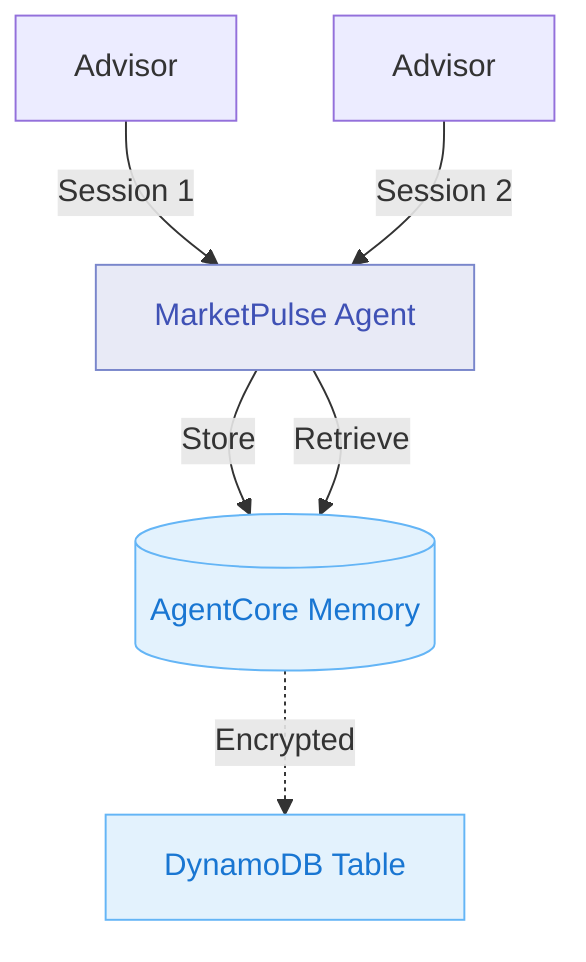

# Module 5: Enable Persistent Memory for Advisor Context

**Duration:** 25 minutes  
**Prerequisites:** Completed [Module 4](04-gateway-mcp.md)

## Learning Objectives

By the end of this module, you will:

1. Enable AgentCore Memory for persistent context
2. Store advisor preferences and client profiles
3. Demonstrate context retention across sessions
4. Understand memory isolation and security

## What is AgentCore Memory?

AgentCore Memory provides persistent storage for agent context:

- **Session continuity** - Remember previous conversations
- **User preferences** - Store advisor-specific settings
- **Entity tracking** - Maintain client profiles, watchlists
- **Context compression** - Summarise long histories

**Key features:**

- Automatic serialisation and retrieval
- Encrypted at rest and in transit
- Scoped to agents (no cross-agent leakage)
- Integrates seamlessly with Strands framework

## Architecture: Module 5



## What to Store in Memory

For MarketPulse, we'll store:

1. **Advisor profile** - Name, preferred units, notification settings
2. **Client registry** - Names, risk profiles, investment goals
3. **Watchlist** - Tickers the advisor tracks regularly
4. **Session context** - Recent discussions for continuity

**Example memory structure:**

```python
{
    "advisor": {
        "name": "James Wilson",
        "temperature_unit": "celsius",
        "notification_preferences": ["market_close", "holiday_alert"]
    },
    "clients": {
        "sarah_chen": {
            "name": "Sarah Chen",
            "risk_profile": "conservative",
            "goals": ["retirement", "capital_preservation"],
            "watchlist": ["AAPL", "MSFT"]
        },
        "michael_rodriguez": {
            "name": "Michael Rodriguez",
            "risk_profile": "aggressive",
            "goals": ["growth", "capital_appreciation"],
            "watchlist": ["TSLA", "NVDA"]
        }
    }
}
```

## Step 1: Update Agent Code with Memory

Edit `agent/app.py` to integrate memory:

```python
from bedrock_agentcore import BedrockAgentCoreApp
from strands_agents import Agent
from strands_agents.memory import Memory

agent = Agent(
    name="MarketPulse",
    model="anthropic.claude-sonnet-4-5-20250929-v1:0",
    instructions="""
    You are MarketPulse, an AI investment brief assistant.
    
    Memory Usage:
    - At session start, check memory for advisor profile and client list
    - When clients are mentioned, store their risk profiles for future reference
    - When tickers are discussed, add them to the advisor's watchlist
    - At session end, update memory with any new information
    
    Always acknowledge when you're recalling information from memory.
    """
)

# Enable memory
memory = Memory(
    namespace="marketpulse",
    ttl_days=90  # Retain for 90 days
)

@agent.on_session_start
async def load_context(session):
    """Load advisor context at session start."""
    context = await memory.get("advisor_context") or {}
    if context:
        advisor_name = context.get("advisor", {}).get("name")
        client_count = len(context.get("clients", {}))
        session.context["memory_loaded"] = True
        session.context["advisor_name"] = advisor_name
        session.context["client_count"] = client_count
        return f"Welcome back, {advisor_name}. You have {client_count} clients in your portfolio."
    else:
        session.context["memory_loaded"] = False
        return "Welcome to MarketPulse. This is a new session."

@agent.on_session_end
async def save_context(session):
    """Save updated context at session end."""
    if session.context.get("advisor_name"):
        await memory.set("advisor_context", session.context["advisor_data"])

@agent.tool
def register_client(name: str, risk_profile: str) -> dict:
    """
    Register a new client in the advisor's portfolio.
    
    Args:
        name: Client's full name
        risk_profile: conservative, moderate, or aggressive
    
    Returns:
        dict: Confirmation of registration
    """
    pass  # Gateway implementation

@agent.tool
def get_client_profile(name: str) -> dict:
    """
    Retrieve a client's profile from memory.
    
    Args:
        name: Client's full name
    
    Returns:
        dict: Client profile with risk profile and watchlist
    """
    pass  # Gateway implementation

# Existing tools remain...
```

## Step 2: Configure Terraform

Edit `terraform/terraform.tfvars`:

```hcl
# Feature Flags (Enable Memory)
enable_runtime = true
enable_gateway = true
enable_http_target = true
enable_lambda_target = true
enable_mcp_target = true
enable_memory = true
enable_identity = false
enable_observability = false

# Memory configuration
memory_retention_days = 90
memory_encryption_enabled = true
```

## Step 3: Rebuild and Deploy

Rebuild the agent with memory support:

```bash
./scripts/build-agent.sh
```

Deploy with Terraform:

```bash
cd terraform
terraform apply
```

**What Terraform creates:**

- DynamoDB table for memory storage
- KMS key for encryption
- IAM permissions for agent to access DynamoDB
- Memory configuration in AgentCore Runtime

**Expected output:**

```
Apply complete! Resources: 3 added, 1 changed, 0 destroyed.

Outputs:

memory_table_name = "marketpulse-memory-abc123"
memory_kms_key_id = "arn:aws:kms:ap-southeast-2:123456789012:key/xyz789"
```

## Step 4: Test Memory Persistence

**Session 1: Register client**

```bash
python scripts/test-agent.py "I'm advisor James Wilson. I have a new client, Sarah Chen. She's a conservative investor interested in Apple."
```

**Expected response:**

```
Agent Response:
===============

Client Registration Confirmed

Client: Sarah Chen
Risk Profile: Conservative
Initial Watchlist: AAPL

I've stored Sarah's profile in my memory. In future sessions, I'll remember 
her risk profile and can provide tailored investment advice.

Current Apple Status:
Price: $184.25
Suitability: Clear Match ✓
Apple's stable performance aligns well with Sarah's conservative profile.
```

**Session 2: Recall client**

Start a new session (new terminal window or restart script):

```bash
python scripts/test-agent.py "What's the latest on Apple for Sarah?"
```

**Expected response:**

```
Agent Response:
===============

Welcome back, James. Checking on Apple for Sarah Chen.

Client Profile (from memory):
- Risk Profile: Conservative
- Watchlist: AAPL

Current Apple Status:
Price: $184.25
Day Range: $182.50 - $185.10
Change: +$0.75 (+0.41%)

Suitability: Clear Match ✓

Apple continues to be appropriate for Sarah's conservative portfolio. 
The stock shows stable performance with modest positive movement today.
```

**Key observation:** The agent remembered Sarah's name, risk profile, and ticker without being told again.

## Step 5: Test Watchlist Management

Add more tickers:

```bash
python scripts/test-agent.py "Sarah is also interested in Microsoft. Can you add it to her watchlist?"
```

Check watchlist:

```bash
python scripts/test-agent.py "What stocks are on Sarah's watchlist?"
```

**Expected response:**

```
Agent Response:
===============

Sarah Chen's Watchlist:

1. AAPL - Apple Inc.
   Current: $184.25
   Suitability: Clear Match ✓

2. MSFT - Microsoft Corporation
   Current: $425.80
   Suitability: Clear Match ✓

Both stocks align with Sarah's conservative investment profile. Would you 
like a detailed brief on either, or shall I check for market holidays 
affecting these stocks this week?
```

## Step 6: View Memory Storage

Check DynamoDB for stored data:

```bash
aws dynamodb get-item \
    --table-name marketpulse-memory-abc123 \
    --key '{"agent_id": {"S": "marketpulse"}, "memory_key": {"S": "advisor_context"}}'
```

**Response:**

```json
{
  "Item": {
    "agent_id": {"S": "marketpulse"},
    "memory_key": {"S": "advisor_context"},
    "data": {"S": "{\"advisor\":{\"name\":\"James Wilson\"},\"clients\":{\"sarah_chen\":{...}}}"},
    "ttl": {"N": "1750272000"},
    "updated_at": {"S": "2026-02-18T14:35:00Z"}
  }
}
```

**Data is encrypted at rest via KMS.**

## Memory Best Practices

### What to Store

✓ User preferences and settings  
✓ Entity profiles (clients, accounts, portfolios)  
✓ Frequently accessed reference data  
✓ Session context for continuity  

### What NOT to Store

✗ Real-time data (prices, quotes)  
✗ PII without consent  
✗ Transactional data (better in databases)  
✗ Large documents (use S3 + references)  

### Memory Isolation

AgentCore Memory provides automatic isolation:

- **Agent-level** - Each agent has its own namespace
- **User-level** - Optional user scoping for multi-tenancy
- **Session-level** - Temporary context cleared after TTL

For MarketPulse:
```python
# Advisor-specific memory
memory = Memory(namespace="marketpulse", user_id="advisor_james")

# This ensures James can't see other advisors' data
```

## Verification Checklist

- [ ] DynamoDB table created
- [ ] KMS encryption key provisioned
- [ ] Agent rebuilt with memory integration
- [ ] Session 1 stores client data
- [ ] Session 2 recalls client data
- [ ] Watchlist persists across sessions
- [ ] Memory encrypted in DynamoDB

## Common Issues

### "Memory not found" on recall

**Cause:** TTL expired or memory namespace mismatch.

**Solution:** Check memory configuration:
```python
# Ensure namespace matches across sessions
memory = Memory(namespace="marketpulse")
```

### High latency on memory retrieval

**Cause:** DynamoDB read capacity insufficient.

**Solution:** Increase DynamoDB provisioned capacity in Terraform.

### Memory not updating

**Cause:** Session end hook not firing.

**Solution:** Ensure `@agent.on_session_end` is called:
```bash
# Check agent logs
aws logs tail /aws/bedrock-agentcore/runtime/marketpulse --follow
```

## FSI Relevance: Memory and Compliance

In financial services, persistent memory enables:

1. **Client Continuity** - Advisors don't repeat themselves
2. **Audit Trail** - Memory updates are logged
3. **Personalisation** - Advice tailored to known preferences
4. **Data Residency** - Memory stays in your AWS account/region
5. **Encryption** - All memory encrypted at rest with KMS

**Compliance considerations:**

- **Right to be Forgotten** - Implement memory purge on client request
- **Data Retention** - Set TTL per regulatory requirements
- **Access Control** - Use IAM to restrict memory access
- **Encryption Keys** - Rotate KMS keys per policy

## Discussion Questions

1. **What context would your advisors want the agent to remember?**
2. **How do you currently handle cross-session continuity?**
3. **What are your data retention requirements for client interactions?**

## Next Steps

You've enabled persistent memory for advisor and client context. The agent now provides continuity across sessions.

In [Module 6](06-identity.md), you'll secure the agent and MCP server with AgentCore Identity.

---

**Key Takeaways:**

- AgentCore Memory provides persistent context storage
- Memory is encrypted, scoped, and automatically managed
- Use session hooks to load and save context
- Enables personalised, continuous advisor experiences
- Critical for FSI where context continuity improves service