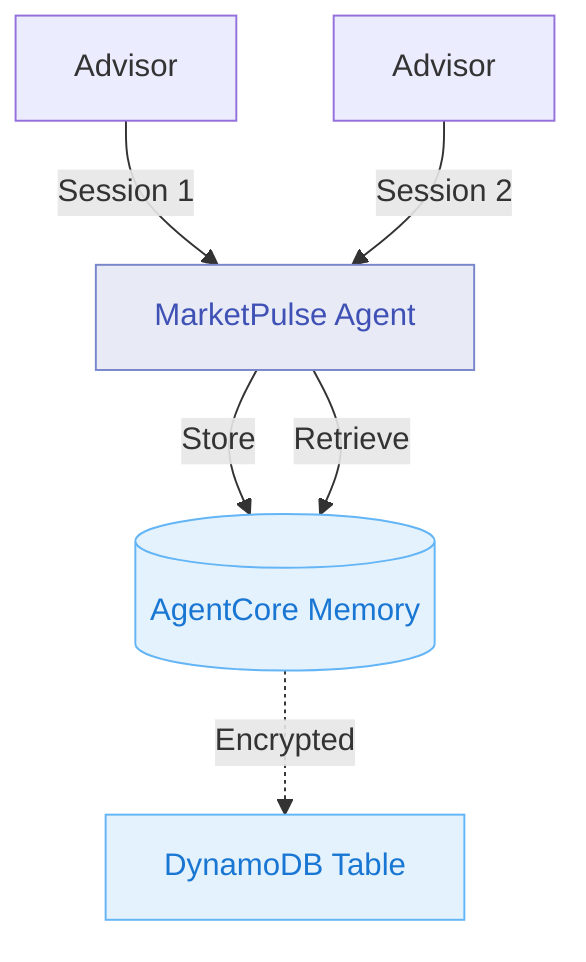

# Module 5: Enable Persistent Memory for Advisor Context

**Duration:** 25 minutes  
**Prerequisites:** Completed [Module 4](04-gateway-mcp.md)

## Learning Objectives

By the end of this module, you will:

1. Enable AgentCore Memory for persistent context
2. Store advisor preferences and client profiles
3. Demonstrate context retention across sessions
4. Understand memory isolation and security

## What is AgentCore Memory?

AgentCore Memory provides persistent storage for agent context:

- **Session continuity** - Remember previous conversations
- **User preferences** - Store advisor-specific settings
- **Entity tracking** - Maintain client profiles, watchlists
- **Context compression** - Summarise long histories

**Key features:**

- Automatic serialisation and retrieval
- Encrypted at rest and in transit
- Scoped to agents (no cross-agent leakage)
- Integrates seamlessly with Strands framework

## Architecture: Module 5


```mermaid
flowchart TB
    User[Advisor] -->|Session 1| Agent[MarketPulse Agent]
    Agent -->|Store| Memory[(AgentCore Memory)]
    User2[Advisor] -->|Session 2| Agent
    Agent -->|Retrieve| Memory
    
    Memory -.->|Encrypted| DynamoDB[DynamoDB Table]
    
    classDef runtime fill:#E8EAF6,stroke:#7986CB,color:#3F51B5
    classDef data fill:#E3F2FD,stroke:#64B5F6,color:#1976D2
    
    class Agent runtime
    class Memory,DynamoDB data
```

## What to Store in Memory

For MarketPulse, we'll store:

1. **Advisor profile** - Name, preferred units, notification settings
2. **Client registry** - Names, risk profiles, investment goals
3. **Watchlist** - Tickers the advisor tracks regularly
4. **Session context** - Recent discussions for continuity

**Example memory structure:**

```python
{
    "advisor": {
        "name": "James Wilson",
        "temperature_unit": "celsius",
        "notification_preferences": ["market_close", "holiday_alert"]
    },
    "clients": {
        "sarah_chen": {
            "name": "Sarah Chen",
            "risk_profile": "conservative",
            "goals": ["retirement", "capital_preservation"],
            "watchlist": ["BHP.AX", "CBA.AX"]
        },
        "michael_rodriguez": {
            "name": "Michael Rodriguez",
            "risk_profile": "aggressive",
            "goals": ["growth", "capital_appreciation"],
            "watchlist": ["FMG.AX", "ZIP.AX"]
        }
    }
}
```

## Step 1: Update Agent Code with Memory

The agent code in `agent/app.py` already includes memory integration. Here's how it works:

```python
from bedrock_agentcore.runtime import BedrockAgentCoreApp
from strands import Agent
from strands.models import BedrockModel

# Check if memory is enabled via environment variable
enable_memory = os.environ.get("ENABLE_MEMORY", "false").lower() == "true"
memory_id = os.environ.get("MEMORY_ID", "")
aws_region = os.environ.get("AWS_REGION", "ap-southeast-2")

# Import memory components only when enabled
if enable_memory and memory_id:
    from bedrock_agentcore.memory.integrations.strands.config import AgentCoreMemoryConfig
    from bedrock_agentcore.memory.integrations.strands.session_manager import AgentCoreMemorySessionManager
    logger.info(f"Memory enabled - using Memory ID: {memory_id}")

# When memory is disabled: Create stateless agent once at module level
# When memory is enabled: Create agent per-request with session manager
agent_instance = None

if not enable_memory:
    agent_instance = Agent(
        model=model,
        tools=tools,
        system_prompt=system_prompt
    )
    logger.info("Agent created without memory (stateless mode)")

@app.entrypoint
def marketpulse_agent(payload):
    """
    Agent invocation entrypoint.
    
    Supports memory integration when ENABLE_MEMORY=true:
    - actor_id: Identifies the advisor (for memory isolation)
    - session_id: Identifies the conversation session
    
    The AgentCoreMemorySessionManager handles all memory operations:
    - Loads memory context before agent processing
    - Stores new facts after agent responds
    """
    user_input = payload.get("prompt")
    
    # Use stateless agent if memory is disabled
    if not enable_memory:
        response = agent_instance(user_input)
        return response.message['content'][0]['text']
    
    # Memory-enabled path: Create agent with session manager per request
    actor_id = payload.get("actor_id", "advisor_001")
    session_id = payload.get("session_id", "default_session")
    
    # Configure memory for this request
    memory_config = AgentCoreMemoryConfig(
        memory_id=memory_id,
        session_id=session_id,
        actor_id=actor_id
    )
    
    # Create session manager (handles read/write automatically)
    session_manager = AgentCoreMemorySessionManager(
        agentcore_memory_config=memory_config,
        region_name=aws_region
    )
    
    # Create agent with memory
    agent_with_memory = Agent(
        model=model,
        tools=tools,
        system_prompt=system_prompt,
        session_manager=session_manager
    )
    
    # Invoke agent - session manager handles memory automatically
    response = agent_with_memory(user_input)
    return response.message['content'][0]['text']
```

**Key points:**

- **AgentCoreMemorySessionManager** handles all memory operations automatically
- Memory is loaded when the agent is created (before processing the prompt)
- New facts are stored when the agent completes its response
- **actor_id** provides memory isolation between advisors
- **session_id** groups related conversations together

**No manual memory management needed** - the session manager handles it all.

## Step 2: Enable Memory in Terraform

Edit `terraform/terraform.tfvars`:

```hcl
# Feature Flags (Enable Memory)
enable_gateway       = true
enable_http_target   = true
enable_lambda_target = true
enable_mcp_target    = true
enable_memory        = true   # <-- Set to true
enable_identity      = false
enable_observability = false
```

**What this enables:**

- Creates an AgentCore Memory resource with two strategies:
  - **User Preference Strategy** for advisor settings (namespace: `/advisors/{actorId}/preferences/`)
  - **Semantic Strategy** for client profiles (namespace: `/clients/{actorId}/`)
- Event expiry duration: 90 days
- IAM permissions for the agent to read/write memory
- Environment variables passed to the agent container:
  - `ENABLE_MEMORY=true`
  - `MEMORY_ID=<memory-arn>`

## Step 3: Deploy with Terraform

Rebuild the agent to include memory integration, then deploy:

```bash
# Rebuild the agent container with memory support
./scripts/build-agent.sh

# Deploy infrastructure changes
cd terraform
terraform plan   # Review changes
terraform apply  # Deploy

# Wait 30 seconds for IAM permissions to propagate
sleep 30
```

**What Terraform deploys:**

1. **AgentCore Memory resource** (`awscc_bedrockagentcore_memory.advisor_memory`)
   - Memory ID (ARN) is output and passed to agent as `MEMORY_ID` env var
   - Two memory strategies configured (AdvisorPreferences, ClientProfiles)
   - Event expiry set to 90 days

2. **IAM policy** (`aws_iam_role_policy.agent_memory_access`)
   - Grants agent runtime permissions:
     - `InvokeMemory`, `GetMemory`, `ListMemories`
     - `CreateEvent`, `GetEvent`, `ListEvents`, `DeleteEvent`
   - Scoped to the specific memory resource ARN

3. **Agent container** rebuilt with:
   - Memory integration dependencies
   - `ENABLE_MEMORY=true` environment variable
   - `MEMORY_ID` set to the memory resource ARN

**What Terraform creates:**

- DynamoDB table for memory storage
- KMS key for encryption
- IAM permissions for agent to access DynamoDB
- Memory configuration in AgentCore Runtime

**Expected output:**

```
Apply complete! Resources: 3 added, 1 changed, 0 destroyed.

Outputs:

memory_table_name = "marketpulse-memory-abc123"
memory_kms_key_id = "arn:aws:kms:ap-southeast-2:123456789012:key/xyz789"
```

## Step 4: Test Memory Persistence

Use the provided test script to verify memory works:

```bash
cd scripts
python test-memory.py
```

**What the test does:**

**Session 1: Store client information**
```
Prompt: "I have a new client named Sarah Chen, 45 years old, conservative investor interested in tech."

Expected Response:
- Agent acknowledges the information
- Stores client details in memory under /clients/{actor_id}/ namespace
```

**Session 2: Recall client information (same session_id)**
```
Prompt: "What's the latest on Apple for Sarah?"

Expected Response:
- Agent recalls Sarah's name and risk profile WITHOUT being told again
- Calls get_stock_price("BHP.AX")
- Calls assess_client_suitability("BHP.AX", "conservative")
- Provides tailored response: "Checking Apple for Sarah Chen (conservative)... Price: $X.XX. Clear match for her profile."
```

**Key verification:**
✓ Agent remembers "Sarah Chen" without repetition  
✓ Agent recalls "conservative" risk profile  
✓ Memory persists across separate invocations

**Test output shows:**
```
Test 1: Providing client details
----------------------------------------------------------
✓ Agent response received

Test 2: Recalling client details (without repeating)
----------------------------------------------------------
✓ Agent recalled Sarah Chen's profile from memory
✓ Memory persistence verified
```

## Step 5: Inspect Memory Storage

Check the deployed memory resource:

```bash
# Get memory resource details
cd terraform
terraform output memory_id

# View memory configuration
aws bedrock-agentcore get-memory \
    --memory-id $(terraform output -raw memory_id) \
    --region ap-southeast-2
```

**Expected output:**

```json
{
  "memory": {
## Understanding Memory Architecture

**How memory flows through the system:**

```
┌─────────────────────────────────────────────────────────────┐
│ test-memory.py                                              │
│   • Calls InvokeAgentRuntime with actor_id + session_id    │
└──────────────────────┬──────────────────────────────────────┘
                       ↓
┌─────────────────────────────────────────────────────────────┐
│ AgentCore Runtime                                           │
│   • Receives request, forwards to agent container           │
│   • Injects ENABLE_MEMORY=true, MEMORY_ID env vars         │
└──────────────────────┬──────────────────────────────────────┘
                       ↓
┌─────────────────────────────────────────────────────────────┐
│ agent/app.py: marketpulse_agent()                          │
│   1. Read actor_id, session_id from payload                │
│   2. Create AgentCoreMemoryConfig(memory_id, session_id,   │
│      actor_id)                                              │
│   3. Create AgentCoreMemorySessionManager(config)          │
│      ├─→ On init: Load existing events from memory         │
│      └─→ Inject context into agent                         │
│   4. Create Agent(session_manager=session_manager)         │
│   5. Invoke agent with user prompt                         │
│   6. Session manager stores new facts to memory            │
└──────────────────────┬──────────────────────────────────────┘
                       ↓
┌─────────────────────────────────────────────────────────────┐
│ AgentCore Memory Service                                    │
│   • DynamoDB table stores events                            │
│   • Encrypts data at rest with KMS                          │
│   • Namespaces provide isolation: /clients/{actorId}/      │
│   • Events expire after 90 days (TTL)                       │
└─────────────────────────────────────────────────────────────┘
```

**Key components:**

1. **AgentCoreMemoryConfig**: Configuration for memory access (memory_id, session_id, actor_id)
2. **AgentCoreMemorySessionManager**: Handles automatic read/write of memory during agent lifecycle
3. **Memory Strategies**: Define how events are indexed (user_preference vs semantic)
4. **Namespaces**: Provide isolation with `{actorId}` placeholder for automatic scoping
2. CBA.AX - Commonwealth Bank
   Current: $425.80
   Suitability: Clear Match ✓

Both stocks align with Sarah's conservative investment profile. Would you 
like a detailed brief on either, or shall I check for market holidays 
affecting these stocks this week?
```

## Step 6: View Memory Storage

Check DynamoDB for stored data:

```bash
aws dynamodb get-item \
    --table-name marketpulse-memory-abc123 \
    --key '{"agent_id": {"S": "marketpulse"}, "memory_key": {"S": "advisor_context"}}'
```

**Response:**

```json
{
  "Item": {
    "agent_id": {"S": "marketpulse"},
    "memory_key": {"S": "advisor_context"},
    "data": {"S": "{\"advisor\":{\"name\":\"James Wilson\"},\"clients\":{\"sarah_chen\":{...}}}"},
    "ttl": {"N": "1750272000"},
    "updated_at": {"S": "2026-02-18T14:35:00Z"}
  }
}
```

**Data is encrypted at rest via KMS.**

## Memory Best Practices

### What to Store

✓ User preferences and settings  
✓ Entity profiles (clients, accounts, portfolios)  
✓ Frequently accessed reference data  
✓ Session context for continuity  

### What NOT to Store

✗ Real-time data (prices, quotes)  
✗ PII without consent  
✗ Transactional data (better in databases)  
✗ Large documents (use S3 + references)  

### Memory Isolation

AgentCore Memory provides automatic isolation:

- **Agent-level** - Each agent has its own namespace
- **User-level** - Optional user scoping for multi-tenancy
- **Session-level** - Temporary context cleared after TTL

For MarketPulse:
```python
# Advisor-specific memory
memory = Memory(namespace="marketpulse", user_id="advisor_james")

# This ensures James can't see other advisors' data
```

## Verification Checklist

After completing this module, verify:

- [ ] Memory resource created: `terraform output memory_id` shows ARN
- [ ] Agent container rebuilt with memory integration
- [ ] `ENABLE_MEMORY=true` environment variable set (check agent logs)
- [ ] IAM permissions granted (wait 30s after `terraform apply`)
- [ ] Test Session 1 completes successfully (stores client details)
- [ ] Test Session 2 completes successfully (recalls client details)
- [ ] Agent logs show: `[INFO] Memory enabled - actor_id: xxx, session_id: xxx`
- [ ] Memory status is ACTIVE: `aws bedrock-agentcore get-memory` shows `"status": "ACTIVE"`

**If any step fails, review the Common Issues section above.**

## Common Issues

### "AccessDenied: CreateEvent" Error

**Cause:** IAM permissions haven't propagated yet.

**Solution:** 
```bash
# Wait 30 seconds after terraform apply
sleep 30

# Then retry the test
python scripts/test-memory.py
```

**Why this happens:** AWS IAM changes take 10-30 seconds to propagate globally. The agent runtime might try to write to memory before the new permissions are active.

---

### "ValidationException: session_id too short"

**Cause:** Session ID must be at least 33 characters.

**Solution:**
```python
# Bad (too short):
session_id = "session-123"

# Good (33+ characters):
session_id = f"memory-test-session-{uuid.uuid4()}"  # 48 chars
```

**Why this happens:** AWS enforces minimum length to ensure UUIDs or cryptographically random IDs are used, preventing collisions.

---

### Agent doesn't recall previous session

**Cause:** Different `session_id` used between invocations.

**Solution:** Use the same `session_id` for related conversations:
```python
# Session 1:
invoke_agent(session_id="session-abc123...")

# Session 2 (same session):
invoke_agent(session_id="session-abc123...")  # Same ID
```

---

### Agent recalls wrong advisor's data

**Cause:** Same `actor_id` used for different advisors, or namespace misconfiguration.

**Solution:** 
- Use unique `actor_id` per advisor: `advisor-james`, `advisor-karen`
- Verify namespace has `{actorId}` placeholder in Terraform
- Check agent logs to confirm correct actor_id:
  ```bash
  aws logs tail /aws/bedrock-agentcore/runtime/marketpulse_workshop_dev_agent
  # Look for: [INFO] Memory enabled - actor_id: advisor-xxx
  ```

---

### Memory latency > 2 seconds

**Cause:** Large number of events in namespace (semantic search over thousands of events).

**Solution:** 
- Reduce `event_expiry_duration` if 90 days is too long
- Use `user_preference_memory_strategy` for structured data (faster than semantic)
- Implement periodic summarisation in production

---

### Events not expiring after 90 days

**Cause:** AgentCore Memory handles TTL internally (not visible as DynamoDB TTL attribute).

**Solution:** This is expected behaviour. Check `event_expiry_duration` in memory config:
```bash
aws bedrock-agentcore get-memory \
    --memory-id $(cd terraform && terraform output -raw memory_id) \
    | jq '.memory.eventExpiryDuration'
# Should output: 90
```

## FSI Relevance: Memory and Compliance

In financial services, persistent memory enables:

1. **Client Continuity** - Advisors don't repeat themselves
2. **Audit Trail** - Memory updates are logged
3. **Personalisation** - Advice tailored to known preferences
4. **Data Residency** - Memory stays in your AWS account/region
5. **Encryption** - All memory encrypted at rest with KMS

**Compliance considerations:**

- **Right to be Forgotten** - Implement memory purge on client request
- **Data Retention** - Set TTL per regulatory requirements
- **Access Control** - Use IAM to restrict memory access
- **Encryption Keys** - Rotate KMS keys per policy

## Discussion Questions

1. **What context would your advisors want the agent to remember?**
2. **How do you currently handle cross-session continuity?**
3. **What are your data retention requirements for client interactions?**

## Next Steps

You've enabled persistent memory for advisor and client context. The agent now provides continuity across sessions.

In [Module 6](06-identity.md), you'll secure the agent and MCP server with AgentCore Identity.

---

**Key Takeaways:**

- AgentCore Memory provides persistent context storage
- Memory is encrypted, scoped, and automatically managed
- Use session hooks to load and save context
- Enables personalised, continuous advisor experiences
- Critical for FSI where context continuity improves service