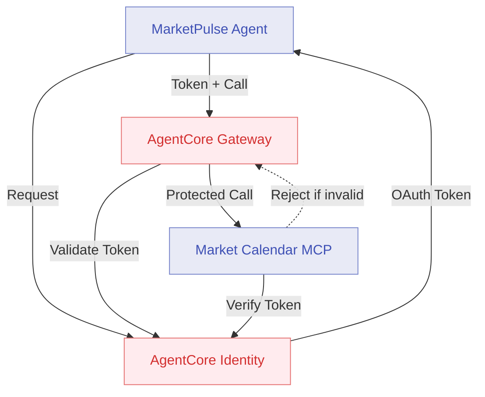
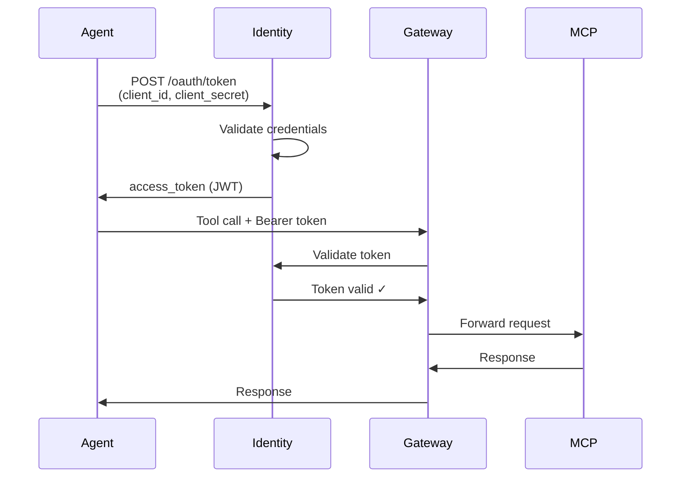

# Module 6: Secure with AgentCore Identity

**Duration:** 25 minutes  
**Prerequisites:** Completed [Module 5](05-memory.md)

## Learning Objectives

By the end of this module, you will:

1. Secure Gateway targets with OAuth 2.0 authentication
2. Protect the MCP server endpoint from unauthorised access
3. Understand OAuth 2.0 client credentials flow
4. Configure agent credentials via AgentCore Identity

## What is AgentCore Identity?

AgentCore Identity provides managed authentication for agents:

- **OAuth 2.0 support** - Standard client credentials flow
- **Credential management** - Automatic rotation and renewal
- **Target protection** - Secure Gateway endpoints
- **IAM integration** - Works with AWS IAM for fine-grained control

**Key benefits:**

- No hardcoded credentials in agent code
- Automatic token refresh before expiry
- Audit trail of all authentication attempts
- Multi-tenancy support for isolating agents

## Architecture: Module 6



## Why Secure the MCP Server?

In the current setup, the MCP server is publicly accessible via Gateway. **This is a security risk:**

1. Anyone with the endpoint URL can call it
2. No audit trail of who called what
3. Cannot implement rate limiting per caller
4. Cannot revoke access without redeploying

**With Identity:**

1. ✓ Only authenticated agents can call MCP tools
2. ✓ Every call includes caller identity
3. ✓ Rate limits can be applied per client
4. ✓ Access can be revoked instantly

## OAuth 2.0 Client Credentials Flow



**Key steps:**

1. Agent requests token from Identity service
2. Identity validates client credentials
3. Identity issues JWT access token
4. Agent includes token in all Gateway calls
5. Gateway validates token before forwarding to targets

## Step 1: Configure OAuth Client

Create OAuth client configuration in `terraform/identity.tf`:

```hcl
resource "aws_agentcore_oauth_client" "marketpulse" {
  name = "marketpulse-agent"
  
  # Client credentials
  client_id_prefix = "marketpulse"
  
  # Token settings
  token_expiry_seconds = 3600  # 1 hour
  refresh_enabled = true
  
  # Allowed scopes
  scopes = [
    "gateway:invoke",
    "mcp:call"
  ]
  
  tags = local.common_tags
}

# Store credentials in Secrets Manager
resource "aws_secretsmanager_secret" "oauth_credentials" {
  name = "${local.project_name}-oauth-credentials"
  kms_key_id = aws_kms_key.agentcore.id
}

resource "aws_secretsmanager_secret_version" "oauth_credentials" {
  secret_id = aws_secretsmanager_secret.oauth_credentials.id
  secret_string = jsonencode({
    client_id = aws_agentcore_oauth_client.marketpulse.client_id
    client_secret = aws_agentcore_oauth_client.marketpulse.client_secret
  })
}
```

## Step 2: Protect MCP Target

Update Gateway configuration to require authentication:

```hcl
resource "aws_agentcore_gateway_target" "mcp_server" {
  name = "market-calendar-mcp"
  type = "MCP"
  
  endpoint = aws_agentcore_runtime.mcp_server.endpoint
  
  # Require authentication
  authentication {
    type = "OAUTH2"
    oauth_config {
      required_scopes = ["mcp:call"]
      issuer = aws_agentcore_identity.main.issuer_url
    }
  }
}
```

## Step 3: Update Agent Code

Edit `agent/app.py` to use OAuth credentials:

```python
from bedrock_agentcore import BedrockAgentCoreApp
from strands_agents import Agent
from strands_agents.auth import OAuth2Client
import os

# Initialise OAuth client
oauth_client = OAuth2Client(
    client_id=os.getenv("OAUTH_CLIENT_ID"),
    client_secret=os.getenv("OAUTH_CLIENT_SECRET"),
    token_url=os.getenv("OAUTH_TOKEN_URL"),
    scopes=["gateway:invoke", "mcp:call"]
)

agent = Agent(
    name="MarketPulse",
    model="anthropic.claude-sonnet-4-5-20250929-v1:0",
    auth_client=oauth_client,  # Attach OAuth client
    instructions="""
    You are MarketPulse, an AI investment brief assistant.
    
    All Gateway calls are now authenticated. You don't need to handle this
    yourself - the framework manages token acquisition and refresh automatically.
    """
)

# Tools remain unchanged
```

## Step 4: Configure Terraform

Edit `terraform/terraform.tfvars`:

```hcl
# Feature Flags (Enable Identity)
enable_runtime = true
enable_gateway = true
enable_http_target = true
enable_lambda_target = true
enable_mcp_target = true
enable_memory = true
enable_identity = true
enable_observability = false

# Identity configuration
oauth_token_expiry = 3600  # 1 hour
enable_token_refresh = true
```

## Step 5: Rebuild and Deploy

Rebuild the agent with Identity support:

```bash
./scripts/build-agent.sh
```

Deploy with Terraform:

```bash
cd terraform
terraform apply
```

**What Terraform creates:**

- OAuth client registration
- Secrets Manager entry for credentials
- Updated Gateway target with auth requirement
- Environment variables for agent runtime

**Expected output:**

```
Apply complete! Resources: 3 added, 2 changed, 0 destroyed.

Outputs:

oauth_client_id = "marketpulse-abc123"
oauth_token_url = "https://identity.agentcore.ap-southeast-2.amazonaws.com/oauth/token"
oauth_secret_arn = "arn:aws:secretsmanager:ap-southeast-2:123456789012:secret:marketpulse-oauth-xyz"
```

## Step 6: Test Authenticated Calls

Test normal agent query (should work):

```bash
python scripts/test-agent.py "Are there any market holidays this week?"
```

**Expected response:**

```
Agent Response:
===============

Market Calendar Check (US Markets)

Period: Feb 18 - Feb 25, 2026

Upcoming Holidays:
- Monday, Feb 22: Presidents' Day (Markets Closed)

Trading Impact: 1 day affected

[Agent authenticated successfully with OAuth token]
```

## Step 7: Test Unauthorised Access

Attempt direct MCP call without credentials:

```bash
curl -X POST https://mcp-abc123.agentcore.ap-southeast-2.amazonaws.com/tools/check_market_holidays \
  -H "Content-Type: application/json" \
  -d '{"country_code": "US", "days_ahead": 7}'
```

**Expected response:**

```json
{
  "error": "Unauthorised",
  "message": "Valid OAuth token required",
  "statusCode": 401
}
```

Now call with token:

```bash
# Get token
TOKEN=$(python scripts/get-oauth-token.py)

# Call with token
curl -X POST https://mcp-abc123.agentcore.ap-southeast-2.amazonaws.com/tools/check_market_holidays \
  -H "Content-Type: application/json" \
  -H "Authorization: Bearer $TOKEN" \
  -d '{"country_code": "US", "days_ahead": 7}'
```

**Expected response:**

```json
{
  "holidays": [
    {
      "date": "2026-02-22",
      "name": "Presidents' Day",
      "is_trading_day": false
    }
  ],
  "trading_days_affected": 1
}
```

## Step 8: View Authentication Logs

Check Identity service logs:

```bash
aws logs tail /aws/bedrock-agentcore/identity --follow
```

**What to look for:**

```
[INFO] Token request: client_id=marketpulse-abc123, scopes=[gateway:invoke, mcp:call]
[INFO] Credentials validated
[INFO] Token issued: expires_in=3600s
[INFO] Token validation: token_valid=true, client=marketpulse-abc123
```

## Authentication Strategies Comparison

| Strategy | Use Case | Pros | Cons |
|----------|----------|------|------|
| **IAM** | AWS services | Native AWS, fine-grained | AWS-only |
| **OAuth 2.0** | Multi-platform | Standard protocol, widely supported | Token management complexity |
| **API Keys** | Simple APIs | Easy to implement | No expiry, hard to rotate |
| **Mutual TLS** | High security | Strong authentication | Certificate management overhead |

**AgentCore Identity provides OAuth 2.0** because:
- Standard protocol supported by most systems
- Automatic token refresh
- Compatible with enterprise identity providers
- Can integrate with SAML/OIDC for SSO

## Verification Checklist

- [ ] OAuth client created in Identity
- [ ] Credentials stored in Secrets Manager
- [ ] MCP target configured with auth requirement
- [ ] Agent rebuilt with OAuth support
- [ ] Authenticated calls succeed
- [ ] Unauthorised calls rejected with 401
- [ ] Token validation logs visible

## Common Issues

### Agent returns "Unauthorised" on all calls

**Cause:** OAuth credentials not injected into agent environment.

**Solution:** Check environment variables:
```bash
aws agentcore describe-runtime --runtime-id <runtime_id> --query 'environment'
```

### Token expired errors

**Cause:** Token expiry too short or refresh disabled.

**Solution:** Increase expiry in Terraform:
```hcl
oauth_token_expiry = 7200  # 2 hours
```

### "Invalid scope" error

**Cause:** Agent requesting scopes not granted to client.

**Solution:** Add required scopes:
```hcl
scopes = [
  "gateway:invoke",
  "mcp:call",
  "memory:read",
  "memory:write"
]
```

## FSI Relevance: Identity and Compliance

OAuth 2.0 authentication addresses key FSI requirements:

1. **Non-Repudiation** - Every call has a verified caller identity
2. **Access Control** - Revoke client access without code changes
3. **Audit Trail** - Full log of who accessed what and when
4. **Credential Rotation** - Automatic token refresh, no downtime
5. **Least Privilege** - Scopes limit what each client can do

**Regulatory alignment:**

- **GDPR** - Identity tracking for data access logs
- **PSD2** - Strong customer authentication requirements
- **SOC 2** - Access control and authentication standards
- **ISO 27001** - Identity and access management controls

## Real-World FSI Patterns

### Pattern 1: Per-Advisor Identity

```python
# Each advisor gets their own OAuth client
oauth_client = OAuth2Client(
    client_id=f"advisor-{advisor_id}",
    client_secret=get_secret(advisor_id),
    token_url=IDENTITY_URL
)
```

**Benefit:** Audit trail shows which advisor accessed what.

### Pattern 2: Service Account per Agent Type

```python
# Different clients for different agent functions
clients = {
    "market-data": OAuth2Client(client_id="svc-market", ...),
    "compliance": OAuth2Client(client_id="svc-compliance", ...),
    "advisory": OAuth2Client(client_id="svc-advisory", ...)
}
```

**Benefit:** Fine-grained access control - compliance agents can't access trading APIs.

### Pattern 3: Dynamic Scope Elevation

```python
# Request additional scopes when needed
token = oauth_client.get_token(
    scopes=["gateway:invoke", "sensitive-data:read"]
)
```

**Benefit:** Principle of least privilege - only request high-privilege scopes when needed.

## Discussion Questions

1. **How do you currently authenticate service-to-service calls?**
2. **What audit requirements do you have for AI agent access?**
3. **How would you integrate this with your enterprise identity provider?**

## Next Steps

You've secured the agent and MCP server with OAuth 2.0 authentication. All calls now require valid credentials.

In [Module 7](07-observability.md), you'll instrument the agent with AgentCore Observability to inspect full request traces.

---

**Key Takeaways:**

- AgentCore Identity provides managed OAuth 2.0 authentication
- Credentials are stored securely and rotated automatically
- Gateway validates tokens before forwarding to targets
- Authentication enables audit trails and access control
- Critical for FSI compliance and security requirements