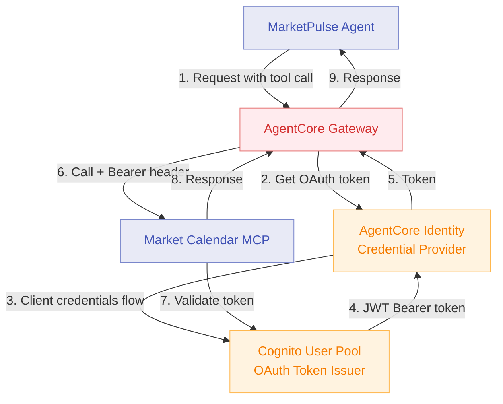
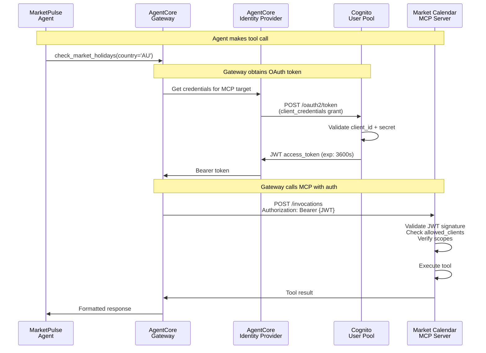

# Module 6: Secure with AgentCore Identity

**Duration:** 30 minutes  
**Prerequisites:** Completed [Module 4](04-gateway-mcp.md) (MCP Gateway target deployed)

## Learning Objectives

By the end of this module, you will:

1. Understand OAuth 2.0 authentication for MCP Gateway targets
2. Secure the MCP server endpoint with JWT Bearer tokens
3. Configure Cognito as an OAuth 2.0 authorisation server
4. Create an AgentCore Identity credential provider for the Gateway
5. Test authenticated vs. unauthenticated access patterns

## What is AgentCore Identity?

AgentCore Identity provides managed authentication for agents accessing external services and Gateway targets:

- **OAuth 2.0 support** - Standard client credentials flow for machine-to-machine auth
- **Credential management** - Automatic token acquisition, refresh, and rotation
- **Target protection** - Secure Gateway endpoints with JWT validation
- **IAM integration** - Works with AWS IAM and Amazon Cognito

**Key benefits:**

- No hardcoded credentials in agent code
- Automatic token refresh before expiry
- Full audit trail of authentication attempts in CloudWatch
- Scope-based access control for fine-grained permissions

## Architecture: Module 6



## Why Secure the MCP Server?

**Module 4 configuration (enable_identity=false):**

The MCP server is accessible via the Gateway using `GATEWAY_IAM_ROLE` credential type. This means:
- No JWT token validation on the MCP Runtime
- Gateway uses its IAM role to invoke the MCP server
- Simpler setup for workshop learning purposes
- **Security risk:** No caller identification or access control

**Module 6 configuration (enable_identity=true):**

The MCP server requires OAuth 2.0 authentication. This means:
- MCP Runtime validates JWT Bearer tokens before processing requests
- Gateway obtains tokens from Cognito via AgentCore Identity
- Every call includes authenticated caller identity
- **Security benefit:** Full access control and audit trails

**Why this matters for FSI:**

1. ✓ **Non-repudiation** - Every call linked to an authenticated client
2. ✓ **Access revocation** - Disable client without redeploying infrastructure
3. ✓ **Rate limiting** - Apply quotas per client_id
4. ✓ **Compliance** - Audit trail meets regulatory requirements (SOC 2, ISO 27001)
5. ✓ **Least privilege** - Scopes restrict what each client can do
  
  # Client credentials
  client_id_prefix = "marketpulse"
  
  # Token settings
  token_expiry_seconds = 3600  # 1 hour
  refresh_enabled = true
  
  # Allowed scopes
## OAuth 2.0 Client Credentials Flow

This is how the Gateway authenticates to the MCP server:



**Key steps:**

1. Agent calls Gateway via standard tool invocation (no auth code needed in agent)
2. Gateway checks if target requires OAuth credentials  
3. Gateway asks AgentCore Identity provider for token
4. Provider performs OAuth client_credentials flow with Cognito
5. Cognito validates client_id + client_secret and issues JWT
6. Gateway includes JWT in `Authorization: Bearer` header
7. MCP Runtime validates JWT before forwarding to FastMCP container
8. Response flows back through Gateway to agent

## Step 1: Review the Terraform Configuration

The OAuth configuration is already defined in `terraform/identity.tf`. Review the resources:

```bash
cat terraform/identity.tf
```

**Key resources created when `enable_identity = true`:**

1. **Cognito User Pool** - OAuth 2.0 authorisation server for issuing tokens
2. **Cognito User Pool Domain** - Provides token endpoint and OIDC discovery URL
3. **Cognito Resource Server** - Defines custom OAuth scope: `mcp-runtime-server/invoke`
4. **Cognito User Pool Client** - M2M client for Gateway (client_credentials flow)
5. **AgentCore Identity Credential Provider** - Stores Cognito credentials, referenced by Gateway

**No code changes are required**. The Terraform resources handle everything.

## Step 2: Enable Identity in Terraform Variables

Edit `terraform/terraform.tfvars`:

```hcl
# Feature Flags - Progressive Workshop Modules
enable_gateway       = true
enable_http_target   = true
enable_lambda_target = true
enable_mcp_target    = true
enable_memory        = false  # Module 5 (optional for this module)
enable_identity      = true   # ← Set this to true for Module 6
enable_observability = false

# Core configuration (unchanged)
aws_region         = "ap-southeast-2"
project_name       = "marketpulse-workshop"
environment        = "dev"
bedrock_model_id   = "anthropic.claude-sonnet-4-5-20250929-v1:0"
finnhub_api_key    = "your-finnhub-api-key"  # From Module 2
```

**What changes when you set `enable_identity = true`:**

- Cognito User Pool created for OAuth token issuance
- MCP Runtime adds JWT authoriser (`authorizer_configuration` block)
- Gateway target switches from `GATEWAY_IAM_ROLE` to `OAUTH` credential type
- AgentCore Identity credential provider stores Cognito client credentials

## Step 3: Apply Terraform Changes

Deploy the Identity module:

```bash
cd terraform
terraform plan  # Review changes
terraform apply
```

**Expected output:**

```
Plan: 6 to add, 2 to change, 0 to destroy.

Changes to Outputs:
  + cognito_client_id            = (sensitive value)
  + cognito_user_pool_domain     = "marketpulse-workshop-mcp-12345678"
  + cognito_user_pool_id         = "ap-southeast-2_AbCdEf123"
  + mcp_authentication_enabled   = true
  + oauth_discovery_url          = "https://cognito-idp.ap-southeast-2.amazonaws.com/..."
```

**Resources created:**

- `aws_cognito_user_pool.mcp_server[0]` - OAuth authorisation server
- `aws_cognito_user_pool_domain.mcp_server[0]` - Token endpoint domain
- `aws_cognito_resource_server.mcp_server[0]` - Scope definition
- `aws_cognito_user_pool_client.gateway_m2m[0]` - M2M client credentials
- `null_resource.mcp_oauth_credential_provider[0]` - Creates AgentCore Identity provider
- Updated: `awscc_bedrockagentcore_runtime.mcp[0]` - Adds JWT authoriser
- Updated: `null_resource.mcp_gateway_target[0]` - Switches to OAUTH credential type

**Terraform will take ~2-3 minutes** to create Cognito resources and update the MCP Runtime.

## Step 4: No Agent Code Changes Required

The MarketPulse agent in `agent/app.py` **requires no modifications** for OAuth authentication.

**Why?**

- OAuth authentication is handled entirely by the **Gateway** and **MCP Runtime**
- The agent makes normal tool calls (e.g., `check_market_holidays`)
- AgentCore Gateway transparently:
  1. Detects the target requires OAuth
  2. Obtains a token from the Identity provider
  3. Includes the Bearer token in the MCP server call
  4. Returns the response to the agent

**The agent code remains unchanged from Module 4.**

## Step 5: Test OAuth Authentication

Run the OAuth authentication test script:

```bash
cd /path/to/workshop
python scripts/test-auth.py
```

**Expected output when `enable_identity = true`:**

```
AWS AgentCore Workshop: Testing OAuth Authentication (Module 6)
======================================================================

Retrieving agent configuration from Terraform outputs...
  Runtime ARN:           arn:aws:bedrock-agentcore:ap-southeast-2:...
  Endpoint Name:         marketpulse_workshop_agent_endpoint
  MCP Configured:        true
  Authentication:        true

✓ OAuth 2.0 authentication is ENABLED

Current configuration: Module 6 (MCP with OAuth authentication)

What this means:
  - MCP Runtime validates JWT Bearer tokens from Cognito
  - Gateway obtains tokens via AgentCore Identity credential provider
  - Unauthenticated calls return 401 Unauthorised

Test Scenarios
----------------------------------------------------------------------

Test 1: Test MCP server authentication
Prompt: Are there any market holidays in Australia this week?

✓ Test 1 PASSED
  Expected: Holiday data or trading days confirmation
  Received: Based on the market calendar, there are no public holidays 
  affecting the Australian stock market in the next 7 days...

Test 2: Test OAuth token acquisition and validation
Prompt: Check if there are any public holidays affecting the Australian 
        stock market in the next 5 days.

✓ Test 2 PASSED
  Expected: Holiday information with dates
  Received: The market calendar shows no public holidays in Australia...

======================================================================
Test Summary
----------------------------------------------------------------------
Total tests:         2
Passed:              2
Failed:              0

Authentication Status: OAuth 2.0 ENABLED ✓

Key components working:
  ✓ Cognito User Pool issuing JWT tokens
  ✓ AgentCore Identity credential provider
  ✓ Gateway obtaining and sending Bearer tokens
  ✓ MCP Runtime validating tokens before forwarding to FastMCP

Security benefits:
  - Only authorised clients can call the MCP server
  - Tokens expire after 1 hour (configurable)
  - Full audit trail in CloudWatch logs
  - Scope-based access control (mcp-runtime-server/invoke)
```

## Step 6 (Optional): Inspect OAuth Tokens

Examine the Cognito configuration:

```bash
# Get the Cognito User Pool ID
terraform output cognito_user_pool_id

# Get the discovery URL (OIDC well-known endpoint)
terraform output oauth_discovery_url

# View discovery document
curl "$(terraform output -raw oauth_discovery_url)"
```

**Discovery document shows:**

```json
{
  "issuer": "https://cognito-idp.ap-southeast-2.amazonaws.com/ap-southeast-2_AbCdEf123",
  "token_endpoint": "https://marketpulse-workshop-mcp-12345678.auth.ap-southeast-2.amazoncognito.com/oauth2/token",
  "jwks_uri": "https://cognito-idp.ap-southeast-2.amazonaws.com/ap-southeast-2_AbCdEf123/.well-known/jwks.json",
  "token_endpoint_auth_methods_supported": ["client_secret_basic", "client_secret_post"],
  "grant_types_supported": ["client_credentials", "refresh_token"]
}
```

**What the Gateway does behind the scenes:**

1. Reads credential provider ARN from SSM Parameter Store (`/marketpulse-workshop/dev/mcp-oauth-provider-arn`)
2. Calls AgentCore Identity: `GetCredentials(providerArn)`
3. Identity returns Cognito `client_id` and `client_secret`
4. Gateway calls Cognito token endpoint: `POST /oauth2/token` with `grant_type=client_credentials`
5. Cognito returns JWT: `{"access_token": "eyJraWQiOiI...", "expires_in": 3600, "token_type": "Bearer"}`
6. Gateway includes JWT in MCP call: `Authorization: Bearer eyJraWQiOiI...`

You can manually test the token endpoint:

```bash
# Get client credentials (stored in Cognito resource)
CLIENT_ID=$(aws cognito-idp describe-user-pool-client \
  --user-pool-id $(terraform output -raw cognito_user_pool_id) \
  --client-id $(terraform output -raw cognito_client_id) \
  --query 'UserPoolClient.ClientId' --output text)

# The client secret is stored securely - Gateway retrieves it via Identity provider
# Manual testing requires extracting it (not recommended in production)
```

## Authentication Strategies Comparison

| Strategy | Use Case | Pros | Cons | AgentCore Support |
|----------|----------|------|------|------------------|
| **GATEWAY_IAM_ROLE** | Internal AWS services | Simple, no token management | AWS-only, no caller identification | ✓ All target types |
| **OAuth 2.0 / JWT** | Multi-platform, M2M | Standard protocol, audit trails | Token management, setup complexity | ✓ MCP targets (required) |
| **API Keys** | Simple public APIs | Easy to implement | No automatic expiry, hard to rotate | ✓ HTTP targets (passthrough) |
| **Mutual TLS** | High-security B2B | Strong authentication | Certificate management overhead | Limited support |

**Why OAuth 2.0 for MCP targets:**

- **Standards-based**: IETF OAuth 2.0 RFC 6749, widely implemented
- **Caller identification**: Every JWT includes `client_id` claim for audit trails  
- **Time-limited**: Tokens expire automatically (default 3600s)
- **Scope-based**: Fine-grained access control per target/operation
- **Revocable**: Disable client instantly without code changes
- **FSI-compliant**: Meets PSD2, GDPR, SOC 2, ISO 27001 requirements

## Verification Checklist

After deploying Module 6, verify:

- [ ] `enable_identity = true` in terraform.tfvars
- [ ] `terraform apply` completed without errors
- [ ] Cognito User Pool created (check Terraform outputs)
- [ ] AgentCore Identity credential provider registered in SSM
- [ ] MCP Runtime has JWT authoriser configured (check Runtime details)
- [ ] Gateway target uses OAUTH credential type (not GATEWAY_IAM_ROLE)
- [ ] test-auth.py script shows "Authentication: true"
- [ ] Agent successfully invokes MCP tools (OAuth handled transparently)

## Common Issues

### Terraform Error: "authoriser_configuration references undefined resource"

**Cause:** `enable_identity = true` but Cognito resources not created due to conditional count logic error.

**Solution:**
```bash
# Check that both flags are set
grep -E 'enable_mcp_target|enable_identity' terraform/terraform.tfvars

# Both should be true:
enable_mcp_target = true
enable_identity = true

# If one is false, update and re-apply
terraform apply
```

### Gateway Target Creation Fails: "OAuth provider ARN not found in SSM"

**Cause:** The AgentCore Identity credential provider wasn't created before Gateway target registration.

**Solution:**
```bash
# Check if the SSM parameter exists
aws ssm get-parameter \
  --name "/marketpulse-workshop/dev/mcp-oauth-provider-arn" \
  --region ap-southeast-2

# If it doesn't exist, the null_resource.mcp_oauth_credential_provider failed
# Check Terraform logs and re-run:
terraform destroy -target=null_resource.mcp_oauth_credential_provider
terraform apply
```

### MCP Server Returns 401: "Access Denied"

**Cause:** JWT validation failing at MCP Runtime.

**Possible reasons:**

1. **Token expired** - Default 3600s (1 hour). Gateway should auto-refresh.
2. **Client ID mismatch** - `allowed_clients` in Runtime authoriser doesn't match Gateway's client_id
3. **Invalid scope** - Token doesn't include `mcp-runtime-server/invoke` scope
4. **Signature invalid** - Token not signed by the expected Cognito User Pool

**Solution:**
```bash
# Verify authoriser configuration on MCP Runtime
aws bedrock-agentcore describe-agent-runtime \
  --agent-runtime-id $(terraform output -raw mcp_server_runtime_id) \
  --region ap-southeast-2 \
  --query 'agentRuntime.authorizerConfiguration'

# Expected output:
# {
#   "customJwtAuthorizer": {
#     "allowedClients": ["<client_id>"],
#     "discoveryUrl": "https://cognito-idp.ap-southeast-2.amazonaws.com/...",
#     "allowedScopes": ["mcp-runtime-server/invoke"]
#   }
# }

# Verify the client_id matches the Gateway's M2M client:
terraform output cognito_client_id
```

### Agent Calls Succeed But No OAuth Token Visible in Logs

**Cause:** OAuth authentication is working correctly! The Gateway handles token acquisition transparently.

**What to check:**

CloudWatch Logs for the Gateway show token acquisition:

```bash
aws logs tail "/aws/agentcore/gateway/$(terraform output -raw gateway_id)" \
  --follow --filter-pattern "oauth"
```

### Token expired errors

**Cause:** Token expiry too short or refresh disabled.

**Solution:** Increase expiry in Terraform:
```hcl
oauth_token_expiry = 7200  # 2 hours
```

# Expected: OAuth token acquisition events
```

MCP Runtime logs show JWT validation:

```bash
aws logs tail "/aws/bedrock/agent/$(terraform output -raw mcp_server_runtime_name)" \
  --follow --filter-pattern "JWT"

# Expected: Token validation success/failure events
```

## FSI Relevance: Identity and Compliance

OAuth 2.0 authentication addresses key FSI regulatory requirements:

### 1. Non-Repudiation and Audit Trails

- **Requirement:** GDPR Article 30, SOC 2 CC6.1
- **How OAuth helps:** Every JWT includes `client_id`, `iat` (issued at), and `exp` (expiry) claims
- **Audit trail:** CloudWatch logs capture which client called which service at what time

### 2. Access Control and Revocation

- **Requirement:** ISO 27001 A.9.4.1, PCI DSS 7.1
- **How OAuth helps:** Tokens expire automatically; client access revoked by deleting Cognito client
- **No downtime:** Revoke compromised clients instantly without redeploying agent code

### 3. Least Privilege via Scopes

- **Requirement:** NIST SP 800-53 AC-6, GDPR Article 25
- **How OAuth helps:** Scopes define what each client can do (`mcp-runtime-server/invoke`)
- **Extensibility:** Add new scopes as services expand (`memory:read`, `knowledge-base:query`)

### 4. Strong Authentication for M2M

- **Requirement:** PSD2 RTS Article 4, ISO 27001 A.9.4.2
- **How OAuth helps:** Client secret + Cognito validation = multi-factor M2M authentication
- **Compliance benefit:** Meets strong customer authentication (SCA) requirements for API access

### 5. Token Expiry and Rotation

- **Requirement:** SOC 2 CC6.1, PCI DSS 8.2.4
- **How OAuth helps:** Tokens expire after 3600s (configurable); Gateway auto-refreshes
- **Security benefit:** Stolen tokens have limited validity; automatic rotation reduces risk

**Regulatory Mapping:**

| Regulation | Control | OAuth Implementation |
|------------|---------|---------------------|
| **GDPR** | Article 30 (Processing records) | CloudWatch logs capture client_id, timestamp, scope for every request |
| **PSD2** | RTS Article 4 (SCA) | Client credentials flow = possession + knowledge factors |
| **SOC 2** | CC6.1 (Logical access) | Scope-based authorisation, automatic token expiry |
| **ISO 27001** | A.9.4.1 (Access restriction) | Cognito client management, instant revocation |
| **PCI DSS** | 8.2.4 (Password changes) | Client secret rotation via Cognito API |

## Real-World FSI Patterns

### Pattern 1: Per-Advisor OAuth Client

**Scenario:** Multi-tenant advisory platform with 100+ advisors. Each advisor's agent needs isolated access.

**Implementation:**

```hcl
# Terraform: Create one Cognito client per advisor
resource "aws_cognito_user_pool_client" "advisor_client" {
  for_each = toset(var.advisor_ids)

  name         = "advisor-${each.key}"
  user_pool_id = aws_cognito_user_pool.advisors.id
  
  # Scopes differ by advisor tier
  allowed_oauth_scopes = lookup(var.advisor_scopes, each.key, ["gateway:invoke", "mcp:call"])
  
  # Client credentials flow only
  allowed_oauth_flows = ["client_credentials"]
}
```

**Benefit:** Audit trail shows which advisor accessed what client data. Revoke individual advisor without affecting others.

### Pattern 2: Service Identity per Agent Function

**Scenario:** Different agent types (market-data, compliance-check, trade-execution) need different permissions.

**Implementation:**

```hcl
# Terraform: Separate resource servers per function
resource "aws_cognito_resource_server" "functions" {
  for_each = {
    market-data   = ["read:stock-price", "read:market-calendar"]
    compliance    = ["read:client-profile", "write:risk-assessment"]
    trading       = ["write:order", "read:portfolio"]
  }

  identifier   = each.key
  user_pool_id = aws_cognito_user_pool.agents.id

  dynamic "scope" {
    for_each = each.value
    content {
      scope_name = scope.value
      scope_description = "${each.key} - ${scope.value}"
    }
  }
}
```

**Benefit:** Compliance agents can't initiate trades. Market data agents can't access PII. Principle of least privilege enforced via OAuth scopes.

### Pattern 3: Temporary Elevated Access

**Scenario:** During market volatility, risk agents need expanded access to execute client portfolio rebalancing.

**Implementation:**

```python
# Python: Agent requests elevated scope dynamically
import boto3

cognito_idp = boto3.client('cognito-idp')

# Normal scope
base_scopes = ["gateway:invoke", "mcp:call"]

# Elevated scope during high-volatility events
if market_volatility_index > threshold:
    elevated_scopes = base_scopes + ["trading:rebalance", "portfolio:modify"]
    
    # Update client to allow elevated scopes (requires admin privileges)
    cognito_idp.update_user_pool_client(
        UserPoolId=user_pool_id,
        ClientId=client_id,
        AllowedOAuthScopes=elevated_scopes
    )
```

**Benefit:** Time-limited elevated privileges. Audit log shows when elevated access was granted and by whom. Revoke automatically after event.

## Discussion Questions

1. **How do you currently authenticate service-to-service calls in your organisation?**  
   (API keys? Mutual TLS? IAM roles? Compare with OAuth 2.0 benefits)

2. **What audit and compliance requirements do you have for AI agent access?**  
   (GDPR? SOC 2? PCI DSS? How would OAuth audit trails help?)

3. **How would you integrate this with your enterprise identity provider?**  
   (SAML federation? OIDC? Cognito supports federated identities)

4. **What are your token expiry policies?**  
   (3600s default - too long? Too short? How does auto-refresh impact your risk model?)

## Next Steps

You've secured the MCP Gateway target with OAuth 2.0 authentication. The agent transparently obtains and uses JWT tokens for all MCP calls.

**Module 7: AgentCore Observability** (Coming Next)

In [Module 7](07-observability.md), you'll instrument the agent with distributed tracing to:
- Visualise the full request flow: Agent → Gateway → MCP Server
- Measure latency for each hop (useful for SLA monitoring)
- Identify bottlenecks in tool calls
- Track OAuth token acquisition time
- Debug failures with detailed span attributes

## Key Takeaways

✓ **OAuth 2.0 authentication** secures MCP Gateway targets with industry-standard M2M auth  
✓ **Cognito User Pool** acts as the authorisation server, issuing JWT Bearer tokens  
✓ **AgentCore Identity credential provider** stores Cognito credentials for Gateway to use  
✓ **JWT validation** on MCP Runtime ensures only authenticated clients can invoke tools  
✓ **No agent code changes** required - OAuth handled transparently by Gateway and Runtime  
✓ **Full audit trail** in CloudWatch logs meets FSI compliance requirements  
✓ **Scope-based access control** enables fine-grained permissions per client  
✓ **Instant revocation** via Cognito client deletion, no agent redeployment needed

---

**Workshop Progress:**  
[Module 4: MCP Server](04-gateway-mcp.md) ← **Module 6: Identity (You are here)** → [Module 7: Observability](07-observability.md)

In [Module 7](07-observability.md), you'll instrument the agent with AgentCore Observability to inspect full request traces.

---

**Key Takeaways:**

- AgentCore Identity provides managed OAuth 2.0 authentication
- Credentials are stored securely and rotated automatically
- Gateway validates tokens before forwarding to targets
- Authentication enables audit trails and access control
- Critical for FSI compliance and security requirements