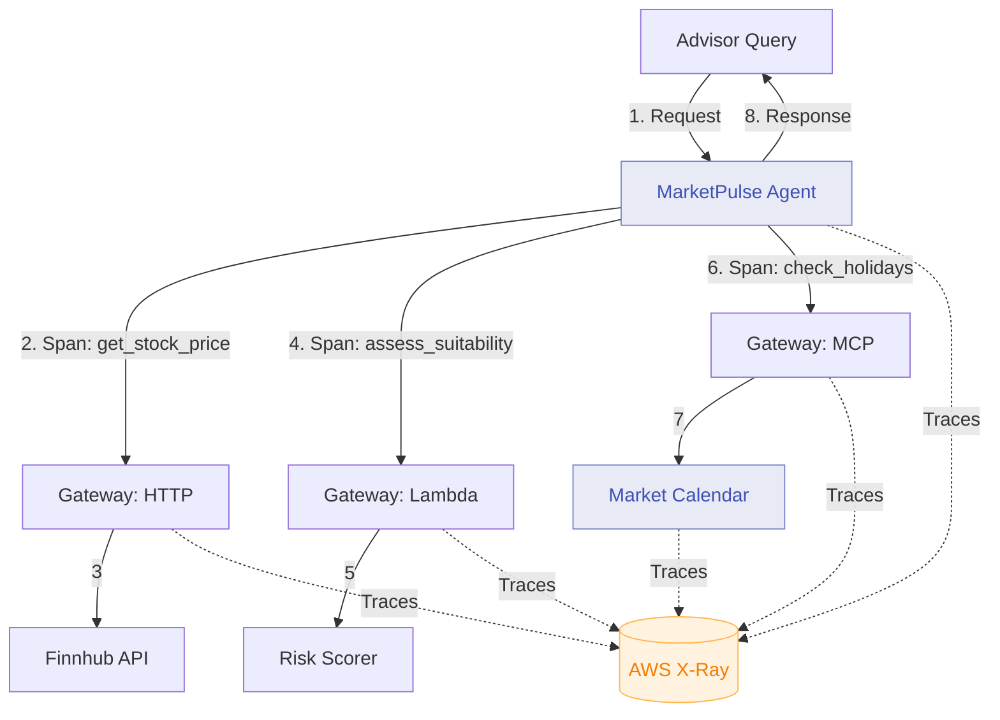

# Module 7: Instrument with AgentCore Observability

**Duration:** 30 minutes (includes debrief)  
**Prerequisites:** Completed [Module 6](06-identity.md)

## Learning Objectives

By the end of this module, you will:

1. Enable distributed tracing for agent requests
2. Inspect complete request traces in AWS X-Ray
3. Identify performance bottlenecks in tool calls
4. Understand how observability supports compliance

## What is AgentCore Observability?

AgentCore Observability provides distributed tracing for agent interactions:

- **Request tracing** - Track requests across all components
- **Tool call visibility** - See exactly which tools were invoked
- **Performance metrics** - Identify slow operations
- **Error tracking** - Pinpoint failure locations

**Key features:**

- Automatic instrumentation (no code changes required)
- AWS X-Ray integration for visualisation
- Correlation IDs for request tracking
- Structured logging with context

## Architecture: Module 7



## What Gets Traced?

For MarketPulse, every request generates a trace with spans for:

1. **Agent request** - Root span covering entire request
2. **LLM invocations** - Each Claude API call
3. **Tool calls** - Each Gateway target invocation
4. **Memory operations** - Reads/writes to DynamoDB
5. **Authentication** - OAuth token requests
6. **External APIs** - HTTP calls to Finnhub, Nager.Date

**Example trace structure:**

```
Trace: advisor-query-abc123 (duration: 2.4s)
├─ Span: agent.process_request (2.4s)
│  ├─ Span: llm.invoke (850ms) - Reasoning
│  ├─ Span: tool.get_stock_price (320ms)
│  │  └─ Span: http.finnhub.quote (280ms)
│  ├─ Span: tool.assess_suitability (180ms)
│  │  └─ Span: lambda.risk_scorer (160ms)
│  ├─ Span: tool.check_holidays (240ms)
│  │  └─ Span: mcp.market_calendar (220ms)
│  │     └─ Span: http.nager_date (180ms)
│  └─ Span: llm.invoke (780ms) - Response synthesis
```

## Step 1: Enable Observability in Agent

Edit `agent/app.py`:

```python
from bedrock_agentcore import BedrockAgentCoreApp
from strands_agents import Agent
from strands_agents.observability import TracingConfig

agent = Agent(
    name="MarketPulse",
    model="anthropic.claude-sonnet-4-5-20250929-v1:0",
    tracing=TracingConfig(
        enabled=True,
        service_name="marketpulse-agent",
        sample_rate=1.0,  # Trace 100% of requests
        include_llm_prompts=True,  # Include prompts in traces (dev only)
        include_llm_responses=True  # Include responses in traces (dev only)
    ),
    instructions="""
    You are MarketPulse, an AI investment brief assistant.
    
    All requests are now traced for observability. This helps identify
    performance issues and supports audit requirements.
    """
)

# Tools remain unchanged
```

**Important:** Set `include_llm_prompts=False` and `include_llm_responses=False` in production to avoid logging sensitive data.

## Step 2: Enable MCP Server Tracing

Edit `mcp-server/market-calendar/app.py`:

```python
from mcp.server import Server
from mcp.observability import enable_tracing

app = Server("market-calendar")

# Enable tracing
enable_tracing(
    service_name="market-calendar-mcp",
    sample_rate=1.0
)

@app.tool()
async def check_market_holidays(country_code: str = "US", days_ahead: int = 7) -> dict:
    """Check for market holidays in the next N days."""
    # Implementation unchanged
```

## Step 3: Configure Terraform

Edit `terraform/terraform.tfvars`:

```hcl
# Feature Flags (Enable Observability)
enable_runtime = true
enable_gateway = true
enable_http_target = true
enable_lambda_target = true
enable_mcp_target = true
enable_memory = true
enable_identity = true
enable_observability = true

# Observability configuration
tracing_sample_rate = 1.0  # 100% in workshop, lower in production
enable_xray = true
log_retention_days = 7
```

## Step 4: Rebuild and Deploy

Rebuild both agent and MCP server:

```bash
./scripts/build-agent.sh
./scripts/build-mcp-server.sh
```

Deploy with Terraform:

```bash
cd terraform
terraform apply
```

**What Terraform creates:**

- X-Ray tracing configuration for agent runtime
- X-Ray tracing configuration for MCP runtime
- IAM permissions for X-Ray access
- CloudWatch log groups with tracing metadata

**Expected output:**

```
Apply complete! Resources: 2 added, 2 changed, 0 destroyed.

Outputs:

xray_group_name = "marketpulse-workshop"
xray_service_map_url = "https://console.aws.amazon.com/xray/home?region=ap-southeast-2#/service-map"
```

## Step 5: Generate a Complete Trace

Run a comprehensive query that exercises all tools:

```bash
python scripts/test-agent.py "I'm meeting Sarah Chen at 2pm today. She's a conservative investor interested in Apple. Give me a quick brief including any market holidays this week."
```

**This query triggers:**
1. Memory lookup (Sarah's profile)
2. Stock price API call (Apple)
3. Risk assessment Lambda (Apple vs conservative profile)
4. Market calendar MCP (upcoming holidays)
5. LLM synthesis of final brief

## Step 6: View Trace in X-Ray

Open the X-Ray console:

```bash
aws xray get-service-graph --start-time $(date -u -d '5 minutes ago' +%s) --end-time $(date -u +%s)
```

Or use the AWS Console:
1. Navigate to AWS X-Ray
2. Select "Traces" in the left menu
3. Find your trace (filter by service: `marketpulse-agent`)
4. Click to view detailed timeline

**What you'll see:**

```
Service Map:
marketpulse-agent → agentcore-gateway → finnhub-api (320ms)
                   → risk-scorer-lambda (180ms)
                   → market-calendar-mcp → nager-date-api (240ms)
```

## Step 7: Analyse Tool Call Performance

In the trace details, identify each tool call:

### Tool 1: get_stock_price (320ms)
- Gateway routing: 15ms
- Finnhub API call: 280ms
- Response processing: 25ms

### Tool 2: assess_client_suitability (180ms)
- Gateway routing: 12ms
- Lambda cold start: 80ms (if first call)
- Lambda execution: 70ms
- Response processing: 18ms

### Tool 3: check_market_holidays (240ms)
- Gateway routing: 14ms
- MCP protocol overhead: 8ms
- Nager.Date API call: 180ms
- Response processing: 38ms

**Key insights:**

1. Finnhub API is the slowest dependency (280ms)
2. Lambda cold starts add latency (80ms first call)
3. MCP protocol adds minimal overhead (8ms)

## Step 8: View Structured Logs

Check CloudWatch logs with trace context:

```bash
aws logs tail /aws/bedrock-agentcore/runtime/marketpulse \
  --format short \
  --follow \
  --filter-pattern '{ $.trace_id = * }'
```

**Example log with trace context:**

```json
{
  "timestamp": "2026-02-18T14:35:42.123Z",
  "level": "INFO",
  "message": "Tool invocation: get_stock_price",
  "trace_id": "1-65d2e4a6-7b8c9d0e1f2a3b4c5d6e7f8",
  "span_id": "abc123def456",
  "service": "marketpulse-agent",
  "tool_name": "get_stock_price",
  "tool_args": {"ticker": "AAPL"},
  "duration_ms": 320,
  "status": "success"
}
```

**Correlation:** Use `trace_id` to find all logs related to a single request across all services.

## Step 9: Set Up Trace Sampling

For production, reduce sample rate:

```hcl
# terraform/terraform.tfvars
tracing_sample_rate = 0.1  # Trace 10% of requests
```

**Sampling strategies:**

1. **Fixed rate** - Sample X% of all requests
2. **Error-based** - Always sample failed requests
3. **Latency-based** - Sample slow requests (>1s)
4. **User-based** - Sample specific users (e.g., VIPs)

Configure adaptive sampling in Terraform:

```hcl
resource "aws_xray_sampling_rule" "marketpulse" {
  rule_name = "marketpulse-adaptive"
  priority = 100
  
  reservoir_size = 10  # Always sample 10 req/sec
  fixed_rate = 0.05    # Then sample 5% of remainder
  
  service_name = "marketpulse-agent"
  service_type = "*"
  host = "*"
  http_method = "*"
  url_path = "*"
  
  # Always trace errors
  attributes = {
    error = "true"
  }
}
```

## Understanding the Trace Data

### Key Metrics Per Span

| Metric | Description | What It Reveals |
|--------|-------------|-----------------|
| **Duration** | Time from span start to end | Bottlenecks |
| **Status** | OK, Error, Fault | Failure points |
| **Annotations** | Key-value metadata | Business context |
| **Metadata** | Request/response data | Debug information |

### FSI-Relevant Annotations

Add custom annotations for compliance:

```python
from aws_xray_sdk.core import xray_recorder

@xray_recorder.capture('tool_call')
def call_tool(tool_name, args):
    # Add compliance metadata
    xray_recorder.put_annotation('advisor_id', session.advisor_id)
    xray_recorder.put_annotation('client_id', args.get('client_id'))
    xray_recorder.put_annotation('risk_profile', args.get('risk_profile'))
    xray_recorder.put_annotation('data_classification', 'CONFIDENTIAL')
    
    return invoke_tool(tool_name, args)
```

**Benefit:** Filter traces by advisor, client, or risk level for compliance reviews.

## Verification Checklist

- [ ] X-Ray enabled in Terraform
- [ ] Agent rebuilt with tracing enabled
- [ ] MCP server rebuilt with tracing enabled
- [ ] Test query generates complete trace
- [ ] Service map shows all components
- [ ] Tool call spans visible with durations
- [ ] Logs include trace_id for correlation

## Common Issues

### No traces appearing in X-Ray

**Cause:** IAM permissions missing for X-Ray.

**Solution:** Check agent execution role:
```bash
aws iam get-role-policy --role-name marketpulse-agent-role --policy-name xray-access
```

### Traces incomplete (missing spans)

**Cause:** Network timeouts or incorrect trace context propagation.

**Solution:** Check Gateway configuration:
```hcl
propagate_trace_context = true
```

### High cardinality in trace annotations

**Cause:** Including unique IDs (e.g., request IDs) as annotations.

**Solution:** Use metadata for unique values:
```python
xray_recorder.put_metadata('request_details', {'request_id': req_id})
```

## FSI Relevance: Observability and Compliance

Distributed tracing addresses FSI audit requirements:

1. **Request Lineage** - Track data flow through all systems
2. **Performance SLAs** - Prove response times meet contractual obligations
3. **Error Attribution** - Identify which component caused a failure
4. **Data Access Audit** - See exactly what data was accessed when
5. **Incident Investigation** - Reconstruct exactly what happened

**Regulatory use cases:**

- **GDPR Subject Access Requests** - Find all traces for a customer
- **MiFID II Best Execution** - Prove trades executed optimally
- **Model Risk Management** - Understand AI decision-making process
- **Operational Resilience** - Demonstrate system health and recovery

## Real-World FSI Patterns

### Pattern 1: Compliance Trace Export

```python
# Export traces for compliance archive
def export_traces_for_audit(start_date, end_date):
    traces = xray_client.get_trace_summaries(
        StartTime=start_date,
        EndTime=end_date,
        FilterExpression='annotation.data_classification = "CONFIDENTIAL"'
    )
    
    # Store in compliance archive (S3 + Glacier)
    archive_to_s3(traces, bucket='compliance-archive')
```

### Pattern 2: Real-Time Alerting

```python
# CloudWatch alarm on high error rates
resource "aws_cloudwatch_metric_alarm" "high_errors" {
  alarm_name = "marketpulse-high-error-rate"
  
  metric_name = "FaultCount"
  namespace = "AWS/XRay"
  statistic = "Sum"
  period = 300
  threshold = 10
  
  dimensions = {
    ServiceName = "marketpulse-agent"
  }
}
```

### Pattern 3: Performance Benchmarking

```python
# Track p95 latency for SLA compliance
def check_sla_compliance():
    metrics = cloudwatch.get_metric_statistics(
        Namespace='AWS/XRay',
        MetricName='Duration',
        Dimensions=[{'Name': 'ServiceName', 'Value': 'marketpulse-agent'}],
        Statistics=['Percentile:95'],
        Period=3600
    )
    
    p95_latency = metrics['Datapoints'][0]['ExtendedStatistics']['p95']
    sla_threshold = 3000  # 3 seconds
    
    return p95_latency < sla_threshold
```

## Discussion Questions

1. **What would you want to trace in your agent systems?**
2. **How does this compare to your current observability approach?**
3. **What compliance requirements does tracing help you meet?**
4. **What performance targets would you set for agent response times?**

## Workshop Debrief

You've now implemented all seven AgentCore components:

| Component | What You Built |
|-----------|----------------|
| Runtime | Deployed MarketPulse agent to managed container runtime |
| Gateway - HTTP | Connected to Finnhub stock price API |
| Gateway - Lambda | Deployed risk assessment function |
| Gateway - MCP | Built and deployed market calendar MCP server |
| Memory | Enabled persistent advisor and client context |
| Identity | Secured agent and MCP with OAuth 2.0 |
| Observability | Instrumented full request tracing |

**Key architectural patterns:**

1. **Separation of concerns** - Agent, logic, and data are decoupled
2. **Security by default** - Authentication required, encryption enabled
3. **Observability first** - Every request is traceable
4. **Incremental deployment** - Each module builds on the previous

## Next Steps Beyond the Workshop

### For Your Organisation

1. **Identify use cases** - Where could agents add value?
2. **Assess data sources** - What internal APIs could become Gateway targets?
3. **Define governance** - What approval processes for agent deployments?
4. **Plan pilot** - Start small, prove value, then scale

### For This Workshop Repository

1. **Experiment with prompts** - Try different advisor queries
2. **Add more tools** - Integrate additional APIs or MCP servers
3. **Implement RAG** - Add a Knowledge Base target for product docs
4. **Harden for production** - Add rate limiting, input validation

## Verification Checklist

- [ ] All 7 modules completed
- [ ] Agent responds to complex multi-tool queries
- [ ] Traces visible in X-Ray console
- [ ] All Gateway targets authenticated
- [ ] Memory persists across sessions
- [ ] Performance metrics within acceptable ranges

## Cleanup (Optional)

To avoid ongoing charges after the workshop:

```bash
cd terraform
terraform destroy
```

**This removes:**
- AgentCore Runtime instances (agent + MCP)
- Gateway configuration
- DynamoDB memory table
- CloudWatch logs (after retention period)
- All other AWS resources created

**Estimated cost for 4-hour workshop:** $3-5 USD (assuming free tier eligible).

## Additional Resources

- [AgentCore Documentation](https://docs.aws.amazon.com/bedrock-agentcore)
- [Strands Agents SDK](https://github.com/strands-agents/sdk-python)
- [AWS X-Ray Developer Guide](https://docs.aws.amazon.com/xray)
- [FSI Reference Architectures](https://aws.amazon.com/financial-services)

---

**Congratulations!** You've built a complete AI agent system on AWS AgentCore with runtime deployment, multi-target Gateway integration, persistent memory, OAuth security, and comprehensive observability.

**Key Takeaways:**

- AgentCore Observability provides automatic distributed tracing
- X-Ray visualises request flows and identifies bottlenecks
- Trace data supports compliance and audit requirements
- Custom annotations enable business context in traces
- Essential for production FSI deployments where explainability is required