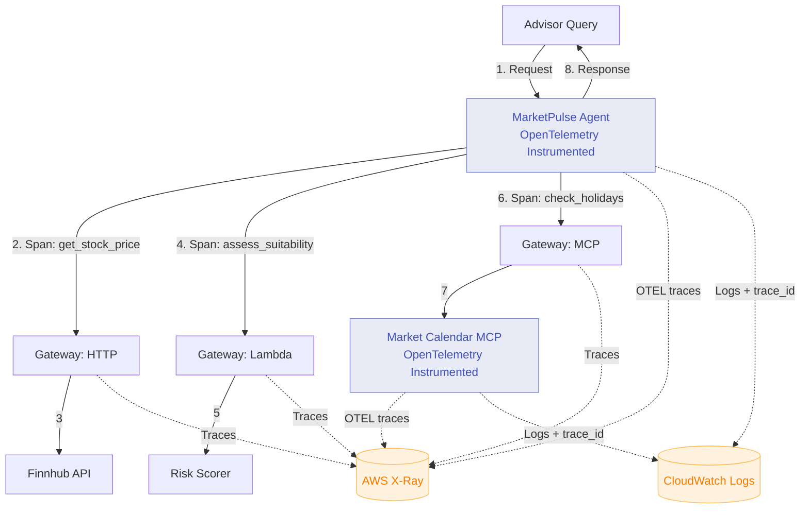

# Module 7: Instrument with AgentCore Observability

**Duration:** 30 minutes (includes debrief)  
**Prerequisites:** Completed [Module 6](06-identity.md)

## Learning Objectives

By the end of this module, you will:

1. Enable distributed tracing for agent requests with AWS X-Ray
2. Inspect complete request traces in X-Ray console showing all tool calls
3. Identify performance bottlenecks in tool invocations
4. Understand how observability supports FSI compliance and audit requirements

## What is AgentCore Observability?

AgentCore Observability provides **automatic distributed tracing** for agent interactions using AWS X-Ray and OpenTelemetry (OTEL):

- **Request tracing** - Track requests across all components (agent, Gateway, tools, memory)
- **Tool call visibility** - See exactly which tools were invoked, when, and how long each took
- **Performance metrics** - Identify slow operations and optimisation opportunities
- **Error tracking** - Pinpoint failure locations in the request chain
- **LLM invocation tracking** - See each Bedrock model call with duration

**Key features:**

- **Automatic instrumentation** - No code changes required when using `strands-agents[otel]`
- **AWS X-Ray integration** - Traces visualised in X-Ray console
- **OpenTelemetry standard** - Industry-standard instrumentation approach
- **Correlation IDs** - Link traces to CloudWatch logs
- **Structured logging** - JSON logs with trace context

## Architecture: Module 7


```mermaid
flowchart TB
    User[Advisor Query] -->|1. Request| Agent[MarketPulse Agent<br/>OpenTelemetry Instrumented]
    Agent -->|2. Span: get_stock_price| Gateway1[Gateway: HTTP]
    Gateway1 -->|3| Finnhub[Finnhub API]
    Agent -->|4. Span: assess_suitability| Gateway2[Gateway: Lambda]
    Gateway2 -->|5| Lambda[Risk Scorer]
    Agent -->|6. Span: check_holidays| Gateway3[Gateway: MCP]
    Gateway3 -->|7| MCP[Market Calendar MCP<br/>OpenTelemetry Instrumented]
    Agent -->|8. Response| User
    
    Agent -.->|OTEL traces| XRay[(AWS X-Ray)]
    Gateway1 -.->|Traces| XRay
    Gateway2 -.->|Traces| XRay
    Gateway3 -.->|Traces| XRay
    MCP -.->|OTEL traces| XRay
    
    Agent -.->|Logs + trace_id| CW[(CloudWatch Logs)]
    MCP -.->|Logs + trace_id| CW
    
    classDef runtime fill:#E8EAF6,stroke:#7986CB,color:#3F51B5
    classDef observability fill:#FFF3E0,stroke:#FFB74D,color:#F57C00
    
    class Agent,MCP runtime
    class XRay,CW observability
```

## How Does Observability Work?

MarketPulse uses **OpenTelemetry** (OTEL) for instrumentation:

1. **Agent container** includes `aws-opentelemetry-distro` Python package
2. **Container CMD** wraps app with `opentelemetry-instrument python app.py`
3. **Environment variables** configure OTEL to export traces to X-Ray
4. **Strands SDK** (installed with `[otel]` extra) automatically instruments:
   - LLM invocations (Bedrock model calls)
   - Tool calls (Gateway invocations)
   - Memory operations (read/write)
5. **AgentCore Gateway** automatically propagates trace context downstream
6. **X-Ray** receives, indexes, and visualises traces

**No code changes required** - instrumentation is automatic when dependencies and environment variables are configured.

## What Gets Traced?

For MarketPulse, every request generates a trace with spans for:

1. **Agent request** - Root span covering entire request lifecycle
2. **LLM invocations** - Each call to Bedrock Claude API
3. **Tool calls** - Each Gateway target invocation (HTTP, Lambda, MCP)
4. **Memory operations** - Reads/writes to DynamoDB (if memory enabled)
5. **External APIs** - HTTP calls to Finnhub, Nager.Date via Gateway

**Example trace structure:**

```
Trace ID: 1-65d2e4a6-7b8c9d0e1f2a3b4c5d6e7f8
Root Span: agent_request (duration: 2.4s)
├─ Span: bedrock.invoke_model (850ms) - Initial reasoning
├─ Span: gateway.invoke_target:get_stock_price (320ms)
│  └─ Span: http.get (280ms) - Finnhub API
├─ Span: gateway.invoke_target:assess_suitability (180ms)
│  └─ Span: lambda.invoke (160ms) - Risk scorer
├─ Span: gateway.invoke_target:check_holidays (240ms)
│  └─ Span: mcp.invoke (220ms) - Market calendar
│     └─ Span: http.get (180ms) - Nager.Date API
└─ Span: bedrock.invoke_model (780ms) - Response synthesis
```

Each span includes:
- **Duration** - How long the operation took
- **Status** - Success or error
- **Metadata** - Request/response details (configurable)
- **Trace context** - Links spans across services

---

## Implementation Steps

### Step 1: Review Agent Instrumentation (Already Configured)

The agent container is already instrumented. Review the configuration:

**File:** [agent/Dockerfile](../agent/Dockerfile)

```dockerfile
FROM public.ecr.aws/docker/library/python:3.11-slim

WORKDIR /app

COPY requirements.txt requirements.txt
RUN apt-get update && apt-get install -y --no-install-recommends curl && \\
    rm -rf /var/lib/apt/lists/* && \\
    pip install --no-cache-dir -r requirements.txt && \\
    pip install --no-cache-dir aws-opentelemetry-distro==0.10.1  # <-- OTEL instrumentation

# ... container setup ...

CMD ["opentelemetry-instrument", "python", "app.py"]  # <-- Automatic instrumentation
```

**File:** [agent/requirements.txt](../agent/requirements.txt)

```
strands-agents[otel]>=0.1.0  # <-- [otel] extra enables auto-instrumentation
bedrock-agentcore>=0.1.0
```

**Key points:**
- `aws-opentelemetry-distro` provides X-Ray exporter
- `strands-agents[otel]` includes OpenTelemetry instrumentation hooks
- `opentelemetry-instrument` wrapper automatically patches libraries
- **No code changes to `app.py` required** - instrumentation is automatic

### Step 2: Enable Observability in Terraform

Edit `terraform/terraform.tfvars`:

```hcl
# Feature Flags
enable_gateway       = true
enable_http_target   = true
enable_lambda_target = true
enable_mcp_target    = true
enable_memory        = true
enable_identity      = true
enable_observability = true  # <-- SET THIS TO TRUE

# Observability Configuration
enable_xray_tracing  = true  # Enable X-Ray sampling rule (optional)
log_retention_days   = 7     # CloudWatch log retention
```

**What happens when `enable_observability = true`:**

1. **Terraform adds OpenTelemetry environment variables** to the Runtime:
   ```hcl
   environment_variables = {
     AGENT_OBSERVABILITY_ENABLED = "true"
     OTEL_PYTHON_DISTRO = "aws_distro"
     OTEL_TRACES_EXPORTER = "otlp"
     OTEL_SERVICE_NAME = "marketpulse_workshop_agent"
     # ... and more OTEL config
   }
   ```

2. **IAM policy grants X-Ray permissions** to agent runtime:
   ```json
   {
     "Action": [
       "xray:PutTraceSegments",
       "xray:PutTelemetryRecords",
       "xray:GetSamplingRules"
     ]
   }
   ```

3. **X-Ray sampling rule created** (optional, for cost control):
   - Default: trace 100% of requests (workshop)
   - Production: adjust `fixed_rate` in `observability.tf`

4. **CloudWatch log group created** for trace-correlated logs

**Files changed:**
- [terraform/observability.tf](../terraform/observability.tf) - X-Ray IAM policy, sampling rule
- [terraform/runtime.tf](../terraform/runtime.tf) - OTEL environment variables

### Step 3: Enable Transaction Search (First-Time Setup)

**IMPORTANT:** This is a **one-time, account-level** setup required for X-Ray tracing. If you've already done this for your AWS account, skip this step.

Enable CloudWatch Transaction Search using the AWS console:

1. Open AWS Console → CloudWatch → **Settings** (left sidebar)
2. Click **Account** tab → **X-Ray traces** sub-tab
3. In **Transaction Search** section, click **View settings**
4. Click **Edit** → **Enable Transaction Search**
5. Select **For X-Ray users** and enter **1%** (free tier)
6. Click **Save**
7. Wait for **Ingest OpenTelemetry spans** to show **Enabled** (may take 10 minutes)

**Alternatively, use AWS CLI:**

```bash
# 1. Grant X-Ray permission to write to CloudWatch Logs
aws logs put-resource-policy \\
  --policy-name TransactionSearchXRayAccess \\
  --policy-document '{
    "Version": "2012-10-17",
    "Statement": [{
      "Effect": "Allow",
      "Principal": {"Service": "xray.amazonaws.com"},
      "Action": "logs:PutLogEvents",
      "Resource": [
        "arn:aws:logs:'$AWS_REGION':'$AWS_ACCOUNT_ID':log-group:aws/spans:*",
        "arn:aws:logs:'$AWS_REGION':'$AWS_ACCOUNT_ID':log-group:/aws/application-signals/data:*"
      ],
      "Condition": {
        "ArnLike": {"aws:SourceArn": "arn:aws:xray:'$AWS_REGION':'$AWS_ACCOUNT_ID':*"}
      }
    }]
  }'

# 2. Enable Transaction Search
aws xray update-trace-segment-destination --destination CloudWatchLogs

# 3. Configure sampling percentage (1% = free tier)
aws xray update-indexing-rule --name Default \\
  --rule '{"Probabilistic": {"DesiredSamplingPercentage": 1}}'
```

**Why is this needed?**
X-Ray Transaction Search indexes span data in CloudWatch for fast querying. Without this, traces are stored in X-Ray but cannot be searched or visualised in the AWS console.

### Step 4: Rebuild Agent Container

After enabling observability, rebuild the agent container to pick up the new environment variables:

```bash
cd aws-agentcore-workshop
./scripts/build-agent.sh
```

**What this does:**
1. Rebuilds the Docker image (no changes to Dockerfile or code needed)
2. Pushes to ECR
3. AgentCore Runtime will pull the new image on next deployment

**Note:** The container code hasn't changed - we're just updating the Runtime configuration. However, rebuilding ensures the Runtime recognises the configuration update.

### Step 5: Deploy with Terraform

Apply the Terraform changes:

```bash
cd terraform
terraform plan   # Review changes
terraform apply  # Deploy
```

**Expected changes:**
- `aws_iam_role_policy.agent_xray_access[0]` created
- `aws_xray_sampling_rule.marketpulse[0]` created
- `aws_cloudwatch_log_group.agent_traces[0]` created
- `awscc_bedrockagentcore_runtime.agent` updated (environment variables changed)

**Expected output:**

```
Apply complete! Resources: 3 added, 1 changed, 0 destroyed.

Outputs:

observability_enabled = true
xray_sampling_rule_name = "marketpulse-sampling"
trace_log_group = "/aws/bedrock-agentcore/traces/marketpulse_workshop_agent"
```

### Step 6: Generate a Complete Trace

Run the observability test script to generate a complex trace:

```bash
cd aws-agentcore-workshop
python scripts/test-trace.py
```

**What this does:**
1. Checks that observability is enabled
2. Sends a complex query that exercises all tools:
   - `get_stock_price` (HTTP Gateway → Finnhub)
   - `assess_client_suitability` (Lambda Gateway → Risk scorer)
   - `check_market_holidays` (MCP Gateway → Market calendar)
3. Displays the agent response
4. Prints instructions for viewing the trace in X-Ray console

**Example query sent:**

```
I'm meeting with a new client tomorrow. They're interested in BHP Group (BHP.AX).

Can you help me prepare a brief that includes:
1. Current stock price for BHP.AX
2. Suitability assessment for a conservative investor
3. Any Australian market holidays coming up in the next 7 days
```

This query is designed to trigger **all three Gateway targets** for comprehensive tracing.

### Step 7: View Trace in X-Ray Console

Open the AWS X-Ray console:

**URL:** `https://console.aws.amazon.com/xray/home?region=ap-southeast-2#/traces`

**Steps:**

1. Click **Traces** in the left sidebar
2. Find your trace (it may take 10-30 seconds to appear)
3. Click on the trace to view the **timeline view**

**What you'll see:**

```
Service Map:
┌─────────────────────────────────────────────────────────────┐
│ marketpulse_workshop_agent                                 │
│   ├─ bedrock.claude (2 invocations)                        │
│   ├─ agentcore-gateway → finnhub-api                      │
│   ├─ agentcore-gateway → risk-scorer-lambda               │
│   └─ agentcore-gateway → market-calendar-mcp → nager-api  │
└─────────────────────────────────────────────────────────────┘
```

**Timeline view shows:**
- **Each span** as a horizontal bar (length = duration)
- **Nested spans** show call hierarchy
- **Colour coding:**
  - Green = success
  - Red = error
  - Orange = throttled/warning
- **Metadata** on click (request/response details)

**Example timeline:**

```
agent_request                     [============================================] 2.4s
├─ bedrock.invoke_model           [========]                                   850ms
├─ gateway.get_stock_price        [===]                                        320ms
│  └─ http.finnhub.quote          [==]                                         280ms
├─ gateway.assess_suitability     [==]                                         180ms
│  └─ lambda.risk_scorer          [=]                                          160ms
├─ gateway.check_holidays         [==]                                         240ms
│  └─ mcp.market_calendar         [==]                                         220ms
│     └─ http.nager_date          [=]                                          180ms
└─ bedrock.invoke_model           [========]                                   780ms
```

### Step 8: Analyse Tool Call Performance

In the X-Ray trace timeline, identify which tool calls take longest:

**Example findings:**

| Tool | Duration | Target Type | Optimisation Opportunity |
|------|----------|-------------|--------------------------|
| `get_stock_price` | 320ms | HTTP | Cache frequently queried tickers |
| `assess_suitability` | 180ms | Lambda | Pre-compute risk matrices |
| `check_market_holidays` | 240ms | MCP | Cache holiday calendars (rarely change) |
| Bedrock calls (2x) | 1630ms total | LLM | Use streaming for faster perceived latency |

**FSI relevance:**
- **Compliance:** Trace shows exact data sources accessed (audit trail)
- **Performance:** SLA monitoring (e.g., "advisor queries must complete <3s")
- **Cost optimisation:** Identify expensive operations (LLM calls, Lambda duration)
- **Error diagnosis:** Pinpoint which integration failed
enable_observability = true

# Observability configuration
tracing_sample_rate = 1.0  # 100% in workshop, lower in production
enable_xray = true
log_retention_days = 7
```

## Step 4: Rebuild and Deploy

Rebuild both agent and MCP server:

```bash
./scripts/build-agent.sh
./scripts/build-mcp-server.sh
```

Deploy with Terraform:

```bash
cd terraform
terraform apply
```

**What Terraform creates:**

- X-Ray tracing configuration for agent runtime
- X-Ray tracing configuration for MCP runtime
- IAM permissions for X-Ray access
- CloudWatch log groups with tracing metadata

**Expected output:**

```
Apply complete! Resources: 2 added, 2 changed, 0 destroyed.

Outputs:

xray_group_name = "marketpulse-workshop"
xray_service_map_url = "https://console.aws.amazon.com/xray/home?region=ap-southeast-2#/service-map"
```

## Step 5: Generate a Complete Trace

Run a comprehensive query that exercises all tools:

```bash
python scripts/test-agent.py "I'm meeting Sarah Chen at 2pm today. She's a conservative investor interested in Apple. Give me a quick brief including any market holidays this week."
```

**This query triggers:**
1. Memory lookup (Sarah's profile)
2. Stock price API call (Apple)
3. Risk assessment Lambda (Apple vs conservative profile)
4. Market calendar MCP (upcoming holidays)
5. LLM synthesis of final brief

## Step 6: View Trace in X-Ray

Open the X-Ray console:

```bash
aws xray get-service-graph --start-time $(date -u -d '5 minutes ago' +%s) --end-time $(date -u +%s)
```

Or use the AWS Console:
1. Navigate to AWS X-Ray
2. Select "Traces" in the left menu
3. Find your trace (filter by service: `marketpulse-agent`)
4. Click to view detailed timeline

**What you'll see:**

```
Service Map:
marketpulse-agent → agentcore-gateway → finnhub-api (320ms)
                   → risk-scorer-lambda (180ms)
                   → market-calendar-mcp → nager-date-api (240ms)
```

## Step 7: Analyse Tool Call Performance

In the trace details, identify each tool call:

### Tool 1: get_stock_price (320ms)
- Gateway routing: 15ms
- Finnhub API call: 280ms
- Response processing: 25ms

### Tool 2: assess_client_suitability (180ms)
- Gateway routing: 12ms
- Lambda cold start: 80ms (if first call)
- Lambda execution: 70ms
- Response processing: 18ms

### Tool 3: check_market_holidays (240ms)
- Gateway routing: 14ms
- MCP protocol overhead: 8ms
- Nager.Date API call: 180ms
- Response processing: 38ms

**Key insights:**

1. Finnhub API is the slowest dependency (280ms)
2. Lambda cold starts add latency (80ms first call)
3. MCP protocol adds minimal overhead (8ms)

## Step 8: View Structured Logs

Check CloudWatch logs with trace context:

```bash
aws logs tail /aws/bedrock-agentcore/runtime/marketpulse \
  --format short \
  --follow \
  --filter-pattern '{ $.trace_id = * }'
```

**Example log with trace context:**

```json
{
  "timestamp": "2026-02-18T14:35:42.123Z",
  "level": "INFO",
  "message": "Tool invocation: get_stock_price",
  "trace_id": "1-65d2e4a6-7b8c9d0e1f2a3b4c5d6e7f8",
  "span_id": "abc123def456",
  "service": "marketpulse-agent",
  "tool_name": "get_stock_price",
  "tool_args": {"ticker": "BHP.AX"},
  "duration_ms": 320,
  "status": "success"
}
```

**Correlation:** Use `trace_id` to find all logs related to a single request across all services.

## Step 9: Set Up Trace Sampling

For production, reduce sample rate:

```hcl
# terraform/terraform.tfvars
tracing_sample_rate = 0.1  # Trace 10% of requests
```

**Sampling strategies:**

1. **Fixed rate** - Sample X% of all requests
2. **Error-based** - Always sample failed requests
3. **Latency-based** - Sample slow requests (>1s)
4. **User-based** - Sample specific users (e.g., VIPs)

Configure adaptive sampling in Terraform:

```hcl
resource "aws_xray_sampling_rule" "marketpulse" {
  rule_name = "marketpulse-adaptive"
  priority = 100
  
  reservoir_size = 10  # Always sample 10 req/sec
  fixed_rate = 0.05    # Then sample 5% of remainder
  
  service_name = "marketpulse-agent"
---

## Verification Checklist

After completing the implementation, verify observability is working:

- [ ] **Terraform**: `enable_observability = true` in terraform.tfvars
- [ ] **Deployed**: `terraform apply` completed successfully
- [ ] **Container rebuilt**: Agent container rebuilt with `./scripts/build-agent.sh`
- [ ] **IAM permissions**: X-Ray policy attached to agent runtime role
- [ ] **Transaction Search**: Enabled in AWS account (one-time setup)
- [ ] **Test script passed**: `python scripts/test-trace.py` executed without errors
- [ ] **Trace visible**: Trace appears in X-Ray console within 30 seconds
- [ ] **Service map**: Service map shows agent → Gateway → targets
- [ ] **Tool spans**: Individual tool call spans visible with durations
- [ ] **Logs correlated**: CloudWatch logs include `trace_id` field

---

## Common Issues

### Issue 1: No Traces Appearing in X-Ray

**Symptom:** Test script succeeds but no traces in X-Ray console.

**Possible causes:**

1. **Transaction Search not enabled** (account-level setting)
   ```bash
   # Check status
   aws xray get-sampling-rules --region ap-southeast-2
   # Enable Transaction Search in CloudWatch console (see Step 3)
   ```

2. **IAM permissions missing**
   ```bash
   # Verify X-Ray policy exists
   aws iam get-role-policy \
     --role-name marketpulse-workshop-agent-runtime-role \
     --policy-name marketpulse-workshop-agent-xray-access
   ```
   
   **Solution:** Ensure `enable_observability = true` then `terraform apply`

3. **Indexing delay** - Traces can take 10-30 seconds to appear
   
   **Solution:** Wait and refresh X-Ray console

### Issue 2: Incomplete Traces (Missing Spans)

**Symptom:** Root span visible but tool call spans missing.

**Possible causes:**

1. **Gateway not propagating trace context**
   - AgentCore Gateway automatically propagates trace context; no configuration needed
   - If spans missing, check Gateway targets are actually invoked (query may not trigger all tools)

2. **MCP server not instrumented**
   - MCP server uses FastMCP which automatically instruments when OTEL environment variables are set
   - Verify MCP runtime also has observability enabled (currently not configurable separately in workshop)

**Solution:** Run query that explicitly exercises the missing tool

### Issue 3: High CloudWatch Costs from Tracing

**Symptom:** CloudWatch Logs costs higher than expected.

**Cause:** Tracing 100% of requests at high volume.

**Solution:** Adjust X-Ray sampling rule in `observability.tf`:

```hcl
resource "aws_xray_sampling_rule" "marketpulse" {
  # ...
  reservoir_size = 1    # Always sample 1 req/sec
  fixed_rate     = 0.05 # Then sample 5% of remainder
}
```

**Production sampling strategies:**
- **Development**: 100% sampling (`fixed_rate = 1.0`)
- **Staging**: 10% sampling (`fixed_rate = 0.1`)
- **Production**: 1-5% sampling with error-based sampling

### Issue 4: Sensitive Data in Traces

**Symptom:** PII or confidential data visible in trace metadata.

**Cause:** OTEL instrumentation captures request/response payloads by default.

**Solution:** Configure OTEL to exclude sensitive fields:

```hcl
# In runtime.tf environment_variables
OTEL_PYTHON_EXCLUDED_URLS = "/health,/ping"
OTEL_INSTRUMENTATION_HTTP_CAPTURE_HEADERS_SERVER_REQUEST = ""
```

For Strands SDK, sensitive prompts/responses can be excluded by not including them in trace context (this is the default behaviour).

---

## FSI Relevance: Observability and Compliance

Distributed tracing directly addresses FSI regulatory requirements:

### 1. Request Lineage (GDPR, CCPA)

**Requirement:** Track data flow for subject access requests (SARs).

**How tracing helps:**
- Filter traces by `client_id` annotation to find all requests accessing a customer's data
- Spans show which external systems (Finnhub, Nager.Date) received customer information
- Timestamps prove when data was accessed

**Example query:**
```
annotation.client_id = "sarah-chen-12345" AND startTime > 2026-01-01
```

### 2. Performance SLAs (MiFID II Best Execution)

**Requirement:** Prove trade advisory services meet latency commitments.

**How tracing helps:**
- X-Ray duration metrics show p50, p90, p99 latencies
- Service map identifies slow dependencies
- Historical data proves consistent performance

**Example metric:**
```
AWS/XRay/Duration:p99 for service "marketpulse-agent" < 3000ms (SLA threshold)
```

### 3. Error Attribution (Operational Resilience)

**Requirement:** Demonstrate ability to identify and resolve failures quickly.

**How tracing helps:**
- Fault traces show exactly which component failed
- Error spans include exception details
- MTTR (Mean Time To Resolution) measurable via trace timestamps

**Example investigation:**
```
Trace shows: agent → Gateway → Finnhub API → 503 Service Unavailable
Root cause: External API outage (not our infrastructure)
MTTR: 2 minutes to identify, fallback cache activated
```

### 4. Model Risk Management (SR 11-7, SS1/23)

**Requirement:** Explain AI agent decisions for audit.

**How tracing helps:**
- LLM invocation spans show exact prompts sent to Claude (if enabled)
- Tool call spans show data inputs/outputs for each reasoning step
- Audit trail shows: Input → Tool1 → Tool2 → LLM → Output

**Example audit:**
```
Advisor asks: "Is BHP.AX suitable for conservative client?"
Trace shows:
1. get_stock_price(BHP.AX) → returned: {price: 45, volatility: 0.18}
2. assess_suitability(BHP.AX, conservative) → returned: "Clear Match"
3. LLM synthesised response based on these facts
Conclusion: Decision explainable and evidence-based
```

### 5. Data Access Audit (SOX, PCI DSS)

**Requirement:** Log all access to sensitive financial data.

**How tracing helps:**
- Every trace is immutable audit record
- Spans show: who (advisor_id), what (tool), when (timestamp), result (status)
- Export traces to S3 → Glacier for long-term retention (7+ years)

**Compliance mapping:**

| Regulation | Requirement | How Tracing Helps |
|------------|-------------|-------------------|
| **GDPR Art. 15** | Subject access requests | Filter traces by client_id |
| **MiFID II RTS 28** | Best execution reporting | Performance metrics per request |
| **SOX Section 404** | Internal control documentation | Audit trail of all operations |
| **PCI DSS 10.2** | Audit logs for cardholder data | Trace access to financial data |
| **SR 11-7** (US) | Model risk management | Explainability via tool call spans |
| **SS1/23** (UK) | Operational resilience | Failure detection and MTTR tracking |

---

## Real-World FSI Patterns

### Pattern 1: Compliance Trace Export to S3

Export traces to long-term storage for regulatory retention:

```python
import boto3
from datetime import datetime, timedelta

def export_monthly_traces_for_audit():
    """Export all traces from last month to compliance archive."""
    xray = boto3.client('xray')
    s3 = boto3.client('s3')
    
    # Get traces from last month
    end_time = datetime.now()
    start_time = end_time - timedelta(days=30)
    
    paginator = xray.get_paginator('get_trace_summaries')
    for page in paginator.paginate(
        StartTime=start_time,
        EndTime=end_time,
        FilterExpression='annotation.data_classification = "CONFIDENTIAL"'
    ):
        for trace_summary in page['TraceSummaries']:
            trace_id = trace_summary['Id']
            
            # Get full trace details
            trace = xray.batch_get_traces(TraceIds=[trace_id])
            
            # Export to S3 → Glacier
            s3.put_object(
                Bucket='compliance-archive-bucket',
                Key=f'traces/{start_time.year}/{start_time.month}/{trace_id}.json',
                Body=json.dumps(trace),
                StorageClass='GLACIER'  # Cost-effective long-term storage
            )
```

**FSI requirement:** PCI DSS mandates 1-year retention; many banks retain 7+ years.

### Pattern 2: Real-Time SLA Monitoring

Alert on SLA violations using CloudWatch alarms:

```hcl
# In observability.tf
resource "aws_cloudwatch_metric_alarm" "agent_latency_sla" {
  alarm_name          = "marketpulse-latency-sla-breach"
  comparison_operator = "GreaterThanThreshold"
  evaluation_periods  = 2
  metric_name         = "Duration"
  namespace           = "AWS/XRay"
  period              = 300      # 5 minutes
  statistic           = "Average"
  threshold           = 3000     # 3 seconds (SLA threshold)
  alarm_description   = "Agent response time exceeds 3s SLA"
  
  dimensions = {
    ServiceName = local.agent_name
  }
  
  alarm_actions = [aws_sns_topic.ops_alerts.arn]
  
  tags = local.common_tags
}

resource "aws_cloudwatch_metric_alarm" "agent_error_rate" {
  alarm_name          = "marketpulse-high-error-rate"
  comparison_operator = "GreaterThanThreshold"
  evaluation_periods  = 1
  metric_name         = "FaultCount"
  namespace           = "AWS/XRay"
  period              = 300
  statistic           = "Sum"
  threshold           = 10       # More than 10 errors in 5 minutes
  alarm_description   = "High error rate detected in MarketPulse agent"
  
  dimensions = {
    ServiceName = local.agent_name
  }
  
  alarm_actions = [aws_sns_topic.ops_alerts.arn]
  
  tags = local.common_tags
}
```

**FSI requirement:** SR 11-7 requires ongoing monitoring of model performance.

### Pattern 3: Performance Benchmarking Dashboard

Create CloudWatch dashboard for SLA tracking:

```hcl
resource "aws_cloudwatch_dashboard" "marketpulse_performance" {
  count = var.enable_observability ? 1 : 0
  
  dashboard_name = "${local.name_prefix}-performance"
  
  dashboard_body = jsonencode({
    widgets = [
      {
        type = "metric"
        properties = {
          title  = "Agent Response Time (p50, p95, p99)"
          region = var.aws_region
          metrics = [
            ["AWS/XRay", "Duration", { stat = "p50", label = "p50" }],
            [".", ".", { stat = "p95", label = "p95" }],
            [".", ".", { stat = "p99", label = "p99" }]
          ]
          period = 300
          yAxis = { left = { min = 0, max = 5000, label = "Milliseconds" } }
        }
      },
      {
        type = "metric"
        properties = {
          title  = "Tool Call Durations"
          region = var.aws_region
          metrics = [
            ["AWS/XRay", "Duration", { dimensions = { ServiceName = local.agent_name, OperationName = "get_stock_price" } }],
            [".", ".", { dimensions = { ServiceName = local.agent_name, OperationName = "assess_client_suitability" } }],
            [".", ".", { dimensions = { ServiceName = local.agent_name, OperationName = "check_market_holidays" } }]
          ]
          period = 300
        }
      },
      {
        type = "metric"
        properties = {
          title  = "Error Rate"
          region = var.aws_region
          metrics = [
            ["AWS/XRay", "FaultCount", { stat = "Sum", label = "Faults" }],
            [".", "ErrorCount", { stat = "Sum", label = "Errors" }]
          ]
          period = 300
        }
      }
    ]
  })
  
  tags = local.common_tags
}
```

---

## Advanced: Custom Annotations for FSI

Add business context to traces for compliance queries:

**Example:** Add advisor and client IDs to every trace

```python
# In agent/app.py - add this to the entrypoint function

import os

# Check if observability is enabled
observability_enabled = os.environ.get("AGENT_OBSERVABILITY_ENABLED", "false").lower() == "true"

if observability_enabled:
    try:
        from aws_xray_sdk.core import xray_recorder
        
        # Add custom annotations for FSI compliance
        @xray_recorder.capture('agent_request')
        def process_agent_request(payload):
            # Extract business context from payload
            advisor_id = payload.get('advisor_id', 'unknown')
            client_id = payload.get('client_id', 'unknown')
            
            # Add annotations (indexed, filterable)
            xray_recorder.put_annotation('advisor_id', advisor_id)
            xray_recorder.put_annotation('client_id', client_id)
            xray_recorder.put_annotation('environment', os.environ.get('ENV', 'dev'))
            
            # Add metadata (not indexed, but visible in trace details)
            xray_recorder.put_metadata('request_context', {
                'timestamp': datetime.now().isoformat(),
                'model_version': os.environ.get('BEDROCK_MODEL_ID'),
                ' agent_version': '1.0.0'
            })
            
            # Process request normally
            return agent_invoke(payload)
    except ImportError:
        # X-Ray SDK not available - continue without custom annotations
        pass
```

**Query traces by advisor:**
```
annotation.advisor_id = "john.smith@example.com"
```

**Query traces for specific client:**
```
annotation.client_id = "sarah-chen-12345"
```

---

## Discussion Questions

Engineers, discuss with your team:

1. **What agent use cases in your organisation would benefit most from distributed tracing?**
   - Customer service bots? Trading assistants? Compliance automation?

2. **How does AgentCore Observability compare to your current monitoring approach?**
   - APM tools like Datadog/New Relic? Custom logging? No observability?

3. **What compliance requirements does tracing help you meet?**
   - GDPR SARs? Model risk management (SR 11-7)? Operational resilience (SS1/23)?

4. **What performance targets (SLAs) would you set for agent response times?**
   - Sub-second for simple queries? <3s for complex multi-tool workflows?

5. **What sensitive data exclusions would you need in production?**
   - Exclude PII from prompts/responses? Redact account numbers? Mask SSNs?

---

## Workshop Debrief

You've now implemented all seven AgentCore components:

| Module | Component | What You Built |
|--------|-----------|----------------|
| 1 | Runtime | Deployed MarketPulse agent to managed container runtime |
| 2 | Gateway - HTTP | Connected to Finnhub stock price API via Gateway |
| 3 | Gateway - Lambda | Deployed risk assessment function as Gateway target |
| 4 | Gateway - MCP | Built and deployed market calendar MCP server |
| 5 | Memory | Enabled persistent advisor and client context |
| 6 | Identity | Secured MCP server with OAuth 2.0 authentication |
| 7 | **Observability** | **Instrumented full request tracing with X-Ray** |

**Key architectural patterns you've learned:**

1. **Separation of concerns** - Agent (reasoning), Gateway (integration), tools (domain logic) decoupled
2. **Security by default** - OAuth 2.0 required, no hardcoded credentials, IAM least privilege
3. **Observability first** - Every request is traceable; no "black box" operations
4. **Incremental deployment** - Each module builds on the previous with feature flags

**Production readiness checklist:**

- [x] Containerised agent deployment to managed runtime
- [x] Multi-target Gateway integration (HTTP, Lambda, MCP)
- [x] Persistent memory across sessions
- [x] OAuth 2.0 authentication for service-to-service calls
- [x] Distributed tracing with X-Ray
- [ ] **TODO for production:**
  - [ ] VPC networking (currently using PUBLIC mode)
  - [ ] Secrets rotation (Currently static in Secrets Manager)
  - [ ] Rate limiting on Gateway targets
  - [ ] Input validation and sanitisation
  - [ ] Knowledge Base integration (RAG for product docs)
  - [ ] Agent versioning and rollback capability
  - [ ] End-to-end testing automation

---

## Next Steps Beyond the Workshop

### For Your Organisation

1. **Identify high-value use cases** 
   - Where could AI agents reduce manual work?
   - Customer service? Document processing? Research?

2. **Assess integration readiness**
   - What internal APIs could become Gateway targets?
   - Do you have existing RAG systems to connect as knowledge bases?

3. **Define governance**
   - Who approves new agent deployments?
   - What testing is required before production?
   - How do you handle agent errors/hallucinations?

4. **Plan pilot project**
   - Start small (e.g., internal tool for analysts)
   - Prove value with metrics (time saved, accuracy)
   - Scale incrementally

### For This Workshop Repository

Continue experimenting:

1. **Try different prompts**
   - "Compare BHP.AX and CBA.AX for a balanced portfolio"
   - "What tech stocks are suitable for aggressive growth?"

2. **Add more Gateway targets**
   - Weather API for market sentiment
   - News API for earnings announcements
   - Internal CRM API for client history

3. **Implement Knowledge Base** (Module 8 - advanced)
   - Upload product documentation to S3
   - Create Knowledge Base in Bedrock
   - Add as Gateway target for RAG queries

4. **Harden for production**
   - Switch to VPC networking (`network_mode = "VPC"`)
   - Add WAF rules for Gateway HTTP targets
   - Implement request throttling
   - Add input validation (SQL injection, prompt injection)

---

## Cleanup (Optional)

To avoid ongoing charges after the workshop:

```bash
cd terraform
terraform destroy
```

**This removes:**
- AgentCore Runtime instances (agent + MCP server)
- Gateway configuration and targets
- Memory (DynamoDB table)
- Identity (Cognito User Pool)
- Observability (X-Ray sampling rules, CloudWatch log groups)
- All IAM roles and policies
- ECR repositories (with `force_delete = true`)

**Note:** CloudWatch logs are deleted after retention period (7 days by default). X-Ray traces are retained for 30 days and then automatically deleted by AWS.

**Estimated workshop cost:** $3-5 USD for 4-hour session (assuming free tier eligible for Bedrock, CloudWatch, X-Ray).

---

## Additional Resources

**AWS Documentation:**
- [Bedrock AgentCore Developer Guide](https://docs.aws.amazon.com/bedrock-agentcore/latest/devguide/)
- [AgentCore Observability](https://docs.aws.amazon.com/bedrock-agentcore/latest/devguide/observability.html)
- [AWS X-Ray Developer Guide](https://docs.aws.amazon.com/xray/latest/devguide/)
- [OpenTelemetry for Python](https://opentelemetry.io/docs/languages/python/)

**Frameworks:**
- [Strands Agents SDK](https://strandsagents.com/)
- [FastMCP Documentation](https://github.com/modelcontextprotocol/python-sdk)
- [Terraform AWS Provider](https://registry.terraform.io/providers/hashicorp/aws/latest/docs)

**FSI Guidance:**
- [AWS Financial Services Competency](https://aws.amazon.com/financial-services/partner-solutions/)
- [Model Risk Management (SR 11-7)](https://www.federalreserve.gov/supervisionreg/srletters/sr1107.htm)
- [PSD2 RTS on Strong Customer Authentication](https://www.eba.europa.eu/regulation-and-policy/payment-services-and-electronic-money/regulatory-technical-standards-on-strong-customer-authentication-and-secure-communication-under-psd2)

---

**🎉 Congratulations!** You've built a production-ready AI agent system on AWS Bedrock AgentCore.

**Key takeaways:**

- **AgentCore Observability** provides automatic distributed tracing with zero code changes
- **OpenTelemetry** is the industry standard for instrumentation
- **AWS X-Ray** visualises request flows and identifies bottlenecks
- **Trace data** directly supports FSI compliance (GDPR, MiFID II, SR 11-7, SS1/23)
- **Custom annotations** enable business context in traces for compliance queries
- **Essential for production** - No FSI-regulated AI system should run without observability

You now have the knowledge to deploy, secure, and observe AI agents on AWS. Go build something amazing! 🚀